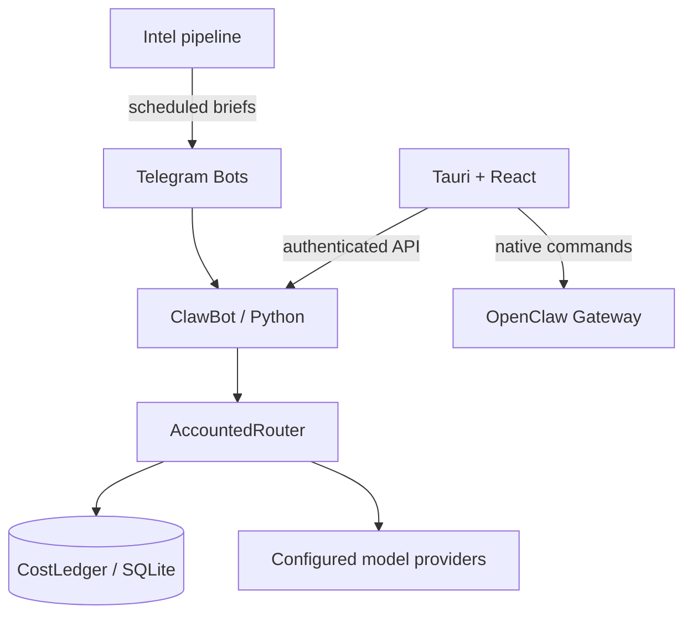

<div align="center">


**把 AI 助手、情报调度与模型预算，接到一个可追踪的工作流里。**

Python / FastAPI 后端 · Telegram 多 Bot · Tauri / React 桌面控制台

[](https://github.com/djblack1209-coder/OpenClaw-Bot/actions/workflows/ci.yml)
[](LICENSE)
[](packages/clawbot)
[](apps/openclaw-manager-src)

[快速体验](#快速体验) · [工程导览](docs/017-engineering-tour.md) · [架构](docs/004-architecture.md) · [参与贡献](docs/013-contributing.md) · [English](docs/016-readme-en.md)

</div>

## 为什么做这个项目

个人 AI 自动化最难的部分，往往出现在一次对话之后：任务如何执行，失败如何处理，模型调用花了多少，定时任务是否重复发送，以及谁可以控制本机服务。

**OpenEverything** 把这些问题放进同一个可检查的工程实现：用 Telegram 触发任务，用桌面端管理配置和服务，用独立情报管线生成简报，用持久化账本约束模型预算。

这是面向开发者的个人自动化参考项目，GitHub 仓库名保留为 **OpenClaw-Bot**。项目集成上游 [OpenClaw](https://github.com/openclaw/openclaw)，并维护本仓库中的控制台、Python 工作流与运维工具；它不是上游官方发行版。

## 先看效果

[](apps/project-showcase/index.html)

*上图是仓库附带的交互式工程讲解页，使用合成数据，不是 Tauri 实时运行截图或线上业务指标。GitHub 只展示 HTML 源码，请按下面步骤在本地打开。*

## 快速体验

只需 Git、Python 3；不需要 API Key、Telegram 账号、Node.js 或运行中的 Gateway。

```bash
git clone https://github.com/djblack1209-coder/OpenClaw-Bot.git
cd OpenClaw-Bot
python3 -m http.server 8765 --bind 127.0.0.1 --directory apps/project-showcase
```

打开 **[http://127.0.0.1:8765](http://127.0.0.1:8765)**，体验三个场景：

1. **系统总览**：从交互入口走到编排、预算策略与执行结果。
2. **情报管线**：连续触发两次，观察同一业务日去重；切换纽约夏令时 / 冬令时，观察新加坡业务时间。
3. **预算账本**：模拟超时后再次调用，观察未知费用如何占用预算并阻止超额尝试。

页面只在浏览器内模拟状态，刷新即重置，不连接任何业务服务。按 `Ctrl+C` 停止预览。运行真实后端与桌面端请看[开发环境与部署](docs/005-quickstart.md)。

## 值得深入看的三个设计

| 设计 | 解决的问题 | 实现与测试 |
|---|---|---|
| **可追踪的模型预算** | 多次重试不能绕过预算；超时不能被当成零费用 | [事务账本](packages/clawbot/src/core/cost_ledger.py) · [价格策略](packages/clawbot/src/core/cost_policy.py) · [回归测试](packages/clawbot/tests/test_cost_ledger.py) |
| **按业务日认领的情报调度** | 主机时区、重复唤醒、进程重启可能造成漏发或重复执行 | [调度认领](packages/clawbot/src/intel/scheduled_cycle.py) · [回归测试](packages/clawbot/tests/test_intel_scheduled_cycle.py) |
| **清晰的本机控制边界** | 多个控制面同时启停服务，容易产生状态冲突 | [Tauri 原生命令](apps/openclaw-manager-src/src-tauri/src) · [API 鉴权](packages/clawbot/src/api/auth.py) · [架构说明](docs/004-architecture.md) |

此外，仓库包含任务图编排、社交草稿与人工审核、分析工具、健康检查和备份恢复工具。阅读时建议先沿着上面的三个切面展开，而不是一次启动所有可选集成。

## 系统如何连接



Gateway 与 ClawBot 是不同组件；Intel 调度和模型账本也有各自的状态边界。独立远端服务的运维材料不属于最小演示的依赖。详见[当前架构](docs/004-architecture.md)。

## 技术栈与代码入口

| 层 | 技术 | 入口 |
|---|---|---|
| 交互与业务 API | Python 3.12、FastAPI、python-telegram-bot | [packages/clawbot](packages/clawbot) |
| 任务与模型调用 | 任务图、LiteLLM 路由、SQLite 费用账本 | [core](packages/clawbot/src/core) |
| 情报工作流 | 数据源适配、业务时区、持久化认领、投递状态 | [intel](packages/clawbot/src/intel) |
| 桌面控制台 | Tauri 2、Rust、React、TypeScript、Zustand | [openclaw-manager-src](apps/openclaw-manager-src) |
| 验证与运维 | pytest、Node tests、Cargo、GitHub Actions、恢复脚本 | [CI](.github/workflows/ci.yml) · [scripts](scripts) |

## 当前成熟度

- **可以直接体验**：零密钥的交互讲解页，包含源码入口和可复现的示例场景。
- **有实现与回归测试**：模型费用账本、情报调度认领、鉴权与桌面控制边界。CI 状态以顶部动态徽章及对应提交的 Actions 为准。
- **需要配置后验收**：真实 Telegram 投递、模型 Provider、桌面安装和可选第三方集成。测试通过不代表这些路径已在你的环境运行。
- **尚未完成的验收**：自然定时投递、部分跨平台安装及独立服务的完整业务路径，见[当前基线](docs/current/current-baseline.md)与[审计闭环](docs/089-audit-closure-2026-09-10.md)。

本项目适合学习、二次开发与受控的个人自动化；目前不承诺开箱即用的商业 SaaS 或无人值守的高风险操作。

## 开发与贡献

开发使用锁定依赖：Python **3.12.x**（macOS arm64 / Linux amd64 后端）、Node **22.19+ 的 22.x 或 24.x**、npm **10.x 或 11.x**。桌面原生构建另需 Rust 与平台编译工具。

从[快速开始](docs/005-quickstart.md)准备环境，再选择一个小切面贡献：补充失败场景测试、改善首次配置体验、翻译文档、修复可复现问题。具体步骤见[贡献指南](docs/013-contributing.md)。

如果这个项目对你有帮助，欢迎 Star 收藏；如果你想改进它，欢迎带着复现步骤提交 [Issue](https://github.com/djblack1209-coder/OpenClaw-Bot/issues)。

## 文档导航

| 想了解什么 | 从这里开始 |
|---|---|
| 五分钟看懂工程取舍 | [工程导览](docs/017-engineering-tour.md) |
| 架构、调用关系和组件归属 | [架构说明](docs/004-architecture.md) · [项目地图](docs/001-project-map.md) |
| 配置、开发、启动与恢复 | [快速开始](docs/005-quickstart.md) |
| 真实运行边界与未闭环项 | [当前基线](docs/current/current-baseline.md) |
| 漏洞报告与参与规范 | [安全政策](docs/014-security.md) · [行为准则](docs/015-code-of-conduct.md) |

## 致谢与许可证

感谢 [OpenClaw](https://github.com/openclaw/openclaw)、[LiteLLM](https://github.com/BerriAI/litellm)、[python-telegram-bot](https://github.com/python-telegram-bot/python-telegram-bot)、[FastAPI](https://github.com/fastapi/fastapi)、[Tauri](https://github.com/tauri-apps/tauri) 及其他依赖的维护者。项目的价值在于具体集成、状态管理与工程约束，不能把上游能力计作本仓库的原创成果。

根项目采用 [Apache License 2.0](LICENSE)。第三方源码、子模块及桌面包的声明可能不同；分发前请核对对应目录的许可证。不要提交密钥、会话或私人运行数据；真实交易、账号变更与外部发布保留明确授权和人工确认。
