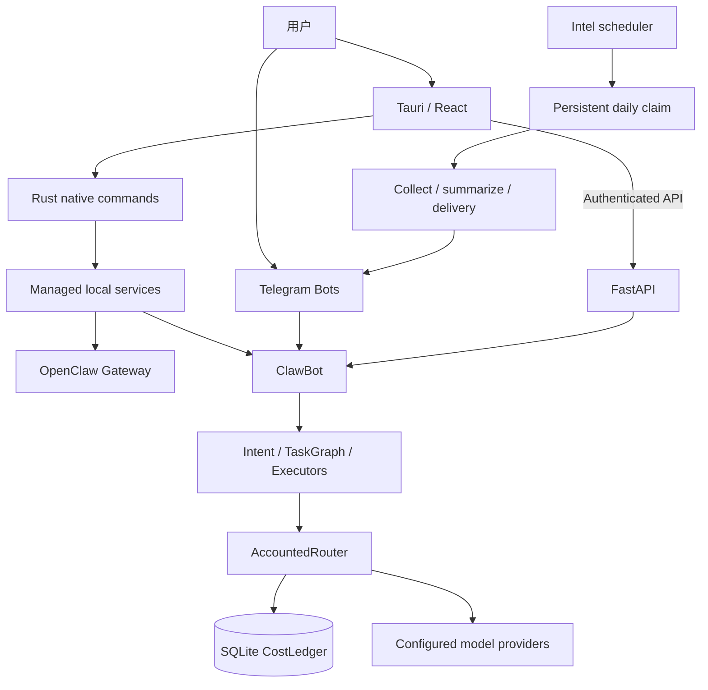
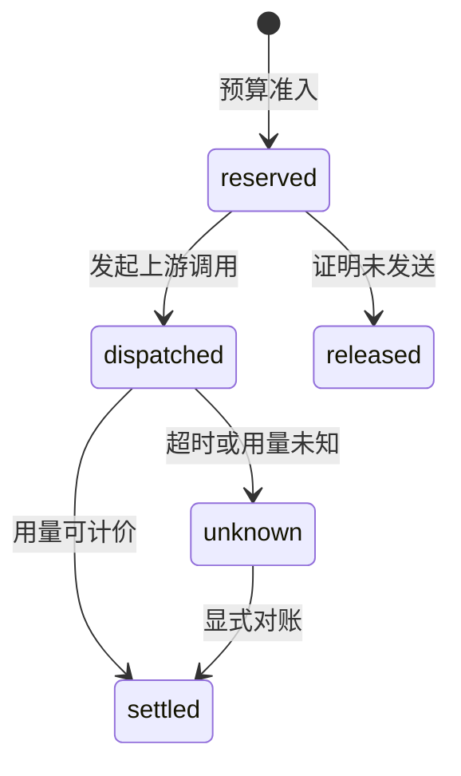

# OpenEverything 架构说明

本文描述可以在本仓库中定位的组件和调用边界。运行状态以[当前基线](current/current-baseline.md)及新鲜探针为准；旧 OMEGA 设计草案可从 Git 历史查看，不再作为现有功能清单。

## 组件与职责



| 组件 | 责任 | 代码入口 |
|---|---|---|
| OpenClaw Gateway | 上游助手运行时及其配置 | [固定运行时锁](../apps/openclaw-manager-src/src-tauri/npm-runtime-lock/package.json) |
| ClawBot | Telegram Bot 装配、业务模块与本机 API | [multi_main.py](../packages/clawbot/multi_main.py) |
| 桌面控制台 | React 界面、原生配置读写、受管服务控制 | [App.tsx](../apps/openclaw-manager-src/src/App.tsx) · [Rust](../apps/openclaw-manager-src/src-tauri/src) |
| 编排层 | 解析意图、构建任务图、执行任务和返回结果 | [brain.py](../packages/clawbot/src/core/brain.py) · [task_graph.py](../packages/clawbot/src/core/task_graph.py) |
| 模型调用与成本 | 路由候选、费用准入、逐次尝试记账 | [accounted_router.py](../packages/clawbot/src/core/accounted_router.py) · [cost_policy.py](../packages/clawbot/src/core/cost_policy.py) |
| Intel | 数据源、简报构建、订阅与投递状态 | [intel](../packages/clawbot/src/intel) |

图中表达主要职责，并不表示所有业务模块都已迁移到同一套调用实现；评审具体功能时仍应检查实际调用方。

## 设计一：先预留，再执行，再结算

[CostLedger](../packages/clawbot/src/core/cost_ledger.py) 把每次上游尝试记录为独立状态。数据库写入通过 SQLite `BEGIN IMMEDIATE` 串行化预算判断与预留；网络调用不在数据库事务中。



- 同一个逻辑请求的重试分别记账，不能复用第一次调用的预算来隐藏新增费用。
- 超时不能证明未计费，未知敞口继续占用预算。
- 价格来自显式配置与快照，不从模型名称推断“免费”；不支持的计费维度保留未知状态。
- 重复结算、并发预算竞争、跨进程重开和 DST 均有[针对性测试](../packages/clawbot/tests/test_cost_ledger.py)。这证明覆盖行为，不等于与真实供应商账单完成对账。

## 设计二：业务时区与主机时间分开

[scheduled_cycle.py](../packages/clawbot/src/intel/scheduled_cycle.py) 以 `Asia/Singapore` 的业务日期和 08:30 开始的投递窗口判断是否运行。主机在纽约时，夏令时和冬令时触发时刻会不同。

调度器先取得进程锁，再以排他创建方式写入当天认领文件；在调用采集或投递之前同步文件与目录状态。重启后仍能看到认领，未知或失败的执行不会自动重放。

这个选择优先减少重复副作用，但会带来取舍：认领后失败需要人工判断恢复，不能宣称外部消息投递严格 exactly-once。进程退出、文件写入失败、重复唤醒和跨日执行的边界见[调度测试](../packages/clawbot/tests/test_intel_scheduled_cycle.py)。

新闻入口统一指向 Global Intelligence Bot。ClawBot `/news` 与微信编号入口负责引导，旧科技早报生成器已退役，见[迁移记录](090-news-consolidation-2026-09-12.md)。

## 设计三：配置、控制和业务 API 各自负责

- 桌面端通过 Rust 原生命令管理受管 LaunchAgent。ClawBot HTTP API 不再提供第二套相互竞争的服务启停实现。
- 本机 API 仍需鉴权，不能因为只绑定本机而省略信任边界。入口见 [auth.py](../packages/clawbot/src/api/auth.py)。
- 首次配置的“保存成功”与“运行已验证”分开呈现；配置回读不能替代真实请求验收。
- 社交草稿、安全填入和外部发布是不同动作。高风险操作保留授权与确认，见[安全政策](014-security.md)。

## 自建与上游的边界

本项目围绕个人工作流组合已有生态：OpenClaw 提供助手运行时，LiteLLM 提供模型路由基础，FastAPI、Tauri、React 提供应用框架。本仓库可供评审的工程重点是控制台集成、业务编排、费用状态、情报投递和恢复约束。

`packages/openclaw-npm/` 的 vendor 内容、桌面 runtime lock 与机器上实际安装版本分别核实。New-API 上游子模块及独立 JIYU / Sub2API 运维材料具有不同的维护和许可证边界；它们不是离线演示依赖，也不能用本机 Bot 测试结果代替其业务验收。

## 验证入口

准备依赖的方法见[快速开始](005-quickstart.md)。已配置开发环境时，从仓库根目录执行：

```bash
cd packages/clawbot
.venv312/bin/python -m pytest tests/test_cost_ledger.py tests/test_intel_scheduled_cycle.py -q
```

桌面修改按[贡献指南](013-contributing.md)运行受影响测试、lint、构建与必要的原生检查。公开展示页是独立的 HTML/CSS/JavaScript 讲解模型，不替代 Python 模块或 Tauri 桌面端的验收。
