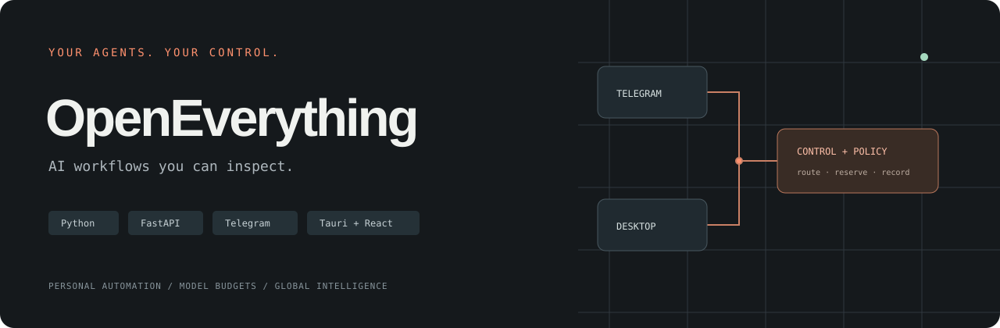
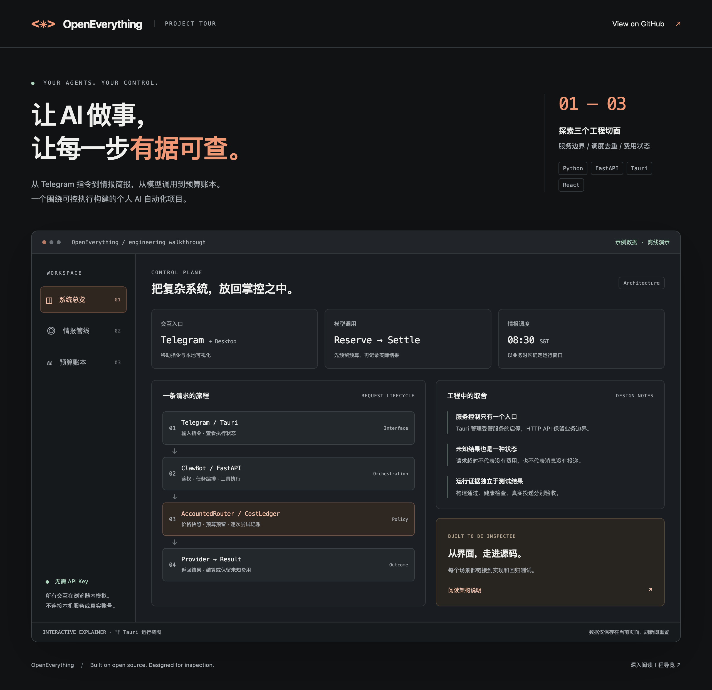

<div align="center">



**Personal AI workflows with explicit execution boundaries, model budgets, and delivery state.**

[](https://github.com/djblack1209-coder/OpenClaw-Bot/actions/workflows/ci.yml)
[](../LICENSE)

[简体中文](../README.md) · [Architecture](004-architecture.md) · [Engineering tour](017-engineering-tour.md) · [Contributing](013-contributing.md)

</div>

## What is OpenEverything?

OpenEverything combines a Python/FastAPI backend, Telegram bots, a Tauri/React desktop console, and an intelligence pipeline into a personal automation reference project. It focuses on the engineering after a chat response: task execution, retries, cost accounting, scheduling, and service control.

The repository retains the name **OpenClaw-Bot**. It integrates upstream [OpenClaw](https://github.com/openclaw/openclaw); this is an independent project, not an official distribution. Upstream runtimes and frameworks are credited separately from the application integration and workflow code maintained here.

## Try it without credentials



*This is a standalone interactive explainer, not a live Tauri screenshot or production telemetry. The tour and detailed engineering documents currently use Chinese.*

```bash
git clone https://github.com/djblack1209-coder/OpenClaw-Bot.git
cd OpenClaw-Bot
python3 -m http.server 8765 --bind 127.0.0.1 --directory apps/project-showcase
```

Open [localhost:8765](http://127.0.0.1:8765). Only Git and Python 3 are required. No API keys, accounts, backend, or desktop installation are needed. Press `Ctrl+C` to stop the preview.

- **System overview:** follow a request through interaction, orchestration, policy, and outcome.
- **Intelligence pipeline:** trigger twice and inspect daily deduplication; compare New York summer and winter time against Singapore business time.
- **Budget ledger:** simulate a timeout, then retry to see unresolved exposure consume the remaining budget.

The browser uses synthetic in-memory state and makes no business API calls. Reloading resets the examples. The source of truth for real behavior is the Python implementation and its tests.

## Three engineering decisions

| Decision | Why it matters | Inspect |
|---|---|---|
| Transactional budget reservations | Retries are separate attempts; an unknown outcome is not zero cost | [CostLedger](../packages/clawbot/src/core/cost_ledger.py) · [Tests](../packages/clawbot/tests/test_cost_ledger.py) |
| Persistent business-day claims | Host time zones, restarts, and overlapping scheduler processes should not replay side effects | [Scheduler](../packages/clawbot/src/intel/scheduled_cycle.py) · [Tests](../packages/clawbot/tests/test_intel_scheduled_cycle.py) |
| Explicit local control boundaries | Native service control and authenticated business APIs have distinct responsibilities | [Tauri](../apps/openclaw-manager-src/src-tauri/src) · [API auth](../packages/clawbot/src/api/auth.py) |

## Stack and scope

Python 3.12, FastAPI, python-telegram-bot, LiteLLM routing, SQLite, Tauri 2, Rust, React, TypeScript, and GitHub Actions. Optional modules include social drafts, analysis tools, and operational recovery tooling.

This is a developer-oriented reference implementation. The explainer works without configuration; real Telegram delivery, providers, desktop installation, and third-party integrations require their own setup and acceptance checks. A successful CI run does not prove live delivery, provider billing reconciliation, or commercial readiness. See the [current baseline](current/current-baseline.md) for outstanding runtime checks.

Development uses committed dependency locks: Python 3.12.x on macOS arm64 / Linux amd64 for the backend, Node 22.19+ within 22.x or Node 24.x, npm 10.x / 11.x, plus Rust and native platform tools for desktop builds. Follow the [quick start](005-quickstart.md) instead of installing arbitrary latest dependencies.

## Contribute

Reproducible bug reports, focused regression tests, onboarding improvements, and translations are welcome. Read the [contribution guide](013-contributing.md), [security policy](014-security.md), and [code of conduct](015-code-of-conduct.md). If the project is useful, a Star helps others discover it.

## Credits and license

Built on [OpenClaw](https://github.com/openclaw/openclaw), [LiteLLM](https://github.com/BerriAI/litellm), [FastAPI](https://github.com/fastapi/fastapi), [python-telegram-bot](https://github.com/python-telegram-bot/python-telegram-bot), and [Tauri](https://github.com/tauri-apps/tauri), among other dependencies.

The root project uses [Apache-2.0](../LICENSE). Vendored components, submodules, and package declarations may use different licenses; check each directory before redistribution. Keep credentials and private runtime data out of the repository. Real transactions, account changes, and external publishing retain explicit authorization boundaries.
