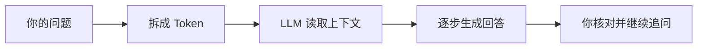

# AI 基础词汇小白指南

> 日期: 2026-08-09
> 适用对象: 第一次使用 AI 聊天或 AI 编程工具的用户

## 目录

- AI、LLM 与 Token
- 首字时间和缓存命中率
- 如何把问题交给 AI

## AI、LLM 与 Token

AI 是让软件完成理解、生成或判断任务的一大类技术。日常聊天和写代码时，通常接触的是大语言模型，英文叫 LLM。它会根据当前输入和已读到的上下文，逐步生成回复。

Token 是模型处理文字时使用的小单位，不等于一个汉字或一个英文单词。输入越长、历史对话越多，通常花费和等待时间越高。把需求、文件范围和验收要求说清楚，比反复粘贴整段无关记录更省事。



## 两个常见指标

**首字时间**，从你发送请求到看到第一个字或第一个代码片段的等待时间。它会受网络、服务排队、输入长度、工具调用和模型负载影响。首字快不代表整段回答一定更快。

**缓存命中率**，重复使用的前缀内容被系统复用的比例。比如固定的项目说明、长期不变的规则可能被缓存，命中后通常能减少重复处理。不同供应商的缓存规则不同，不能把某一次较快的响应当作稳定承诺。

## 实用做法

- 说明目标、已有材料和不希望 AI 做的事。
- 把大任务拆成可以检查的小步骤。
- 让 AI 在改动前先复述理解，在改动后给出验证结果。
- 不把密码、Cookie、私钥、恢复码或账号资料发进聊天。

## 可复制给 AI 的提示词

```text
我是 AI 新手。请先用不超过 8 句话解释：AI、LLM、Token、首字时间和缓存命中率分别是什么，并指出它们会怎样影响我的等待时间和费用。不要假装知道我的账号、套餐、余额或模型配置；不确定时请直接说需要我在哪里查看。
```

## 真实限制

AI 可能误解上下文、编造不存在的信息，或把看似合理的答案说得很肯定。涉及付款、账号、安全、医疗、法律和生产变更时，要以官方页面、实际界面和独立核对为准。

## 参考资料

- [OpenAI ChatGPT App 文档](https://learn.chatgpt.com/docs/app)
