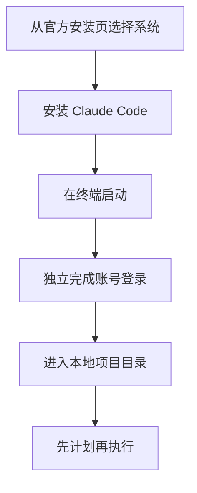

# Claude Code 入门与 CC Switch 路由指南

> 日期: 2026-08-09
> 适用对象: 希望让 Claude 在本机项目中协助写代码的初学者

## 目录

- 安装与登录
- 项目、模型和思考强度
- CC Switch 与本地代理
- 权限模式

## 安装与登录

Claude Code 是终端里的编程助手。Windows、macOS 和 Linux 都应按 Anthropic 的官方安装页选择对应方式，安装后在终端启动并用自己的 Anthropic 账号完成登录。不要从聊天记录复制未知安装命令，也不要把登录令牌交给任何人。

macOS、Linux 或 WSL 可使用官方安装脚本：

```bash
curl -fsSL https://claude.ai/install.sh | bash
```

Windows PowerShell 可使用：

```powershell
irm https://claude.ai/install.ps1 | iex
```

也可以使用包管理器备选安装：

```bash
brew install --cask claude-code
```

```powershell
winget install Anthropic.ClaudeCode
```

安装后运行以下命令验证：

```bash
claude --version
```



## 选项目、模型和思考强度

先在终端进入项目根目录，再启动 Claude Code。项目目录决定它能看到哪些文件，不要在包含私人资料的大目录里直接运行。

模型负责能力和速度的取舍。思考强度会影响模型为复杂任务投入的推理量，界面或版本支持的选项以当前客户端为准。简单改字可用较快设置，跨多个文件、难以回滚的改动应先让它出计划并逐项确认。

## Plan、执行和权限

Plan 是先只读查看并说明准备怎么做。执行阶段才会改文件或运行命令。权限模式决定每一步是否需要你批准，初学者建议保留确认，尤其是安装依赖、删除文件、访问网络和运行会影响系统的命令。

## CC Switch 和本地代理

CC Switch 可以管理终端客户端的 Provider 配置，并提供本地代理路由。先在 CC Switch 导入你有权使用的 Provider 配置，再在 Claude Code 中按 CC Switch 的说明使用本地代理。它不替你完成 Anthropic 账号登录，也不应成为保存明文凭据的地方。

## 可复制给 AI 的提示词

```text
请帮我在当前项目中使用 Claude Code，但先只读检查目录和现有说明。然后给我一份计划，标出哪些步骤会改文件、安装依赖、联网或需要我的批准。不要读取、输出或请求密码、Token、Cookie、私钥和账号恢复码。等我确认计划后再执行。
```

## 真实限制

Claude Code 的菜单、模型和权限提示会随版本、地区、账号权限和组织政策变化。CC Switch 的路由只影响配置链路，不能绕过服务提供商的账号、付款、地区或使用条款。

## 参考资料

- [Claude Code 安装](https://docs.anthropic.com/en/docs/claude-code/setup)
- [CC Switch 本地代理服务](https://ccswitch.co/docs/proxy-service.html)
