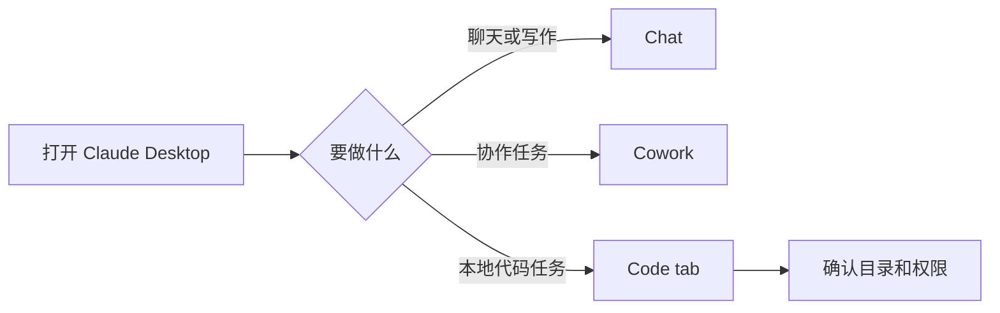

# Claude Desktop 入门：Chat、Cowork 与 Code

> 日期: 2026-08-09
> 适用对象: 在 Windows 或 macOS 使用 Claude Desktop 的用户

## 目录

- 安装和登录
- Chat、Cowork、Code 的区别
- Code tab 与 Extension Developer
- CC Switch 的边界

## 安装和登录

Windows 和 macOS 请从 Anthropic 官方桌面端安装说明下载对应安装包，安装后使用自己的 Claude 账号独立登录。桌面端登录状态属于 Claude Desktop，不能从其他工具自动迁移。

## 三个入口怎么选

**Chat** 适合聊天、写作和普通问答。**Cowork** 用于协作式工作流，实际可见功能以账号和版本为准。**Code** 或 Code tab 用于把编程任务交给 Claude Code 相关体验，开始前仍应确认项目目录和权限提示。



## Extension Developer 在哪里

Claude Desktop 没有通用的开发者模式总开关。扩展开发入口位于 **Settings > Extensions > Advanced settings** 内的 **Extension Developer** 区域，用于开发和测试 Claude Desktop Extension。该区域是否显示取决于版本、系统和账号权限，应以当前应用页面和官方文档为准。

Extension Developer 只服务于 Extension 开发，不会自动开放系统权限、跳过账号限制，也不会把任意功能变成可编辑状态。

## CC Switch 的边界

CC Switch 对 Claude Desktop 不同步 MCP。Claude Desktop 的 MCP 或扩展需按它自己的设置和官方流程配置。Claude Desktop 账号登录也必须独立完成，不能假定导入 CC Switch Provider 后就已经登录 Claude。

## 可复制给 AI 的提示词

```text
请用 Claude Desktop 的当前界面指导我完成一个本地代码任务。先告诉我该使用 Chat、Cowork 还是 Code tab，并在任何会读取项目文件、启用扩展或执行命令之前说明影响和等待我的确认。不要要求我把账号密码、Cookie、Token 或私钥粘贴到聊天中。
```

## 真实限制

Chat、Cowork、Code tab 与 Extensions 的可用性会因桌面端版本、操作系统、账号计划和地区不同而不同。若界面找不到 Extension Developer，不应自行下载未知插件或修改应用文件。

## 参考资料

- [Claude Desktop 安装](https://support.anthropic.com/en/articles/10065433-installing-claude-for-desktop)
- [Claude Code 与桌面端](https://docs.anthropic.com/en/docs/claude-code/desktop)
