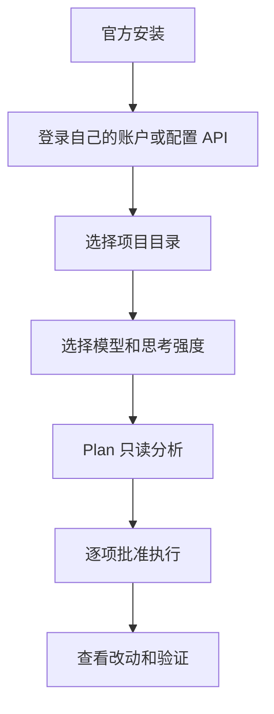

# Codex 入门与 CC Switch API 路由边界

> 日期: 2026-08-09
> 适用对象: 想在 Windows、macOS 或 Linux 上使用 Codex 的用户

## 目录

- 安装和项目
- 模型、思考强度与 Plan
- 执行和审批模式
- CC Switch 的正确用途

## 安装和项目

按 Codex 官方文档在 Windows、macOS 或 Linux 安装客户端。创建或打开任务时，只选择需要处理的项目目录。开始前检查目录内是否含有密码、备份、私有证书或不应交给 AI 的资料。

macOS 或 Linux 可使用官方 CLI 安装脚本：

```bash
curl -fsSL https://chatgpt.com/codex/install.sh | sh
```

Windows PowerShell 可使用：

```powershell
powershell -ExecutionPolicy ByPass -c "irm https://chatgpt.com/codex/install.ps1 | iex"
```

也可以使用 npm 或 Homebrew 备选安装：

```bash
npm install -g @openai/codex
```

```bash
brew install --cask codex
```

安装后首次运行 `codex`，按提示完成登录。本文在 Linux 上只覆盖 Codex CLI，不覆盖桌面端。



## 模型、思考强度、Plan 与执行

模型和思考强度决定速度、成本和复杂问题的处理方式，选择项以当前客户端展示为准。Plan 阶段应先解释范围、风险和验证方法。执行阶段才允许写文件、运行命令或访问外部资源。

审批模式用于控制执行边界。初学者应对安装软件、修改大量文件、删除内容、使用网络、访问凭据目录等操作保留手动审批。

## CC Switch 只配置 API 路由

CC Switch 可为 Codex 配置 API 路由或本地代理。它不导入 ChatGPT 消费者订阅账号，也不共享 ChatGPT 的浏览器登录态。需要使用 ChatGPT 或 Codex 的账号功能时，仍须在对应产品中按官方流程独立登录。

## 可复制给 AI 的提示词

```text
请在当前 Codex 项目中先进入 Plan 模式。只读检查项目结构后，列出目标、会修改的文件、可能的风险和验证命令。任何写入、安装、删除、网络访问或读取敏感目录的动作都先等我批准。不要要求或记录任何账号密码、Token、Cookie、私钥或订阅信息。
```

## 真实限制

可用模型、思考强度和审批选项会随客户端版本、登录方式、组织策略与地区变化。API 路由和 ChatGPT 消费者订阅是两套授权链路，不能互相替代。

## 参考资料

- [Codex 开发者命令](https://learn.chatgpt.com/docs/developer-commands)
- [ChatGPT App 文档](https://learn.chatgpt.com/docs/app)
