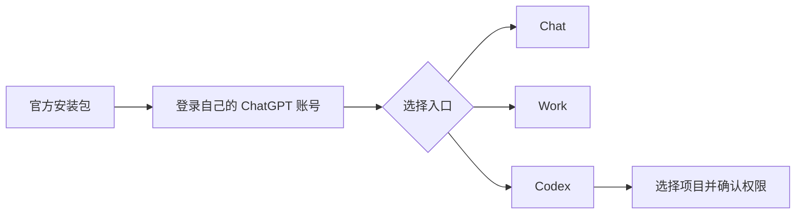

# ChatGPT Desktop 入门：Chat、Work 与 Codex

> 日期: 2026-08-09
> 适用对象: 在 Windows 或 macOS 使用 ChatGPT Desktop 的用户

## 目录

- 安装与自己的账号登录
- Chat、Work、Codex 的基本区别
- 项目选择
- 不与 CC Switch 同步登录态

## 安装和登录

Windows 与 macOS 请按 OpenAI 官方 App 文档安装。首次打开后，用自己的 ChatGPT 账号登录。共享电脑应使用系统账户隔离或在用完后退出，不要把登录验证码、会话 Cookie 或恢复码发到聊天里。



## 三种入口

**Chat** 用于对话、写作和提问。**Work** 用于工作空间或工作任务，具体入口由账号和客户端决定。**Codex** 面向代码任务，开始时选择实际要处理的项目目录，并确认 AI 的文件和命令权限。

项目选择的原则很简单：只选本次任务需要的文件夹。不要因为方便就选择整个主目录、云盘同步目录或包含证书和备份的目录。

## CC Switch 不同步 ChatGPT 登录态

不能把 ChatGPT 消费者登录态同步到 CC Switch。CC Switch 管理的是终端客户端的 Provider 或 API 路由配置，不保存也不导入 ChatGPT 网页或桌面端的账号会话。两边需要分别按自己的流程登录和授权。

## 可复制给 AI 的提示词

```text
我想在 ChatGPT Desktop 中完成一个项目任务。请先问我应该选哪个项目目录，并告诉我 Chat、Work、Codex 哪个入口更合适。任何文件写入、命令执行、联网、安装或访问敏感目录之前都先说明并等待确认。不要让我提供密码、Cookie、Token、私钥或恢复码。
```

## 真实限制

桌面端的入口、工作区能力和 Codex 可用性受系统、客户端版本、账号计划、地区及组织策略影响。账户登录与 API 路由是不同机制，不能用一个替代另一个。

## 参考资料

- [ChatGPT App 文档](https://learn.chatgpt.com/docs/app)
- [ChatGPT Windows 应用](https://learn.chatgpt.com/docs/windows/windows-app)
- [Codex 开发者命令](https://learn.chatgpt.com/docs/developer-commands)
