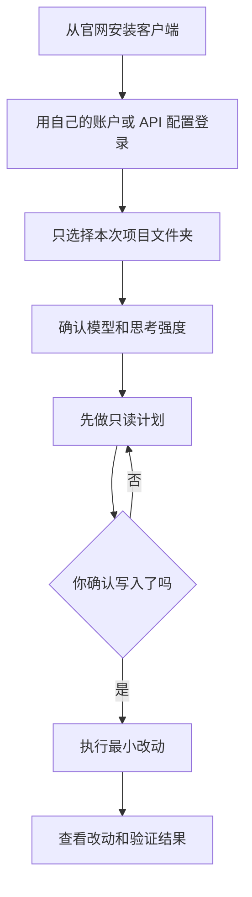

# OpenCode 与 Grok Build 入门指南

> 日期: 2026-08-09
> 适用对象: 想在 Windows、macOS 或 Linux 上用 OpenCode 或 Grok Build 处理代码项目的普通用户

## 目录

- 先选工具和安装来源
- 选择项目与模型
- 计划、执行和确认边界
- 通过 CC Switch 使用本地路由
- 可复制给 AI 的提示词

## 先理解两个工具

OpenCode 是面向终端和代码项目的开源 AI 编程工具。Grok Build 是 xAI 在其客户端或网页中提供的构建类能力；名称、入口、支持的系统和模型选项会随产品版本、地区及账号权限变化。两者都应从各自官方网站或可信应用商店安装，不能把不明来源的安装脚本粘到终端。



## 安装、项目与模型

1. 打开 [OpenCode 官方站点](https://opencode.ai/) 或 [xAI 官方帮助中心](https://help.x.com/en/using-x/grok)，选择与你的 Windows、macOS 或 Linux 系统相符的安装入口。
2. 首次启动时，只打开这一次要处理的项目文件夹。不要选择整个用户目录、同步盘、证书目录或备份目录。
3. 在模型选择器中选择当前账户实际可用的模型。模型名称和思考强度以客户端显示为准，不要手动填写网上看到的名称。
4. 对复杂、不可逆或会影响生产环境的任务，先要求工具生成计划；只有了解会改哪些文件、如何验证、如何回退后才允许执行。

所谓“无需确认”只适合临时测试目录中的低风险重复操作。安装软件、访问网络、读取敏感目录、删除文件、修改生产配置或产生费用，都应保留人工确认。

## 通过 CC Switch 使用本地路由

CC Switch 可以集中管理兼容客户端的 Provider 配置和本地代理，但它不是账户登录态同步工具。不要尝试将 Grok、OpenCode、浏览器或桌面客户端的 Cookie、密码、恢复码同步进去。

1. 在 CC Switch 中先导入你有权使用的 Provider 配置，检查地址和模型来自可信来源。
2. 在“本地代理”中启动服务，复制客户端需要的本地地址，不把真实 API 密钥贴入聊天或截图。
3. 在 OpenCode 或 Grok Build 的 Provider 设置中选择该本地地址；能使用的协议与模型以客户端实际兼容性为准。
4. 用一个不收费、只读的小请求确认连接成功，再开始项目工作。失败时停止排查配置，不要反复发送可能收费的请求。

## 可复制给 AI 的提示词

```text
我是新手，想用 OpenCode 或 Grok Build 完成当前项目的一个小任务。请先只读查看项目结构，并告诉我应该选择哪个项目文件夹、当前客户端可见的模型和思考强度如何取舍。先给出计划、会修改的文件、验证方式和回退方式；没有我的明确确认，不要写文件、安装软件、删除内容、联网、打开生产配置或访问敏感目录。

如果需要通过 CC Switch 使用本地路由，请只指导我在图形界面中导入我自己有权使用的 Provider 配置、启动本地代理并选择本地地址。不要要求、显示、保存或转发密码、Cookie、Token、私钥、订阅信息或恢复码。
```

## 常见误区

- “能打开项目”不等于允许它修改所有文件。项目权限与系统权限是两层边界。
- 本地代理只转发兼容 API 请求，不会继承网页会员、桌面登录态或绕开地区、付款和使用条款。
- 更强的模型或更高思考强度可能更慢、成本更高；先用小任务验证即可，不需要制造大量请求。

## 参考资料

- [OpenCode 官方文档](https://opencode.ai/docs)
- [OpenCode GitHub 项目](https://github.com/anomalyco/opencode)
- [xAI Help Center: Grok](https://help.x.com/en/using-x/grok)
- [CC Switch 本地代理](https://ccswitch.co/docs/proxy-service.html)
