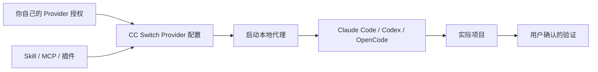

# CC Switch 配置、更新与扩展管理指南

> 日期: 2026-08-09
> 适用对象: 使用 CC Switch 管理 Claude Code、Codex、OpenCode 等本地客户端的用户

## 目录

- CC Switch 能做什么，不能做什么
- 更新终端客户端
- Provider 与本地代理
- Skill、MCP 和插件
- 用量查询
- 可复制给 AI 的提示词

## 先划清边界

CC Switch 用于管理终端客户端的兼容 Provider 配置、扩展和本地代理。它不能替代 Claude、ChatGPT、Grok 等产品自己的账户登录，也不应保存浏览器 Cookie、密码、恢复码或私钥。



## 更新终端客户端

1. 在 CC Switch 的客户端管理或更新入口查看已安装客户端和版本。
2. 只选择官方来源列出的更新项，先阅读变更说明和系统权限请求。
3. 更新前关闭正在运行的客户端；更新完成后重新打开，确认版本与基本启动正常。
4. 不要为了“全绿”安装不使用的客户端，也不要执行陌生的终端安装命令。

客户端名称和更新入口可能随 CC Switch 版本变化；找不到时，以 [CC Switch 官方文档](https://ccswitch.co/docs/) 的当前界面说明为准。

## Provider 与本地代理

在 CC Switch 导入你有权使用的 Provider 配置后，可在本地代理页面启动路由服务。推荐顺序：

1. 导入一个 Provider，核对名称、地址和可用模型。
2. 启动本地代理，记录界面显示的本机地址。
3. 让目标客户端选择该地址和兼容协议。
4. 用一次低风险请求验证，再开始工作。

不要把网页账户登录态导入 CC Switch，也不要认为本地代理能取得未购买的模型、绕过地区限制或自动承担付款。

## Skill、MCP 和插件的区别

- **Skill**：给 AI 的工作说明或流程能力，例如如何审查代码。
- **MCP**：让 AI 调用外部工具或数据源的标准连接方式，例如读取一个本地服务。
- **插件**：为客户端添加功能的安装包，可能包含 Skill、MCP 或界面能力。

添加前先看发布者、源码、权限和网络地址。只启用当前任务需要的最小集合；不用的扩展应关闭或移除。MCP 的环境变量中不应填入聊天里收到的秘密，优先使用系统钥匙串或产品的安全存储。

## 用量查询

用量查询是否可用取决于 Provider 是否提供对应接口，以及你的账户权限。通常在 Provider 配置或客户端状态页启用；开启后先确认只展示必要的用量和时间范围，不要把完整账户标识、账单信息或密钥写入日志。

看不到用量时，先核对 Provider 是否支持，再检查配置与账号权限。不要通过反复调用模型来“测试余额”。

## 可复制给 AI 的提示词

```text
请只指导我在 CC Switch 图形界面完成以下事项：检查已安装的终端客户端是否有官方更新、导入我自己有权使用的一个 Provider、启动本地代理、按需启用一个已知来源的 Skill 或 MCP，并检查该 Provider 是否原生支持用量查询。

开始前先列出每一步会改变什么。不要安装陌生插件，不要读取或显示密码、Cookie、Token、私钥、订阅信息、账单资料或恢复码；涉及更新、写配置、启动服务或联网时都等我确认。完成后只给出界面位置、状态和如何撤销。
```

## 参考资料

- [CC Switch 官方文档](https://ccswitch.co/docs/)
- [CC Switch 本地代理](https://ccswitch.co/docs/proxy-service.html)
- [CC Switch MCP 管理](https://ccswitch.co/docs/extensions-mcp.html)
- [Model Context Protocol 官方文档](https://modelcontextprotocol.io/)
