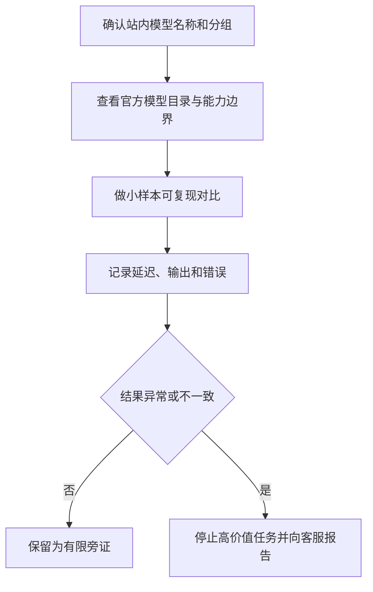

# 模型真伪与渠道质量核对指南

> 日期: 2026-08-09
> 适用对象: 想判断 API 返回模型是否符合预期的 JIYU AI 用户

## 目录

- 先理解“真伪”能证明什么
- 三层核对方法
- 测试网站与开源工具的正确用途
- 影响结果的因素
- 可复制给 AI 的提示词

## 先说结论

没有一个网页测试或一轮对话能百分之百证明远端服务实际使用了某个模型。最可靠的是服务方可追溯的模型标识、请求记录和官方模型目录；行为测试只能提供旁证，不能替代合同、账单或服务方披露。



## 三层核对方法

1. **标识核对**：检查调用返回的模型名称、站内用量记录与 API 文档是否一致。不要把模型别名当作厂商身份保证。
2. **能力核对**：选一两个不含隐私的小样本，检查上下文长度、工具调用、图像或推理等公开能力是否与官方说明相符。
3. **可复现对比**：在相同提示词、相近参数和相近网络条件下，间隔多次测试，记录输出质量、首字时间、错误率和价格展示。一次表现好或差都不足以下结论。

若发现长期明显偏离公开能力、模型名称与记录不一致、或对高价值任务影响很大，停止继续消耗并向站内客服报告。对模型保真度要求特别高时，选择明确标注的自营资源并先做小额度验证。

## 测试网站与开源工具

- [LMArena](https://lmarena.ai/) 可以做盲测对比，适合判断你偏好的回答风格，不是来源鉴定工具。
- [Promptfoo](https://www.promptfoo.dev/) 是开源评测工具，可将同一组非敏感提示词重复发送给多个兼容端点，便于找出能力或稳定性差异。
- [Inspect AI](https://github.com/UKGovernmentBEIS/inspect_ai) 是开源评测框架，可做可复现任务评测；它同样不能验证远端供应链身份。
- [OpenAI 模型文档](https://platform.openai.com/docs/models) 与 [Anthropic 模型文档](https://docs.anthropic.com/en/docs/about-claude/models) 适合核对公开能力范围和命名规则。

只使用不含个人资料、商业机密、密钥或受版权限制的大段内容作为测试样本。不要用大批量并发、长上下文轰炸或反复付费请求来制造压力。

## 为什么测试结果会波动

结果会受到上游渠道、测试方法、网络路径、客户端指纹、模型版本、服务端负载、缓存、参数、限流和时间段影响。因此，网站榜单、指纹类提示词或一次“像不像”的答案都只能作为参考，不能当作绝对证据。

## 可复制给 AI 的提示词

```text
请帮我为一个 API 模型做低成本、可复现的质量核对方案。先说明：任何单次测试都不能证明模型来源；结果会受服务渠道、测试方法、网络、客户端指纹、模型版本、缓存和负载影响。

只设计 3 个不含隐私、不产生大流量的样本，并提供记录表字段：模型标识、时间、参数、首字时间、完整耗时、错误码、输出摘要和站内用量记录。不要要求我提供 API Key、Cookie、账单、账号或内部路由信息。异常时建议我停止高价值调用并向客服提交脱敏证据，而不是猜测或攻击服务。
```

## 参考资料

- [LMArena](https://lmarena.ai/)
- [Promptfoo](https://www.promptfoo.dev/)
- [Inspect AI](https://github.com/UKGovernmentBEIS/inspect_ai)
- [OpenAI 模型文档](https://platform.openai.com/docs/models)
- [Anthropic 模型文档](https://docs.anthropic.com/en/docs/about-claude/models)
