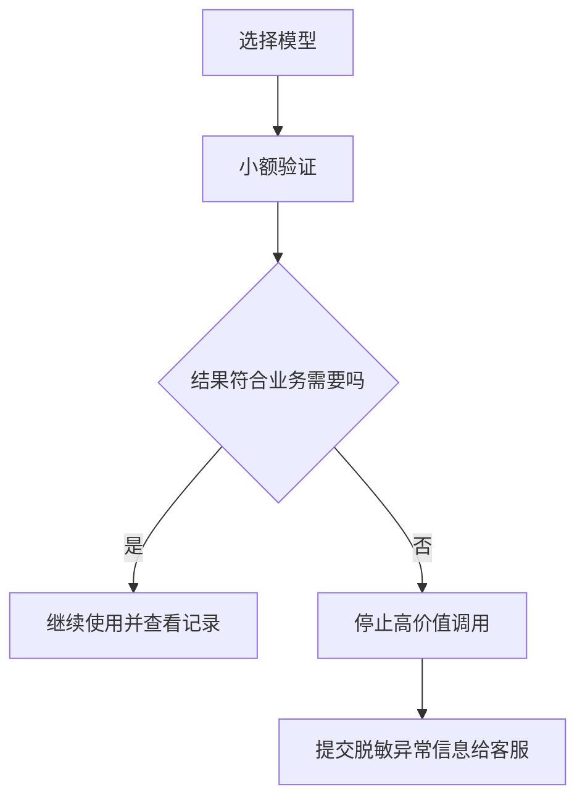

# JIYU AI 服务说明与使用条款指南

> 日期: 2026-08-09
> 适用对象: 使用 JIYU AI 模型、API 密钥和客户端导入功能的用户
> 当前状态: 线上登录条款与文档源已于 2026-08-09 修正；地区技术分流仍须由管理员完成原生配置并进行真实回读。

## 目录

- 服务范围与模型可用性
- 地区展示规则
- 合规使用与账户处置
- 异常举报与高保真需求
- 用户使用流程

## 服务范围与模型可用性

JIYU AI 提供兼容接口、模型分组、使用记录和客户端配置辅助。非自营资源会受上游服务、可用额度、网络和服务维护影响，模型价格、质量、限额与可用性可能变化。JIYU AI 不对非自营资源的持续可用性或模型表现作保证，用户应根据自己的业务风险进行小额验证和选择。

对模型保真度或稳定性要求较高的用户，应优先选择标注为自营的资源，并在正式业务前完成小样本验证。若怀疑存在掺水、错配或异常质量的渠道，可向客服提交脱敏的时间、模型名称、请求现象和站内记录，协助处理。



## 地区展示规则

用户选择的业务规则为：

- 中国大陆 IP 用户仅显示并可使用国内模型。
- 境外 IP 用户可显示并使用全部模型。
- 个人资料、余额、订单和 API 密钥以海外主系统为唯一事实来源；地区展示不能生成第二套账户或余额。

这项规则应由服务端和边缘路由同时执行，不能只靠前端隐藏。当前发布只先修正了法律文案，技术分流仍待生产发布与真实回读；在此之前，展示与实际可用范围以线上页面和 API 的最终回读为准。

## 合规使用与账户处置

用户不得利用服务从事违反适用法律、侵犯他人权利，或违反 Anthropic、OpenAI、xAI 等模型提供方适用条款的活动。系统可能提供关键词或风险控制，但这只能降低部分风险，不能保证识别所有违规行为。

因用户违规使用导致的限制、封禁、数据丢失或第三方账户处置，由用户自行承担相应责任。JIYU AI 可在合理范围内采取限制、暂停或终止服务等措施，并依据实际情况处理申诉。

## 账户与安全

不要将 API 密钥、密码、Cookie、私钥、恢复码或付款凭据发送给客服、AI 聊天工具或第三方。发现密钥泄漏、异常扣费或异常请求时，应立即在站内停用或轮换对应密钥，并向客服提供不含秘密的时间和现象。

## 争议与变更

服务规则、可用模型和支付方式可能随着合规要求、产品能力和外部服务变化而调整。重要变更应在公开页面说明生效时间和影响范围。本文不替代依法应提供的完整隐私政策、退款规则或正式法律条款。

## 可复制给 AI 的提示词

```text
请用普通用户能理解的语言解释 JIYU AI 当前服务条款：非自营资源的价格、质量、限额和可用性可能波动；对保真度要求高时应选择自营资源并先小额验证；可举报疑似异常渠道；用户不得违反适用法律及模型提供方条款；中国大陆 IP 仅显示国内模型，境外 IP 显示全部模型。

不要出现任何内部定价规则、倍率、供货商名称、管理地址、账号标识或凭据。不要承诺尚未上线的能力；若地区规则尚未实际生效，明确提示以线上回读为准。
```

## 参考资料

- [OpenAI 使用政策](https://openai.com/policies/usage-policies/)
- [Anthropic 使用政策](https://www.anthropic.com/legal/aup)
- [xAI 使用条款](https://x.ai/legal/terms-of-service/)
