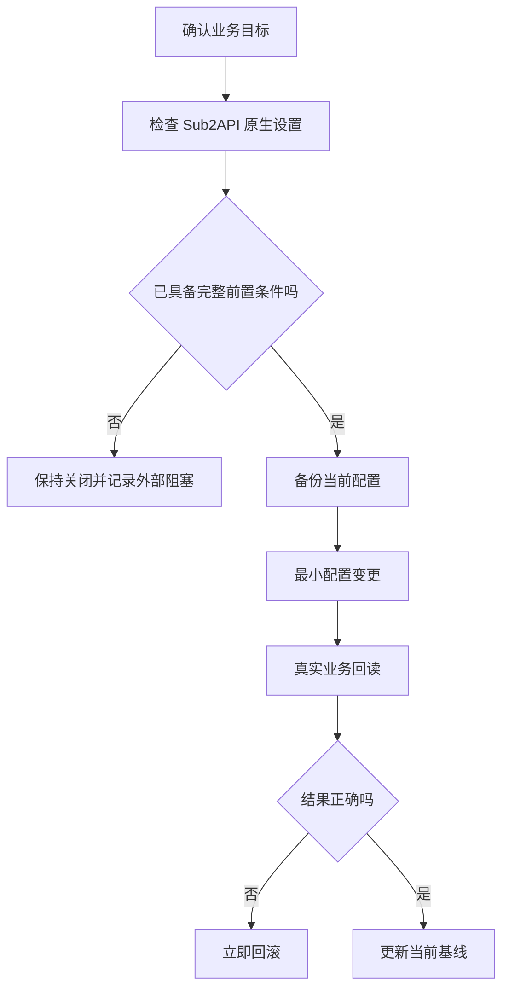

# JIYU AI 系统设置、支付与地区分流说明

> 日期: 2026-08-09
> 适用对象: JIYU AI 的站点所有者和负责日常配置的管理员
> 当前状态: 支付与中国地区分流关闭；JIYU 私有 R2 已用于原生数据库备份和异步图片对象存储。图片成功链仍等待上游渠道恢复。

## 目录

- 原生设置优先原则
- 支付系统的启用条件
- 无营业执照个人运营者的官方接入边界（2026-08-09）
- S3 与异步生图对象存储
- 安全审计设置
- 中国大陆与境外展示分流
- 可复制给 AI 的提示词

## 原生设置优先原则

优先使用 Sub2API 已有的支付、对象存储、异步任务、风险控制和管理员配置能力，不叠加第二套后台或自建控制面。每一次生产写入前都需要最新配置快照、可恢复备份、最小改动、回滚步骤和真实业务回读。



## 支付系统：当前不应直接开启

上传个人收款码不是安全的自动支付接入。自动充值需要商户或服务商允许的支付产品、真实回调地址、签名验签资料、订单幂等逻辑、退款规则和一次真实小额回读。

- 微信支付：本站提供线上 AI/API/虚拟服务，不能把小微商户当作无营业执照个人的合规直连方案。官方公开准入仅面向指定线下行业，且小微申请只能由已获权限的服务商 API 发起；当前保持站内支付关闭。
- 支付宝：个人收款或当面付能力不等同于网站自动入账。支付宝电脑网站支付须以当前开通页审核为准；不要承诺无营业执照个人一定可开通，仍须满足真实可访问站点、ICP备案主体一致及回调、验签、订单和退款处理等要求。
- PayPal、Stripe、Visa、Mastercard：通常还涉及主体、地区、KYC、结算账户、争议处理和业务合规要求，不能仅靠上传二维码开通。

在资质、回调、签名验证与真实小额验证全部就绪前，保持站内支付开关关闭；第三方店铺售卖兑换码和站内核销仅是当前过渡渠道，不等同于站内支付，也不把付款截图当作自动到账证据。

## 云猫自配易支付：只读核对结果（2026-08-16）

云猫商家后台的“自配支付渠道”功能已经开通，但“易支付支付宝”和“易支付微信”当前均为“已关闭”，两项都没有已配置的收款账号。页面显示两条通道的费率均为 1%，冻结周期为即时解冻；同时要求运营账户有足够余额抵扣订单手续费，保证金钱包余额不能低于单笔订单金额。

新增账号表单要求四项：账号别名、易支付网关、易支付 PID、易支付密钥。这里的“收款账号”不是把个人微信/支付宝号或二维码填进云猫，而是一个易支付服务商的商户接入档案：

- `易支付网关`：易支付服务商提供的接口地址。
- `易支付 PID`：易支付商户号/商户唯一标识。
- `易支付密钥`：对应商户密钥，用于签名和回调校验。
- 实际收款主体：由该易支付服务商绑定的支付宝或微信商户结算账户决定；云猫当前没有配置账号，因此无法从云猫后台推断具体收款人。

开通顺序应为：先在易支付服务商侧取得已审核的商户账号，并在服务商后台启用对应的支付宝或微信支付方式；再把网关、PID、密钥分别添加到云猫的两条通道；最后核对回调、签名、订单状态和结算归属后，才由商家手动开启对应通道。两条通道应分别配置，不能把支付宝账号的 PID/密钥复用于微信。

易支付官方接口文档要求 `pid`、支付类型、订单号、异步通知地址和签名等字段；官方微信开户说明要求在微信商户侧完成开户并设置商户 API v2 密钥。平台自身是否接受某个服务商网关、是否要求额外审核，以云猫客服和所选易支付服务商的当前规则为准。本轮没有添加账号、开启通道、提交资质或发起真实订单。

参考：

- [易支付官方微信商户开户说明](https://www.yi-zhifu.com/newsinfo?id=26)
- [易支付官方接口文档](https://yi-zhifu.com/doc)

## 无营业执照个人运营者的官方接入边界（2026-08-09）

- 个人微信/支付宝收款码不是 API 支付集成，不能提供可由站点验签、关联订单和确认到账的服务端回调，不能安全地据此自动给余额入账。
- 微信支付普通商户需要符合条件的商户主体；小微商户仅由已获小微进件权限的服务商 API 申请，公开准入目前仅限餐饮、线下零售、居民生活服务、休闲娱乐、交通出行等线下行业。小微进件接口虽含 `MICRO_TYPE_ONLINE` 与线上商品/服务字段，但该接口字段不改变上述公开准入范围；本站线上 AI/API/虚拟服务不得据此申请或开启站内直连支付。
- 支付宝电脑网站支付需真实可访问站点且 ICP 备案主体一致；无营业执照个人能否取得稳定、完整的业务资质不得预先承诺，须以当前产品开通页和审核结果为准，并满足异步回调、验签、订单与退款处理要求。
- PayPal 中国网站结账需要已验证的企业账户。
- Stripe 收款要求企业位于其支持的业务地点，不能通过绕过国家/地区限制来开通。

官方资料：

- https://pay.weixin.qq.com/doc/v3/merchant/4012071573
- https://pay.weixin.qq.com/core/affiliate/micro_intro
- https://pay.weixin.qq.com/docs/partner/apis/xiaowei-merchant-application/submit.html
- https://opendocs.alipay.com/b/09ihsa
- https://opendocs.alipay.com/open/270/
- https://www.paypal.com/c2/webapps/mpp/paypal-checkout
- https://stripe.com/global

## S3、R2 与异步生图

Sub2API 的异步生图依赖完整对象存储。应优先在原生对象存储/备份设置中配置一个兼容的 S3、R2、OSS 或 MinIO 目标，并使用图片专用前缀、最小访问权限、公开访问策略或短时签名 URL、大小上限和过期时间。

当前已使用 JIYU 专用私有 R2 和独立前缀配置原生数据库备份与异步图片对象存储。数据库对象已经完成 checksum、下载、解压和临时 PostgreSQL 恢复；图片前缀因两条上游渠道仍分别受权限和模型支持阻断，尚无成功图片对象。不要把“存储已配置”误写成“生图渠道已可用”。

R2 保持非公开访问，凭据只存在受保护的生产配置中；图片、备份和未完成分片使用各自生命周期。不要将 Access Key、Secret、Bucket 名称、账户标识或回调密钥写入聊天、文档、命令历史或仓库。只在上游恢复后做一次最低成本真实单图验收，不创建周期性付费探针。

## 安全审计设置

安全设置应优先启用原生的管理员鉴权、最小权限、风险控制、速率限制、支付回调验签、密钥轮换和操作日志。审计日志只记录必要的事件与脱敏结果，不记录请求密钥、完整提示词、支付凭据或用户隐私。

发现凭据可能泄漏时，先轮换相关凭据并检查访问记录，再进行任何新的生产配置。不要为了审计新增常驻 AI 管理面、模拟流量或重复的状态源。

## 中国大陆与境外展示分流

目标规则是：中国大陆 IP 指向中国服务器站点，其他 IP 指向海外服务器站点；中国站点只承载无状态页面/网关和已验证国内模型，用户、余额、订单和密钥仍由海外主系统作为唯一事实来源。

最小架构是使用 Cloudflare 可信国家标记把大陆请求送到中国 origin、其他请求送到 Oracle；国内 origin 不保存账号/账本副本，鉴权、余额、订单、支付和写入统一回 Oracle。模型请求只在已验证的地域渠道内调度，海外故障不得跨地域回退。

当前只读核对已确认 Oracle SSH 和生产备份可用，但中国主机没有 JIYU 服务，腾讯主机 SSH 不可达，也没有确认中国域名/ICP 或 Cloudflare China Network 权限。Cloudflare Load Balancing 是付费附加项；China Network 需要 Enterprise、单独订阅、ICP 和 JD Cloud 审核。项目禁止擅自升级套餐，因此技术分流仍未上线；在前置条件满足前，生产仅保留海外唯一事实源和过渡性的模型地域限制。上线前必须保存双 origin prestate、备份、回滚方案，并由真实大陆和境外网络回读页面、登录、目录、API 和账户余额不变。

## 可复制给 AI 的提示词

```text
请只读检查 JIYU AI 的原生系统设置，分别列出支付、对象存储、异步生图、安全审计和地区展示分流的当前开关、前置条件、风险和最小回滚方案。优先复用 Sub2API 原生能力，不新增后台、控制面、合成流量或重复状态源。

不要开启任何支付、存储、异步任务、边缘路由或生产配置；不要读取、显示、记录或要求我在聊天中提供密码、Token、Cookie、私钥、对象存储凭据、商户资料或账户标识。对任何缺失的商户资质、MFA、付费、权限或真实小额交易，明确列为需要我处理的门槛。
```

## 参考资料

- [Sub2API 异步生图说明](https://github.com/Wei-Shaw/sub2api/blob/main/docs/ASYNC_IMAGE_TASKS.md)
- [微信支付商户平台](https://pay.weixin.qq.com/)
- [支付宝开放平台](https://open.alipay.com/)
- [Cloudflare Workers request.cf](https://developers.cloudflare.com/workers/runtime-apis/request/#incomingrequestcfproperties)
