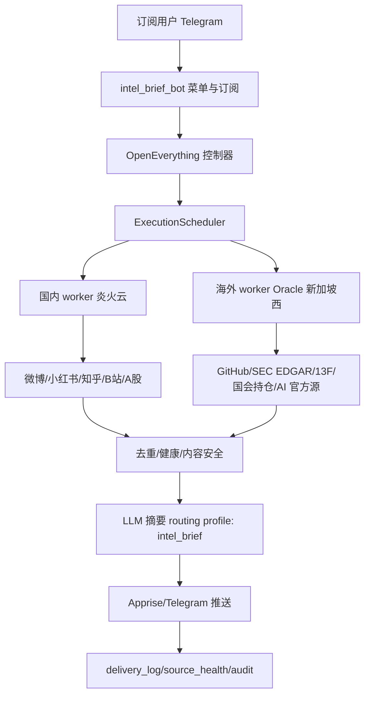

# Intel Brief Master Implementation Plan

> **For agentic workers:** REQUIRED SUB-SKILL: Use superpowers:subagent-driven-development (recommended) or superpowers:executing-plans to implement this plan task-by-task. Steps use checkbox (`- [ ]`) syntax for tracking.

**Goal:** 把“每日情报简报 Intel Brief”建设成 OpenEverything 内独立订阅产品，先完成方案、开源轮子搬运、运行基线文档，再分阶段做可验证生产变更。

**Architecture:** 采用“中央控制器 + 国内 worker + 海外 worker”的三层架构。OpenEverything 负责订阅、调度、摘要、推送和审计；国内 worker 优先承载微博/小红书/A 股等纯国内源；海外 worker 优先使用低负载 Oracle 新加坡西承载 GitHub、SEC EDGAR、AI 官方源、国会持仓等海外源。

**Tech Stack:** Python 3.12 / SQLite / Existing ExecutionScheduler / Existing LLM routing / Telegram 7-bot framework extension / Apprise / MediaCrawler / AKShare / edgartools / RSSHub / GitHub API / APScheduler-compatible scheduling.

## Global Constraints

- 先规划、先调研、先搬运评估，再做生产变更。
- 每个外部数据源上线前必须在目标运行环境真实调用，不能用 Mac 本地网络结果替代服务器证据。
- 涉及密钥、Token、Cookie、登录态，只记录存在性、位置和格式，不在文档中输出明文。
- 海外服务器优先使用低负载 Oracle 新加坡西；凭证在 VPS-Config 对应凭证目录中，执行时只读引用。
- 国内服务器优先使用炎火云；凭证在 VPS-Config 对应凭证目录中，执行时只读引用。
- 每落地一步必须同步 OpenEverything 与 VPS-Config 对应文档，避免基线漂移和部署回撤。
- 不在完成真实验证前声明 Phase 完成，不用 mock 数据冒充真实闭环。

---

## 1. 当前结论

### 1.1 先暂停继续写生产功能

当前最重要的工作不是继续堆代码，而是把 Intel Brief 的“产品边界、运行拓扑、开源轮子、验证门、部署记录”一次性理清。此前已落地的 `src/intel/*` 基础切片保留，但后续新增生产链路要以本文档为基线。

### 1.2 推荐的系统分层



### 1.3 Worker 角色定义

| 角色 | 首选节点 | 负责内容 | 不负责内容 | 文档基线 |
|---|---|---|---|---|
| Controller | OpenEverything 当前运行环境或后续主服务 | 订阅、配置、调度、DB、摘要、推送、审计 | 不直接抓取高风险社媒 | `docs/052-intel-brief-master-plan.md` |
| Domestic worker | 炎火云 | 微博、小红书、知乎、B站、A股、RSSHub 国内路由 | SEC/GitHub/海外官网 | `VPS-Config/docs/indexes/intel-brief-runtime-placement.public.md` |
| Overseas worker | Oracle 新加坡西低负载节点 | GitHub Trending、SEC EDGAR、13F、Senate、OpenAI/Anthropic/DeepSeek 官方源 | 需要国内风控稳定性的社媒登录 | `VPS-Config/docs/indexes/intel-brief-runtime-placement.public.md` |

---

## 2. 开源轮子调研结果

调研方式：2026-07-06 使用 `agent-reach doctor --json` 确认 GitHub 后端为 `gh CLI`，再使用 `gh search repos` 与 `gh repo view` 查询。以下星数和更新时间是调研时快照，实施前需要重新确认。

### 2.1 高价值轮子清单

| 类目 | 首选轮子 | 星数快照 | License 快照 | 用法判断 | 搬运方式 |
|---|---:|---:|---|---|---|
| 国内多平台社媒抓取 | [NanmiCoder/MediaCrawler](https://github.com/NanmiCoder/MediaCrawler) | 55,505 | Other | 首选。覆盖小红书、微博、抖音、快手、B站、贴吧、知乎，贴合本项目 | 作为独立 worker 子进程或服务封装，不直接混入主进程 |
| 微博专项备选 | [dataabc/weibo-crawler](https://github.com/dataabc/weibo-crawler) | 4,558 | 未声明 | 当 MediaCrawler 微博不稳定时备用 | 只借鉴数据字段和抓取流程，避免直接复制未知许可代码 |
| 微博免 Cookie 备选 | [XWang20/WeiboCrawler](https://github.com/XWang20/WeiboCrawler) | 165 | MIT | 可作为“尽量免登录”策略参考 | 小模块适配，优先测试公开页能力 |
| 小红书轻量备选 | [mcxiaoxiao/xiaohongshuCrawler](https://github.com/mcxiaoxiao/xiaohongshuCrawler) | 54 | MIT | 小而轻，能力弱于 MediaCrawler | 仅作为失败降级参考 |
| A 股数据 | [akfamily/akshare](https://github.com/akfamily/akshare) | 21,045 | MIT | 已在 Oracle Phase 0 部分验证可用 | 直接依赖，按接口粒度做健康追踪 |
| A 股备选 | [waditu/tushare](https://github.com/waditu/tushare) | 15,212 | BSD-3-Clause | 有 token/权限体系，适合后续增强 | 作为付费或注册后补充源，不进 MVP 硬依赖 |
| 通用金融平台 | [OpenBB-finance/OpenBB](https://github.com/OpenBB-finance/OpenBB) | 70,160 | Other | 功能很强但体量大，适合二期金融深度分析 | 不搬全量，先评估 API/SDK 子能力 |
| 量化研究 | [microsoft/qlib](https://github.com/microsoft/qlib) | 45,825 | MIT | 对“每日简报”过重，更适合交易研究 | 暂不进 MVP，留作投研增强 |
| SEC/13F | [dgunning/edgartools](https://github.com/dgunning/edgartools) | 2,448 | MIT | 已在 Oracle Phase 0 验证 13F 可用 | 直接依赖，放海外 worker |
| SEC 下载备选 | [jadchaar/sec-edgar-downloader](https://github.com/jadchaar/sec-edgar-downloader) | 710 | MIT | edgartools 失败时备用 | 只做下载层 fallback |
| Senate 持仓数据 | [timothycarambat/senate-stock-watcher-data](https://github.com/timothycarambat/senate-stock-watcher-data) | 96 | 未声明 | 已验证 raw GitHub 可用 | 只读 raw JSON，MVP 可用 |
| GitHub Trending API | [huchenme/github-trending-api](https://github.com/huchenme/github-trending-api) | 828 | MIT | 可直接复用 Trending 解析思路 | 优先用 GitHub 官方 API + 该项目作解析参考 |
| GitHub Star 历史 | [star-history/star-history](https://github.com/star-history/star-history) | 9,255 | MIT | 适合 star 增长图，不适合作为后端源 | 借鉴 star history 查询思路 |
| RSS 聚合 | [DIYgod/RSSHub](https://github.com/DIYgod/RSSHub) | 45,139 | AGPL-3.0 | 国内外源丰富，但 AGPL 有合规边界 | 独立部署/独立服务调用，避免代码混入闭源主仓 |
| RSS 产品参考 | [RSSNext/Folo](https://github.com/RSSNext/Folo) | 38,616 | AGPL-3.0 | 适合产品体验参考 | 不搬代码，只参考信息组织方式 |
| LLM 路由 | [BerriAI/litellm](https://github.com/BerriAI/litellm) | 52,777 | Other | OpenEverything 已有 routing；可借鉴监控和 fallback 设计 | 不替换现有 routing，后续只做兼容层评估 |
| 通知网关 | [caronc/apprise-api](https://github.com/caronc/apprise-api) | 1,242 | MIT | 现有 Apprise 可继续复用 | 不新增服务，先复用库能力 |
| 调度基础 | [agronholm/apscheduler](https://github.com/agronholm/apscheduler) | 7,555 | MIT | 现有 ExecutionScheduler 足够 | 不替换，只保持接口兼容 |

### 2.2 搬运优先级

| 优先级 | 搬运对象 | 原因 | 验证门 |
|---|---|---|---|
| P0 | MediaCrawler、AKShare、edgartools、Senate raw JSON、GitHub API/Trending | 直接覆盖 MVP 核心信息源 | 目标 worker 真实调用，写入 source_health |
| P1 | RSSHub 独立服务、dataabc/weibo-crawler、sec-edgar-downloader、Tushare | 增强覆盖率和稳定性 | 独立服务或 fallback 证据，不破坏主链路 |
| P2 | OpenBB、Qlib、Folo、Langfuse/LiteLLM 深度能力 | 提升金融深度、产品体验、观测能力 | 等 MVP 有真实用户和内容后再引入 |

### 2.3 许可与合规判断

- MIT/BSD 项目可以优先作为依赖或小范围适配。
- AGPL 项目如 RSSHub、Folo 不建议把代码复制进主仓；可以独立部署服务，通过 HTTP API 调用。
- 未声明 License 的项目不直接复制代码，只借鉴数据字段、接口形态和运行经验。
- MediaCrawler license 显示为 Other，实施前必须读仓库许可文件；建议以独立 worker 方式调用，降低主仓许可污染和运行风险。

---

## 3. 开发总路线

### Phase A：规划与基线冻结

产物：本文档、VPS-Config runtime placement 文档、OpenEverything changelog/index/health 更新。

验收：

- `docs/052-intel-brief-master-plan.md` 存在。
- `docs/003-docs-index.md` 登记本文档。
- VPS-Config 有 Intel Brief 节点放置基线，不含密钥明文。
- 本阶段不部署、不重启、不改生产配置。

### Phase B：搬运前预验证

产物：每个候选轮子的目标节点真实验证报告。

执行顺序：

1. Oracle 新加坡西：验证 `edgartools`、Senate raw GitHub、GitHub Trending/API、OpenAI/Anthropic/DeepSeek 官方源。
2. 炎火云：验证 MediaCrawler 微博/小红书、AKShare、RSSHub 国内路由。
3. Controller：验证只调度、不直接抓高风险社媒。

证据格式：

```text
source=<数据源>
worker=<oracle-sg-west|yanhuoyun|controller>
timestamp=<UTC 时间>
command=<脱敏命令>
status=<success|partial|failed>
sample=<脱敏样本 3 行以内>
limit=<限速/登录态/额度说明>
```

### Phase C：统一 Source Adapter

目标：把所有轮子收敛成统一接口，避免每个数据源散落特殊逻辑。

接口草案：

```python
@dataclass(frozen=True)
class IntelSourceResult:
    source: str
    worker: str
    fetched_at: str
    items: list[dict[str, Any]]
    raw_count: int
    health_status: str
    evidence_path: str

class IntelSourceAdapter(Protocol):
    source_name: str

    def fetch(self, *, limit: int = 20) -> IntelSourceResult:
        """从目标数据源抓取真实数据并返回统一结果。"""
```

### Phase D：多服务器调度接入

目标：将已存在的 `src/intel/runtime_policy.py` 接入 `ExecutionScheduler`，按 source 自动派发到国内/海外 worker。

最小策略：

- `preferred_worker=domestic`：派发炎火云 worker。
- `preferred_worker=overseas`：派发 Oracle 新加坡西 worker。
- `preferred_worker=controller`：仅在本地或主服务执行轻量任务。
- worker 不可达时：记录 `source_health`，不静默降级到错误地区抓取。

### Phase E：内容安全、去重、摘要

目标：真实数据进入摘要前必须经过去重、source_health、内容安全过滤。

顺序：

1. `dedup.py`：按 URL、标题 hash、证券代码、人物名、时间窗口去重。
2. `content_moderation.py`：已有基础模块，接入全链路。
3. `llm_routing.json`：新增 `intel_brief` profile，低稳定 provider 后置。
4. 摘要验收：用真实抓取数据，不用 mock 数据。

### Phase F：订阅与推送闭环

目标：Telegram 第 8 Bot、订阅 DB、偏好设置、推送日志闭环。

先做：

- 订阅状态、套餐、到期提醒。
- 自定义人物输入进入 `tracking_targets`，按目标限流和审计。
- Telegram 菜单只展示已验证数据源。

后做：

- 微信/飞书/钉钉适配层。
- 支付和售卖渠道接入。
- X/Reddit/Instagram，需另行确认网络出口和账号风险。

---

## 4. 可执行任务拆分

### Task 1: 文档基线与架构冻结

**Files:**
- Create: `docs/052-intel-brief-master-plan.md`
- Create: `/Users/blackdj/Documents/VPS-Config/docs/indexes/intel-brief-runtime-placement.public.md`
- Modify: `docs/002-changelog.md`
- Modify: `docs/003-docs-index.md`
- Modify: `docs/009-health.md`

**Interfaces:**
- Consumes: 用户本轮决策、GitHub 调研快照、现有 `src/intel/runtime_policy.py`
- Produces: 后续所有 Intel Brief 生产变更的文档基线

- [x] **Step 1: 写入 OpenEverything 主计划文档**

Run: `test -f docs/052-intel-brief-master-plan.md && echo exists`
Expected: `exists`

- [x] **Step 2: 写入 VPS-Config 节点放置文档**

Run: `test -f /Users/blackdj/Documents/VPS-Config/docs/indexes/intel-brief-runtime-placement.public.md && echo exists`
Expected: `exists`

- [x] **Step 3: 更新索引和变更记录**

Run: `grep -n "052-intel-brief-master-plan" docs/003-docs-index.md && grep -n "Intel Brief 总体方案" docs/002-changelog.md`
Expected: 两条命令均能找到对应记录。

### Task 2: Worker 预验证脚本与证据格式

**Files:**
- Create: `packages/clawbot/scripts/intel_worker_probe.py`
- Create: `packages/clawbot/tests/test_intel_worker_probe.py`
- Modify: `docs/006-registries.md`
- Modify: `docs/009-health.md`

**Interfaces:**
- Consumes: `src/intel/runtime_policy.resolve_runtime_policy(source_name)`
- Produces: `probe_result` JSON，字段为 `source`、`worker`、`timestamp`、`status`、`sample`、`limit`

- [x] **Step 1: 先写失败测试**

```python
from src.intel.runtime_policy import resolve_runtime_policy


def test_oracle_sources_route_to_overseas_worker():
    policy = resolve_runtime_policy("sec_edgar")
    assert policy.preferred_worker == "overseas"


def test_domestic_sources_route_to_domestic_worker():
    policy = resolve_runtime_policy("xiaohongshu")
    assert policy.preferred_worker == "domestic"
```

Run: `cd packages/clawbot && .venv312/bin/python -m pytest tests/test_intel_worker_probe.py -q`
Expected before implementation: FAIL because probe script is missing.

- [x] **Step 2: 实现只读 probe，不连接生产服务**

```python
from __future__ import annotations

import json
from datetime import UTC, datetime
from pathlib import Path

from src.intel.runtime_policy import resolve_runtime_policy


def build_probe_result(source: str, status: str = "not_run") -> dict[str, str]:
    policy = resolve_runtime_policy(source)
    return {
        "source": source,
        "worker": policy.preferred_worker,
        "timestamp": datetime.now(UTC).isoformat(),
        "status": status,
        "sample": "",
        "limit": "not_verified",
    }


def write_probe_result(source: str, output_path: str | Path) -> dict[str, str]:
    result = build_probe_result(source)
    Path(output_path).write_text(json.dumps(result, ensure_ascii=False, indent=2), encoding="utf-8")
    return result
```

Run: `cd packages/clawbot && .venv312/bin/python -m pytest tests/test_intel_worker_probe.py -q`
Expected after implementation: PASS.

### Task 3: Source Adapter 统一接口

**Files:**
- Create: `packages/clawbot/src/intel/sources/base.py`
- Create: `packages/clawbot/tests/test_intel_source_adapter_base.py`
- Modify: `packages/clawbot/src/intel/sources/congress_trading.py`

**Interfaces:**
- Produces: `IntelSourceResult` dataclass and `IntelSourceAdapter` Protocol
- Consumes: existing Senate parser

- [x] **Step 1: 写失败测试**

```python
from src.intel.sources.base import IntelSourceResult


def test_source_result_carries_evidence_path():
    result = IntelSourceResult(
        source="senate_trading",
        worker="overseas",
        fetched_at="2026-07-06T00:00:00Z",
        items=[{"ticker": "BYND"}],
        raw_count=1,
        health_status="success",
        evidence_path="/tmp/evidence.json",
    )
    assert result.evidence_path.endswith("evidence.json")
```

Run: `cd packages/clawbot && .venv312/bin/python -m pytest tests/test_intel_source_adapter_base.py -q`
Expected before implementation: FAIL because `src.intel.sources.base` is missing.

- [x] **Step 2: 实现最小接口**

```python
from __future__ import annotations

from dataclasses import dataclass
from typing import Any, Protocol


@dataclass(frozen=True)
class IntelSourceResult:
    source: str
    worker: str
    fetched_at: str
    items: list[dict[str, Any]]
    raw_count: int
    health_status: str
    evidence_path: str


class IntelSourceAdapter(Protocol):
    source_name: str

    def fetch(self, *, limit: int = 20) -> IntelSourceResult:
        """从目标数据源抓取真实数据并返回统一结果。"""
```

Run: `cd packages/clawbot && .venv312/bin/python -m pytest tests/test_intel_source_adapter_base.py -q`
Expected after implementation: PASS.

### Task 4: 开源轮子逐项真实验证

**Files:**
- Create evidence files under `packages/clawbot/data/intel_evidence/`
- Modify: `docs/084-intel-brief-implementation-report.md`
- Modify: `/Users/blackdj/Documents/VPS-Config/docs/indexes/intel-brief-runtime-placement.public.md`

**Interfaces:**
- Consumes: Task 2 probe JSON format
- Produces: 每个数据源一条真实验证记录

- [ ] **Step 1: Oracle 新加坡西验证海外源**

Run from target server, not Mac:

```bash
python - <<'PY'
from src.intel.sources.congress_trading import fetch_senate_transactions
print(fetch_senate_transactions(limit=1)[0])
PY
```

Expected: 输出一条脱敏 Senate transaction，包含 `source` 和 `ticker` 字段。

- [ ] **Step 2: 炎火云验证国内源**

Run from target server, not Mac:

```bash
python - <<'PY'
import akshare as ak
print(ak.stock_lhb_detail_em().head(1).to_dict(orient="records"))
PY
```

Expected: 输出一条脱敏 A 股龙虎榜记录。

- [ ] **Step 3: MediaCrawler 登录态验证**

Run from domestic worker after account login state is prepared:

```bash
python main.py --platform xhs --lt cookie --type search --keywords AI --save_data_option json
```

Expected: 输出至少一条小红书搜索结果；若被风控要求扫码，记录为 `partial`，不宣称无人值守完成。

### Task 5: Scheduler 派发接入

**Files:**
- Modify: `packages/clawbot/src/execution/intel_brief.py`
- Modify: existing scheduler registration file discovered before implementation
- Create: `packages/clawbot/tests/test_intel_scheduler_dispatch.py`
- Modify: `docs/006-registries.md`

**Interfaces:**
- Consumes: `resolve_runtime_policy(source_name)`
- Produces: `dispatch_source_job(source_name: str) -> dict[str, str]`

- [x] **Step 1: 写失败测试**

```python
from src.execution.intel_brief import dispatch_source_job


def test_dispatch_uses_runtime_policy_for_domestic_source():
    result = dispatch_source_job("weibo")
    assert result["worker"] == "domestic"


def test_dispatch_uses_runtime_policy_for_overseas_source():
    result = dispatch_source_job("sec_edgar")
    assert result["worker"] == "overseas"
```

Run: `cd packages/clawbot && .venv312/bin/python -m pytest tests/test_intel_scheduler_dispatch.py -q`
Expected before implementation: FAIL because `dispatch_source_job` is missing.

- [x] **Step 2: 最小实现只返回派发计划，不触发远程执行**

```python
from src.intel.runtime_policy import resolve_runtime_policy


def dispatch_source_job(source_name: str) -> dict[str, str]:
    policy = resolve_runtime_policy(source_name)
    return {
        "source": policy.source_name,
        "worker": policy.preferred_worker,
        "region_hint": policy.region_hint,
        "reason": policy.reason,
    }
```

Run: `cd packages/clawbot && .venv312/bin/python -m pytest tests/test_intel_scheduler_dispatch.py -q`
Expected after implementation: PASS.

---

## 5. 更高收益的提升建议

1. **证据包优先于功能数量**：每个数据源都生成 `evidence_path`，摘要里能追溯每条内容来自哪次真实调用。这样付费产品更可信，也能快速排障。
2. **把 worker 做成“可替换执行器”**：国内/海外 worker 只暴露统一 JSON 输入输出，不和主 DB 强耦合。未来炎火云不稳定时，可以换腾讯云、阿里云或另一台 Oracle，不需要改业务代码。
3. **内容源分级售卖**：免费试读只给 GitHub/AI 官方源；付费基础版给 A 股/国会/13F；高价版给社媒人物追踪和定制关键词。这样成本和风控压力随价格分层。
4. **源健康面板**：把 `source_health` 做成运营看板，显示最近成功时间、失败原因、连续失败次数、登录态剩余有效性。比等用户投诉更早发现问题。
5. **社媒抓取“低频缓存池”**：同一个人物或关键词全站共享抓取结果，用户订阅数增加时不增加抓取频率，降低封号和骚扰风险。
6. **LLM 摘要双轨**：先用小模型做结构化提取和去重，再用稳定大模型写最终简报。这样既省 token，也减少幻觉。
7. **AGPL 组件服务化**：RSSHub/Folo 这类 AGPL 项目只独立部署和 API 调用，不复制进主仓，降低许可证风险。
8. **上线前自然日演练**：每次增加数据源后至少跑满一个自然日，报告成功率、空结果率、重复率、token 成本和推送延迟。

---

## 6. 不进入本轮生产的事项

- 不创建或购买新的服务器。
- 不重启 Oracle、炎火云或本地服务。
- 不写入真实 Telegram Bot Token。
- 不保存微博/小红书 Cookie 或二维码截图。
- 不接入支付或定价自动化。
- 不接入 X/Reddit/Instagram，除非后续明确确认网络出口和账号策略。


## 7. Phase C/D 生产闭环支架进展（2026-07-06）

本节记录用户允许进入 Phase B 后的连续推进状态：Phase B 不作为终点，已向 Phase C/D 建立本地可验证支架，但仍保持不部署、不重启、不写入凭证。

| 阶段 | 本轮状态 | 证据 | 边界 |
|---|---|---|---|
| Phase C Source Adapter | 已完成最小统一接口：`IntelSourceResult` / `IntelSourceAdapter`，并把 Senate raw GitHub fallback 封装为 `SenateTransactionsAdapter`。 | `packages/clawbot/tests/test_intel_source_adapter_base.py`；`packages/clawbot/data/intel_evidence/phasec/20260706T230209Z-controller-source-adapter-plan.json` | 本轮只验证接口契约和已验证 Senate 源的封装；没有新增外部调用。 |
| Phase D Dispatch Plan | 已完成 `src/execution/intel_brief.py` 的 plan-only 派发函数：按 `runtime_policy` 输出 domestic/overseas/controller 计划。 | `packages/clawbot/tests/test_intel_scheduler_dispatch.py`；`packages/clawbot/data/intel_evidence/phased/20260706T230209Z-controller-dispatch-plan.json` | 只生成计划，不 SSH、不远程执行、不注册 scheduler、不推送 Telegram。 |
| 测试基线 | Intel Brief 相关测试 20 个通过。 | `cd packages/clawbot && .venv312/bin/python -m pytest tests/test_intel_schema_and_tracking.py tests/test_intel_content_moderation.py tests/test_intel_congress_trading.py tests/test_intel_runtime_policy.py tests/test_intel_worker_probe.py tests/test_intel_source_adapter_base.py tests/test_intel_scheduler_dispatch.py -q` → `20 passed` | 仅证明本地契约正确，不等于生产数据源全链路已闭环。 |

下一步进入生产闭环前的硬门槛：恢复/确认 Oracle SGW 管理执行路径，或由用户明确授权 Oracle Ashburn 作为临时海外 worker；同时继续在炎火云验证 MediaCrawler 登录态与无人值守可行性。

## 8. Phase D/E 生产闭环支架追加进展（2026-07-06）

本节继续推进“不能停在 Phase B”的目标：在不触发远程执行、不写凭证、不注册生产调度的前提下，把 controller 与 worker 的边界、以及 source_health 可观测入口补齐。

| 阶段 | 本轮状态 | 证据 | 边界 |
|---|---|---|---|
| Phase D Worker Contract | 已新增 `IntelWorkerRequest` / `IntelWorkerResponse`，controller 派发计划内包含 JSON-safe `worker_request`。 | `packages/clawbot/tests/test_intel_worker_contract.py`；`packages/clawbot/data/intel_evidence/phased/20260706T230933Z-controller-worker-contract-plan.json` | 只生成可发送给 worker 的请求结构；没有 SSH、没有远程命令、没有部署。 |
| Phase E Source Health | 已新增 `record_source_health` / `get_source_health`，支持 success 恢复清零、failure 连续计数。 | `packages/clawbot/tests/test_intel_schema_and_tracking.py`；`packages/clawbot/data/intel_evidence/phasee/20260706T230933Z-source-health-seed.json` | 使用临时 SQLite DB 验证 helper；没有创建或修改生产 DB。 |
| SGW 管理路径排查 | 只读搜索确认 VPS-Config 已有 SGW bootstrap/readiness SOP，且 SOP 明确把 Mac SSH banner timeout 归类为 management-path mismatch；当前 `~/.ssh/config` 未发现 SGW alias。 | 终端只读 grep；VPS-Config `tools/oracle-new-server-onboarding-package.sh`、`tools/status-beszel-sgw-readiness.sh` | 不修改安全组、不新增 SSH alias、不打开新 Mac /32；SGW 仍未达到生产执行证据门槛。 |

下一步生产闭环门槛：把 `worker_request` 真正交给已验证 worker 执行前，必须先确认 SGW 管理路径或明确授权 Ashburn fallback；国内 worker 侧仍需 MediaCrawler 登录态真实验证。

## 9. Phase E Worker Runner 与 SGW Read-only Preflight（2026-07-06）

本节继续推进从 controller plan-only 到可部署 worker 闭环的中间层：worker 本地执行器已能接收 JSON-safe request、调用已注册 adapter、返回 response，并可写入 source_health。SGW 侧完成一次 OCI read-only preflight，证明 OCI API 只读认证/用量查询可运行，但仍不等于 SGW SSH 管理路径和生产 worker 执行已闭合。

| 项目 | 状态 | 证据 | 边界 |
|---|---|---|---|
| Worker local runner | 已新增 `execute_worker_request` / `execute_worker_request_json`，支持 request JSON → adapter → response JSON → source_health。 | `packages/clawbot/tests/test_intel_worker_runner.py`；`packages/clawbot/data/intel_evidence/phasee/20260706T232159Z-worker-runner-local-contract.json` | 本地注入 adapter 验证；没有远程 worker、没有 SSH、没有生产 DB。 |
| Adapter registry | 已新增 `build_default_source_adapters`，当前只注册已有 Phase B 证据的 `senate_trading`。 | `packages/clawbot/tests/test_intel_source_adapter_base.py` | 未验证的数据源不进入默认 registry，避免未验证源被生产调用。 |
| SGW read-only preflight | 已运行 `make oracle-sg-west-readonly-preflight`，OCI read-only API run 为 `completed-with-launch-blockers`，总状态 `blocked-launch-prerequisites`，`PRODUCTION_ACTION none`。 | `/Users/blackdj/Documents/VPS-Config/credentials/generated/oracle-sg-west-readonly-preflight/20260706T232032Z-oracle-sg-west-readonly-preflight.private.md` | 只证明 SGW OCI 配置/只读 API 可用；不证明 SSH 管理路径恢复，也没有创建/删除/重启/改网络。 |

下一步进入生产执行前仍需：恢复/确认 SGW SSH 管理路径；在目标 worker 上运行 `execute_worker_request_json`；把真实响应写入 Intel Brief DB 的 source_health；再考虑 scheduler 注册。

## 10. Phase E Worker CLI 入口与 fallback readiness（2026-07-06）

本节把 worker runner 暴露为目标节点可执行的 CLI 入口，为后续 SGW/炎火云真实 worker 执行做准备。CLI 已能从 stdin 或文件读取 `IntelWorkerRequest` JSON，执行默认 adapter registry，并把结果写入可选 SQLite `source_health`。

| 项目 | 状态 | 证据 | 边界 |
|---|---|---|---|
| Worker CLI | 已新增 `scripts/intel_worker_cli.py`，支持 stdin / `--input` / `--db`，成功返回 0，业务失败返回 2，JSON 解析错误返回 1。 | `packages/clawbot/tests/test_intel_worker_cli.py`；`packages/clawbot/data/intel_evidence/phasee/20260706T233517Z-worker-cli-local-execution.json` | 本地 Mac/controller 执行，不替代目标 worker 运行证据。 |
| CLI 真实样本 | 本地 CLI 调用 `senate_trading` 默认 adapter 成功，返回 BYND / Ron L Wyden 样本，并写入临时 source_health。 | `packages/clawbot/data/intel_evidence/phasee/20260706T233517Z-worker-cli-local-execution.json` | 真实外部调用发生在本地，不可当作 SGW/炎火云网络证据。 |
| Oracle Ashburn fallback readiness | 只读 SSH 检查 `oracle-arm1` 可访问，Python 3.12.3；常见路径未发现 OpenEverything 项目。 | `packages/clawbot/data/intel_evidence/phasee/20260706T233541Z-oracle-arm1-worker-cli-readiness-readonly.json` | 未拷贝文件、未创建 venv、未部署；要在 fallback 运行 CLI 需另行 staging/同步和回滚记录。 |

下一步如果继续推进目标节点真实执行，有两个分支：一是恢复 SGW 管理路径后在 SGW 运行 CLI；二是明确授权 Ashburn fallback 临时 staging，用 `/tmp` 或受控目录同步最小代码后运行，并写回证据与回滚路径。

## 11. Phase E Worker Bundle 与 oracle-arm1 fallback 真实远程执行（2026-07-06）

本节首次把 Intel worker CLI 以最小 bundle 方式放到目标海外 fallback 节点执行，并完成回滚清理。该证据证明“controller 生成的 JSON request → 远程 worker CLI → adapter 真实抓取 → response JSON → source_health DB”的最小链路可以在 Oracle Ashburn fallback 上跑通；但它不替代首选 Oracle SGW 的生产 worker 证据。

| 项目 | 状态 | 证据 | 回滚/边界 |
|---|---|---|---|
| Worker bundle | 已新增 `scripts/intel_worker_bundle.py`，生成只含 CLI/Intel runtime/schema 的最小 bundle，manifest 含 `secrets_included=false` 与 rollback cleanup。 | `packages/clawbot/tests/test_intel_worker_bundle.py`；`packages/clawbot/data/intel_evidence/phasee/20260706T234228Z-worker-bundle-local-evidence.json` | Bundle 不含密钥/服务文件/生产配置；删除 bundle 目录即回滚。 |
| oracle-arm1 fallback 远程执行 | 临时 staging 到 `/tmp/openclaw-intel-worker-20260706T234325Z`，执行 `senate_trading` 成功，返回 BYND / Ron L Wyden 样本，source_health failure_count=0。 | `packages/clawbot/data/intel_evidence/phasee/20260706T234325Z-oracle-arm1-worker-cli-remote-execution.json` | 已执行 `rm -rf /tmp/openclaw-intel-worker-20260706T234325Z`，二次验证 `remote_stage_absent`；没有 systemd/cron/config/Token/Cookie 变更。 |

下一步：若 SGW 管理路径仍未恢复，可把同一 bundle 流程用于炎火云 domestic worker 的非登录源（如 AKShare adapter）验证；社媒 MediaCrawler 仍需要登录态/账号决策，不能用此 Senate 证据替代。

## 12. Phase E Domestic Worker AKShare 真实远程执行（2026-07-06/UTC 2026-07-07）

本节把已在 Phase B 验证过的炎火云国内节点推进到 worker CLI 真实执行：新增 AKShare 龙虎榜 adapter，纳入默认 registry/bundle，在炎火云 `/tmp` 临时 staging + 临时 venv 中执行成功，并清理回滚。

| 项目 | 状态 | 证据 | 回滚/边界 |
|---|---|---|---|
| AKShare adapter | 已新增 `AkshareLhbAdapter`，调用 `akshare.stock_lhb_detail_em()` 并归一化为 `code/name/reason/close_price`。 | `packages/clawbot/tests/test_intel_astock_flow.py` | `akshare` lazy import；controller 本地无需安装该依赖。 |
| Registry / bundle | 默认 registry 已包含 `akshare`；worker bundle 已包含 `src/intel/sources/astock_flow.py`。 | `packages/clawbot/tests/test_intel_source_adapter_base.py`；`packages/clawbot/tests/test_intel_worker_bundle.py` | 仅因 Phase B 已有炎火云 AKShare 证据才加入 registry。 |
| Python 3.10 兼容 | 修复 `datetime.UTC` 导致炎火云 Python 3.10 ImportError；改为 `timezone.utc`，并加静态回归测试。 | `packages/clawbot/tests/test_intel_python310_compat.py`；失败证据 `packages/clawbot/data/intel_evidence/phasee/20260706T235130Z-yanhuoyun-akshare-worker-cli-remote-execution.json` | 兼容修复不改变业务逻辑。 |
| CLI stdout 纯 JSON | 修复 AKShare/tqdm 进度条污染取证输出问题；worker runner 捕获 adapter stdout，远程取证分离 stdout/stderr。 | `packages/clawbot/tests/test_intel_worker_runner.py`；clean evidence `packages/clawbot/data/intel_evidence/phasee/20260707T000126Z-yanhuoyun-akshare-worker-cli-clean-stdout.json` | 第三方进度条可在 stderr 出现；stdout 已验证为单个 response JSON。 |
| 炎火云 remote execution | 临时 staging 到 `/tmp/openclaw-intel-worker-20260707T000126Z`，临时 venv 安装 `akshare==1.18.64`，执行成功，返回 `000021` / `深科技`，source_health `failure_count=0`。 | `packages/clawbot/data/intel_evidence/phasee/20260707T000126Z-yanhuoyun-akshare-worker-cli-clean-stdout.json` | cleanup_ok + `remote_stage_absent`；无 systemd/cron/生产配置/Token/Cookie/持久项目目录。 |

当前 production loop 状态：海外 fallback（oracle-arm1 / Senate）与国内 worker（炎火云 / AKShare）都已有临时 worker CLI 真实执行证据；仍未进入常驻服务、scheduler 注册、Telegram 推送和完整自然日演练。

## 13. Phase E Remote Runner 固化与双 worker 复核（2026-07-07）

本节把前几轮手工 SSH/tar/CLI 的临时执行流程固化为 `scripts/intel_worker_remote_run.py`：构建 bundle、远程 `/tmp` staging、执行 worker CLI、查询 source_health、cleanup、写 evidence。随后用同一脚本复核海外 fallback 与国内 worker 两条已验证数据源路径。

| 项目 | 状态 | 证据 | 回滚/边界 |
|---|---|---|---|
| Remote runner script | 已新增 `scripts/intel_worker_remote_run.py`，支持 `--source`、`--ssh-target`、`--worker-label`、`--pip-package`、`--output`。 | `packages/clawbot/tests/test_intel_worker_remote_runner.py` | 只做临时 staging，不创建服务/cron/systemd/生产配置。 |
| oracle-arm1 / Senate 复核 | 使用 remote runner 执行 `senate_trading` 成功，返回 BYND / Ron L Wyden，source_health `failure_count=0`。 | `packages/clawbot/data/intel_evidence/phasee/20260707T001230Z-remote-runner-oracle-arm1-senate.json` | cleanup_ok + `remote_stage_absent`；仍为 Ashburn fallback，不是 SGW。 |
| 炎火云 / AKShare 复核 | 使用 remote runner + 临时 pip package 执行 `akshare` 成功，返回 `000021` / `深科技`，source_health `failure_count=0`。 | `packages/clawbot/data/intel_evidence/phasee/20260707T001324Z-remote-runner-yanhuoyun-akshare.json` | cleanup_ok + `remote_stage_absent`；不验证社媒登录态。 |

当前生产闭环推进状态：已有一个可重复的远程执行原语，且已在海外 fallback 与国内 worker 两边跑通各一个非登录数据源。下一步才能安全讨论把该 remote runner 接到 scheduler 的受控 dispatch 层；但在 SGW 管理路径、MediaCrawler 登录态、Telegram token 未闭合前，仍不能启用完整生产推送。

## 14. Phase F-pre Collect Once 多源远程采集（2026-07-07）

本节把已验证的 remote runner 再向上封装为 controller 一次性多源采集编排：`scripts/intel_collect_once.py` 按 source 找到 worker profile，调用 remote runner，聚合 child evidence，形成一个 collection evidence。该层是接入 scheduler 前的受控编排原语。

| 项目 | 状态 | 证据 | 回滚/边界 |
|---|---|---|---|
| Collect-once script | 已新增 `scripts/intel_collect_once.py`，支持 `--source` 多次指定、`--output` 聚合报告、`--evidence-dir` child run 目录。 | `packages/clawbot/tests/test_intel_collect_once.py` | 只编排已登记 worker profile 的源；未知源失败且不远程执行。 |
| 多源真实采集 | 一次性采集 `senate_trading` + `akshare` 成功；海外 fallback 与国内 worker child run 均 cleanup_ok / `remote_stage_absent`。 | `packages/clawbot/data/intel_evidence/phasef/20260707T002040Z-collect-once-senate-akshare.json` | one-shot collection；未注册 scheduler，未部署服务，未推送 Telegram。 |
| Child evidence | Senate child：BYND / Ron L Wyden；AKShare child：000021 / 深科技；两者 source_health failure_count=0。 | `packages/clawbot/data/intel_evidence/phasef/20260707T002040Z-child-runs/` | 仍只覆盖非登录源；社媒/MediaCrawler 未验证。 |

当前生产闭环推进状态：controller 已能一次性调度两个已验证 worker/source 并聚合结果。下一步可以在不启用 Telegram/生产 scheduler 的前提下，做“内容质控 + 简报草稿生成”的 dry-run；或先继续补 SGW preferred worker 管理路径。

## 15. Phase F Dry-run 简报生成（2026-07-07）

本节继续推进“采集成功以后必须走向生产闭环”的目标：在不调用 LLM、不推送 Telegram、不注册 scheduler 的前提下，把真实 collect-once 证据转换为可读 Markdown 简报草稿，并在生成前统一执行去重与内容过滤入口。

| 项目 | 状态 | 证据 | 回滚/边界 |
|---|---|---|---|
| Brief builder | 已新增 `src/intel/brief_builder.py`，支持从 collect evidence 提取条目、按数据源规范化展示字段、stable-key 去重、调用 `content_moderation`、生成 Markdown/JSON evidence。 | `packages/clawbot/tests/test_intel_brief_dry_run.py` | 只转换已有 evidence，不访问外部数据源，不写生产 DB。 |
| Dry-run CLI | 已新增 `scripts/intel_brief_dry_run.py`，从 collect evidence 生成 dry-run Markdown 与 JSON。 | `packages/clawbot/tests/test_intel_brief_dry_run.py` | 不调用 LLM，不推送 Telegram，不注册 scheduler。 |
| 真实 dry-run | 使用真实 `senate_trading` + `akshare` collect evidence 生成简报草稿成功：source_count=2、rendered_count=2、deduped_count=0、moderated_count=0。 | `packages/clawbot/data/intel_evidence/phasef/20260707T003755Z-brief-dry-run.md`；`packages/clawbot/data/intel_evidence/phasef/20260707T003755Z-brief-dry-run.json` | 当前只是草稿生成层；未进行 LLM 摘要、订阅者筛选、Telegram 发送、自然日定时任务。 |

当前生产闭环推进状态：已形成“真实远程采集 → 聚合 evidence → 质控/去重 → Markdown dry-run 草稿”的可重复小闭环。下一步应在同样证据标准下接入 LLM routing 的摘要生成 dry-run，随后再进入订阅者筛选与 Telegram 沙盒推送。

### 15.1 Dry-run 验证基线（2026-07-07T00:41Z）

最终验证 evidence：`packages/clawbot/data/intel_evidence/phasef/20260707T004119Z-brief-dry-run-verification.json`。结果：`ruff` 通过，Intel Brief 相关 pytest `54 passed`，OpenEverything/VPS-Config `git diff --check` 均通过。该验证只覆盖 dry-run 内容生成层，不覆盖 LLM摘要、Telegram推送、scheduler注册或自然日演练。

## 16. Phase G LLM 摘要 dry-run（2026-07-07）

本节把 Phase F 的 dry-run 简报草稿继续推进到 LLM 摘要层：输入仍然是已经真实远程采集并经过内容过滤/去重的 dry-run evidence；输出为 LLM summary dry-run evidence。该层仍不做 Telegram 推送、scheduler 注册或生产 DB 写入。

| 项目 | 状态 | 证据 | 回滚/边界 |
|---|---|---|---|
| LLM routing profile | 已在 `config/llm_routing.json` 增加 `routing_profiles.intel_brief`，生产偏好链为 `qwen/gemini/gpt-oss/deepseek/llama/gemma/g4f`；dry-run 家族为 `intel_local/gemma/g4f/qwen`。 | `packages/clawbot/tests/test_intel_llm_summary.py` | 只是配置与调用入口；不写入任何 API Key。 |
| Local dry-run family | 已把本地 Ollama `qwen2.5:1.5b` 登记为 `intel_local` family，并把 `fallback_chains.intel_local=[]`，用于本地取证时避免触发外部 provider fallback。 | `packages/clawbot/config/llm_routing.json`；`packages/clawbot/data/intel_evidence/phaseg/20260707T005640Z-llm-summary-dry-run-intel-local.json` | 本地模型只用于 dry-run 证据；不代表最终付费产品摘要质量。 |
| LLM summary builder | 新增 `src/intel/llm_summary.py` 与 `scripts/intel_llm_summary_dry_run.py`，支持读取 Phase F dry-run JSON、构造中文情报摘要 prompt、调用现有 LiteLLM routing、记录 token usage、失败时生成抽取式 fallback evidence。 | `packages/clawbot/tests/test_intel_llm_summary.py` | 不抓取外部数据源，不推送 Telegram，不注册 scheduler。 |
| 首次真实调用障碍 | `gemma` family 指向本地 8B Ollama 模型，20s timeout 内未返回，随后按现有 Router fallback 链尝试外部 provider，暴露出部分 Key auth/model 问题；结果为 `partial_fallback`。 | `packages/clawbot/data/intel_evidence/phaseg/20260707T005033Z-llm-summary-dry-run.json` | 该证据是失败/降级证据，不作为 LLM 成功闭环。 |
| 成功 LLM dry-run | 使用 `--family intel_local --max-tokens 160`，通过现有 LiteLLM routing 调用本地 Ollama `qwen2.5:1.5b` 成功，prompt_tokens=353、completion_tokens=159、total_tokens=512。 | `packages/clawbot/data/intel_evidence/phaseg/20260707T005640Z-llm-summary-dry-run-intel-local.md`；`.json` | 证明“真实采集数据 → LLM routing → 摘要 evidence”本地闭环可跑；仍未验证生产 provider 成本/质量/稳定性。 |

当前生产闭环推进状态：已形成“真实远程采集 → 聚合 evidence → 内容质控/去重 → Markdown dry-run → LLM routing 摘要 dry-run”的可重复链路。下一步应进入订阅者/渠道层沙盒：先用测试订阅者和本地/假 Telegram sender 生成 delivery evidence，再等待真实第8个 bot token 做 Telegram 沙盒推送。

### 16.1 LLM 摘要验证基线（2026-07-07T01:00Z）

最终验证 evidence：`packages/clawbot/data/intel_evidence/phaseg/20260707T010034Z-llm-summary-postdocs-verification.json`。结果：`llm_routing.json` JSON 校验通过；变更范围 `ruff` 通过；Intel Brief + LLM routing 相关 pytest `148 passed`；OpenEverything/VPS-Config `git diff --check` 均通过。该验证覆盖 LLM 摘要 dry-run 支架与本地 routing 成功证据，不覆盖生产 Telegram、scheduler、常驻 worker 或自然日演练。

## 17. Phase H 订阅者与投递层沙盒（2026-07-07）

本节继续推进到“订阅者/投递”层，但仍严格不接触真实 Telegram Bot Token：使用 sandbox SQLite DB、测试订阅者、fake Telegram sender 和 JSONL outbox 验证投递路径。输入是 Phase G 已成功的 LLM summary dry-run evidence。

| 项目 | 状态 | 证据 | 回滚/边界 |
|---|---|---|---|
| Delivery sandbox module | 新增 `src/intel/delivery.py`，支持 sandbox subscriber/plan/subscription/source_preferences 写入、摘要消息渲染、fake Telegram outbox、`delivery_log` 写入。 | `packages/clawbot/tests/test_intel_delivery_sandbox.py` | 只写入指定 sandbox DB；不触碰 `packages/clawbot/data/intel_brief.db` 或任何生产 DB。 |
| Delivery sandbox CLI | 新增 `scripts/intel_delivery_sandbox.py`，从 LLM summary evidence 生成 fake Telegram 投递 evidence。 | `packages/clawbot/tests/test_intel_delivery_sandbox.py` | 不读取 Telegram Token，不调用 Bot API。 |
| 真实 sandbox run | 使用 `20260707T005640Z-llm-summary-dry-run-intel-local.json` 作为输入，创建 1 个测试订阅者，fake sender 写出 1 条 outbox，`delivery_log_count=1`，`network_calls=0`。 | `packages/clawbot/data/intel_evidence/phaseh/20260707T010624Z-delivery-sandbox.json`；`.db`；`fake-telegram-outbox.jsonl` | 回滚删除 evidence 中 `rollback` 三个路径；未注册 scheduler、未创建常驻服务、未推送真实 Telegram。 |

当前生产闭环推进状态：已形成“真实远程采集 → 聚合 evidence → 内容质控/去重 → LLM 摘要 dry-run → 订阅者筛选/投递日志/fake Telegram outbox”的本地可审计闭环。下一步的硬门槛是用户提供第8个 `intel_brief_bot` 的真实 Token 与沙盒 chat id，才能做真实 Telegram Bot API 沙盒推送；否则只能继续完善本地调度/自然日 dry-run。

### 17.1 投递沙盒验证基线（2026-07-07T01:08Z）

最终验证 evidence：`packages/clawbot/data/intel_evidence/phaseh/20260707T010821Z-delivery-sandbox-verification.json`。结果：`llm_routing.json` JSON 校验通过；变更范围 `ruff` 通过；Intel Brief + LLM routing 相关 pytest `154 passed`；OpenEverything/VPS-Config `git diff --check` 均通过。该验证覆盖 fake Telegram 投递沙盒，不覆盖真实 Telegram Bot API、真实 bot token、scheduler 注册或自然日演练。

## 18. Phase I Scheduled Sandbox 排练（2026-07-07）

本节继续推进“不能停在 Phase B”的目标：在仍不注册生产 scheduler、不创建 cron/systemd、不调用真实 Telegram Bot API 的前提下，把已验证的 collect-once → brief → LLM summary fallback → delivery sandbox 串成一个带时间判断的本地 scheduled controller rehearsal。

| 项目 | 状态 | 证据 | 回滚/边界 |
|---|---|---|---|
| Scheduled decision | 新增 `build_schedule_decision()`：支持 enabled、HH:MM 到点判断、同日去重。 | `packages/clawbot/tests/test_intel_scheduled_pipeline.py` | 只是 controller 本地判断；未写 crontab、systemd timer 或 ExecutionScheduler 生产注册。 |
| Scheduled sandbox pipeline | 新增 `src/intel/scheduled_pipeline.py`，从既有 collect evidence 串联 dry-run brief、LLM summary dry-run、delivery sandbox。 | `packages/clawbot/tests/test_intel_scheduled_pipeline.py` | 只消费已有 collect evidence，不远程抓取新数据；本次 LLM 用 `fallback-only`，不调用外部 LLM。 |
| CLI | 新增 `scripts/intel_scheduled_sandbox.py`，支持 `--collect-evidence` / `--output-dir` / `--output` / `--now` / `--time` / `--stamp` / `--llm-mode`。 | `packages/clawbot/tests/test_intel_scheduled_pipeline.py` | CLI 只生成 evidence；不注册常驻任务。 |
| 真实 scheduled sandbox run | 使用 Phase F 真实远程采集证据作为输入，在 `2026-07-07T08:31:00+00:00`、计划时间 `08:30` 条件下触发成功。 | `packages/clawbot/data/intel_evidence/phasei/20260707T011556Z-scheduled-sandbox.json` | `network_calls=0`；fake Telegram only；sandbox DB only；没有真实 Bot API、生产 DB、cron/systemd。 |

真实 run 摘要：schedule reason=`due`；brief `source_count=2 / rendered_count=2 / deduped_count=0 / moderated_count=0`；LLM `llm_attempted=false`（fallback-only）；delivery `eligible=1 / sent=1 / failed=0`；fake sender `network_calls=0`。

当前生产闭环推进状态：已形成“到点判断 → 使用既有真实采集证据 → 内容草稿 → 摘要降级 → 订阅者筛选/投递日志/fake Telegram outbox”的 scheduled sandbox 闭环。仍未完成的生产硬门槛：真实第8个 Telegram bot token/chat id、生产 scheduler 注册、常驻 worker、SGW preferred worker 管理路径、MediaCrawler 登录态、至少一个自然日真实定时演练。

### 18.1 Scheduled sandbox 验证基线（2026-07-07T01:17Z）

最终验证 evidence：`packages/clawbot/data/intel_evidence/phasei/20260707T011701Z-scheduled-sandbox-verification.json`。该验证覆盖 scheduled sandbox 代码、CLI、相关 Intel Brief 测试、LLM routing 配置 JSON、OpenEverything/VPS-Config diff check；不覆盖真实 Telegram Bot API、生产 scheduler、常驻服务或自然日演练。

## 19. Phase J ExecutionScheduler 安全闸门接入（2026-07-07）

本节把 Phase I 的 scheduled sandbox 从独立 CLI 继续推进到现有 `ExecutionScheduler` 入口，但仍只允许 sandbox-only 执行，不启用真实生产推送。

| 项目 | 状态 | 证据 | 回滚/边界 |
|---|---|---|---|
| 独立调度开关 | 已在 `.env.example` 登记 `INTEL_BRIEF_ENABLED` / `INTEL_BRIEF_TIME`，默认关闭；新增 `INTEL_BRIEF_MODE=sandbox`、`INTEL_BRIEF_LLM_MODE=fallback-only` 等安全默认值。 | `packages/clawbot/config/.env.example`；`packages/clawbot/tests/test_intel_scheduler_gate.py` | 未写任何真实 token/chat id；生产 ack 为空。 |
| 硬闸门 | 新增 `build_intel_brief_scheduler_gate()`：生产模式必须同时具备 bot token 存在、chat id 存在、worker placement confirmed、production ack；且当前仍追加 `production_runner_not_implemented`，避免误进入真实推送。 | `packages/clawbot/data/intel_evidence/phasej/20260707T012933Z-production-hard-gate-blocked.json` | gate evidence 只记录密钥存在性布尔值，不输出明文。 |
| ExecutionScheduler 接入 | `ExecutionScheduler._loop()` 已解析 `INTEL_BRIEF_TIME` 并调用 `_run_intel_brief()`；`_run_intel_brief()` 默认只允许 sandbox runner。 | `packages/clawbot/tests/test_intel_scheduler_gate.py` | 未启动 scheduler 服务；只是代码路径与本地调用验证。 |
| async runner 修复 | 真实本地调用发现 scheduler async loop 中直接调用含 `asyncio.run()` 的同步 scheduled pipeline 会报错；已补回归测试并改为默认 runner 通过 `asyncio.to_thread()` 执行。 | 失败终端记录；回归测试 `test_execution_scheduler_default_sandbox_runner_works_inside_async_loop` | 修复只影响 Intel Brief sandbox runner 调用方式，不改变其他 scheduler 任务。 |
| 控制面板登记 | `controls.py` 静态任务表新增 `intel_brief`，标注为默认 disabled 的“Intel Brief 沙盒闸门”。 | `packages/clawbot/src/api/routers/controls.py` | 仅展示项；不是生产启用。 |
| 真实 scheduler sandbox invocation | 通过 `ExecutionScheduler._run_intel_brief()` 入口触发 sandbox-only run：brief rendered=2，LLM attempted=false，delivery sent=1，network_calls=0。 | `packages/clawbot/data/intel_evidence/phasej/20260707T013200Z-execution-scheduler-sandbox-invocation.json`；下游 `20260707T083100Z-scheduled-sandbox.json` | 使用既有 Phase F collect evidence；未远程抓取新数据、未推送真实 Telegram、未写生产 DB。 |

当前生产闭环推进状态：Intel Brief 已接入现有 `ExecutionScheduler` 的安全闸门路径，默认关闭，且 production 模式被显式阻断；sandbox 模式可从 scheduler async context 安全执行。仍未完成：真实第8个 Telegram bot token/chat id、真实生产投递实现、生产 scheduler 启用、常驻 worker、SGW preferred worker 管理路径、MediaCrawler 登录态、自然日真实定时演练。

### 19.1 Phase J 验证基线（2026-07-07T01:33Z）

最终验证 evidence：`packages/clawbot/data/intel_evidence/phasej/20260707T013304Z-scheduler-gate-verification.json`。结果：Phase J evidence JSON 均可解析；`llm_routing.json` JSON 校验通过；变更范围 `ruff` 通过；Intel Brief + LLM routing + Execution facade 相关 pytest 通过；fake secret 泄漏检查通过；OpenEverything/VPS-Config `git diff --check` 均通过。该验证不覆盖真实 Telegram Bot API、生产 scheduler 启用、常驻 worker 或自然日演练。

## 20. Phase K Telegram Bot API sandbox sender 合同层（2026-07-07）

本节把 Phase J 的 scheduler safety gate 继续推进到真实 Telegram 推送前的最后一层：Telegram Bot API sender 合同、脱敏 gate、可注入 transport 和只读证据 CLI。由于当前仍没有第8个 `intel_brief_bot` 的真实 token/chat id，本节不调用真实 Telegram Bot API。

| 项目 | 状态 | 证据 | 回滚/边界 |
|---|---|---|---|
| Telegram sandbox gate | 新增 `build_telegram_sandbox_gate()`：检查 `INTEL_BRIEF_TELEGRAM_BOT_TOKEN`、`INTEL_BRIEF_TELEGRAM_CHAT_ID`、`INTEL_BRIEF_TELEGRAM_SANDBOX_SEND_ACK`，只输出布尔存在性。 | `packages/clawbot/tests/test_intel_telegram_delivery.py`；`packages/clawbot/data/intel_evidence/phasek/20260707T014112Z-telegram-sandbox-gate-blocked.json` | 不输出 token/chat id 明文；未调用 Bot API。 |
| Telegram sender contract | 新增 `TelegramBotApiSender`，支持注入 transport；公开结果只含 redacted endpoint、chat_id_present、message_id、text_chars。 | `packages/clawbot/tests/test_intel_telegram_delivery.py` | 默认真实 HTTP transport 只有显式 allow-real-network 时才会被 probe 使用。 |
| Probe CLI | 新增 `scripts/intel_telegram_sandbox_probe.py`，默认 gate-only；只有 `--allow-real-network` 且 gate ready 才可能调用真实 Bot API。 | `packages/clawbot/tests/test_intel_telegram_delivery.py` | 本轮未使用 `--allow-real-network`。 |
| 注入 transport 合同证据 | 使用假 token/chat id + 注入 transport 验证 sender 合同成功，`network=injected_transport`，`message_id=20260707`。 | `packages/clawbot/data/intel_evidence/phasek/20260707T014112Z-telegram-sandbox-contract-injected.json` | 这是合同验证，不是真实 Telegram 网络调用；fake secret/chat id 未写入 evidence。 |
| Env baseline | `.env.example` 新增 `INTEL_BRIEF_TELEGRAM_SANDBOX_SEND_ACK`。 | `packages/clawbot/config/.env.example` | 默认空；不会误发。 |

当前生产闭环推进状态：真实 Telegram 推送所需的 sender 合同和脱敏闸门已经存在；下一步只有在用户提供真实第8 Bot token + sandbox chat id，并设置 sandbox send ack 后，才能运行一次真实 Telegram Bot API 沙盒推送。仍未完成：真实 Bot API 沙盒推送、生产 scheduler 启用、常驻 worker、SGW preferred worker 管理路径、MediaCrawler 登录态、自然日真实定时演练。

### 20.1 Phase K 验证基线（2026-07-07T01:44Z）

最终验证 evidence：`packages/clawbot/data/intel_evidence/phasek/20260707T014408Z-telegram-contract-verification.json`。结果：Phase K evidence JSON 均可解析；Telegram 合同层 `ruff` 通过；`.env.example` 中 sandbox ack 变量存在；Phase K 单测通过；Intel Brief + LLM routing 相关 pytest 通过；token/chat/fake secret 泄漏检查通过；OpenEverything/VPS-Config `git diff --check` 均通过。该验证不覆盖真实 Telegram Bot API、真实 bot token/chat id、生产 scheduler、常驻 worker 或自然日演练。

## 21. Phase L-pre Telegram summary delivery 集成预演（2026-07-07）

本节把 Phase K 的 Telegram sender 合同接到真实 Intel Brief summary evidence：不再只发送任意 probe 文本，而是读取已有 LLM summary evidence，复用 `build_delivery_message()` 渲染真实摘要消息，再通过 Telegram sandbox gate/transport 生成证据。当前仍未提供真实第8 Bot token/chat id，因此真实 Bot API 仍未调用。

| 项目 | 状态 | 证据 | 回滚/边界 |
|---|---|---|---|
| Summary → Telegram message | 新增 `build_telegram_summary_delivery_probe()`：读取 summary evidence，渲染 Telegram 消息，并写 message preview。 | `packages/clawbot/tests/test_intel_telegram_delivery.py` | message preview 仅来自已存在 Intel Brief summary evidence；不抓取新数据。 |
| CLI | 新增 `scripts/intel_telegram_summary_probe.py`：输入 `--summary-evidence` 和 `--output`，默认不真实联网。 | `packages/clawbot/tests/test_intel_telegram_delivery.py` | 只有 `--allow-real-network` 且 gate ready 才可能调用 Bot API；本轮未使用。 |
| 缺凭证阻断 evidence | 使用真实 Phase I LLM summary evidence 渲染消息，但 token/chat/ack 缺失，gate blocked，`network_calls=0`。 | `packages/clawbot/data/intel_evidence/phasel/20260707T015241Z-telegram-summary-gate-blocked.json` | 未调用 Telegram。 |
| 注入 transport 集成 evidence | 使用同一真实 summary evidence + 注入 transport 验证发送合同，`network=injected_transport`，message_chars=344。 | `packages/clawbot/data/intel_evidence/phasel/20260707T015241Z-telegram-summary-contract-injected.json` | 合同层验证，不是真实 Telegram 网络。 |

当前生产闭环推进状态：真实 Intel Brief 摘要内容已经能进入 Telegram Bot API sender 合同层。下一步仍需要用户提供真实第8 Bot token + sandbox chat id + sandbox ack，才能执行一次真实 Telegram Bot API 沙盒推送。仍未完成：真实 Telegram 推送、生产 scheduler 启用、常驻 worker、SGW preferred worker 管理路径、MediaCrawler 登录态、自然日真实定时演练。

### 21.1 Phase L-pre 验证基线（2026-07-07T01:54Z）

最终验证 evidence：`packages/clawbot/data/intel_evidence/phasel/20260707T015419Z-telegram-summary-delivery-verification.json`。结果：Phase L-pre evidence JSON 均可解析；Telegram summary delivery 相关 `ruff` 通过；Phase L-pre 单测通过；Intel Brief + LLM routing 相关 pytest 通过；token/chat/fake secret 泄漏检查通过；OpenEverything/VPS-Config `git diff --check` 均通过。该验证不覆盖真实 Telegram Bot API、真实 bot token/chat id、生产 scheduler、常驻 worker 或自然日演练。


## 22. Phase M Production Readiness 审计（2026-07-07）

本节把前面已完成的真实远程采集、LLM fallback 摘要、Telegram sender 合同和 ExecutionScheduler 闸门汇总为一个只读生产就绪审计。该审计不调用外部网络、不注册 cron/systemd、不创建常驻 worker、不写生产 DB。

| 项目 | 状态 | 证据 | 回滚/边界 |
|---|---|---|---|
| Readiness 聚合器 | 新增 `src/intel/production_readiness.py`，聚合 collect evidence、summary evidence、Telegram sandbox gate、scheduler production gate、worker placement gate。 | `packages/clawbot/tests/test_intel_production_readiness.py` | 只读；不读取/输出密钥明文。 |
| CLI | 新增 `scripts/intel_production_readiness_audit.py`，从当前工作目录解析相对 evidence 路径并写 readiness JSON。 | `packages/clawbot/data/intel_evidence/phasem/20260707T020329Z-production-readiness-audit.json` | CLI 退出码 `2` 表示 production blocked，符合预期。 |
| 当前 readiness | `ready=2/5`：真实 collect evidence ready、summary evidence ready；Telegram sandbox、scheduler production、worker placement 未 ready。 | 同上 | 缺口为 `telegram_bot_token_missing`、`telegram_chat_id_missing`、`sandbox_send_ack_missing`、`worker_placement_not_confirmed`、`production_ack_missing`、`production_runner_not_implemented`。 |

当前生产闭环推进状态：生产就绪审计已经可重复生成并能明确阻断未满足门槛。用户已提供第8个 bot 的公开用户名与 token 材料，但 token 尚未通过安全运行时环境注入，chat id 尚未发现；因此仍不能声明真实 Telegram 沙盒投递完成，也不能启用 production scheduler。


## 23. Phase L-real Telegram 本机沙盒自举助手（2026-07-07）

本节继续推进真实 Telegram 沙盒投递，但保持“密钥不落盘、不回显、真实网络显式 ack”的边界。由于用户表示本机有 Telegram，并提供第8个 bot 的公开用户名 `carven_Jianbao_bot`，新增一个本机自举助手：打开/引导用户给 bot 发送 `/start intel_brief_sandbox`，随后通过 Bot API `getUpdates` 自动发现 chat id，再发送真实 Intel Brief summary sandbox 消息。

| 项目 | 状态 | 证据 | 回滚/边界 |
|---|---|---|---|
| 本机自举模块 | 新增 `src/intel/telegram_bootstrap.py`：支持 getMe、getUpdates、chat candidate 选择、summary message 发送；evidence 永不写 token/chat id/bot numeric id。 | `packages/clawbot/tests/test_intel_telegram_bootstrap.py` | 只有 token + `INTEL_BRIEF_TELEGRAM_SANDBOX_SEND_ACK=I_UNDERSTAND_TELEGRAM_SANDBOX_SEND` + `--allow-real-network` 齐备时才联网。 |
| CLI | 新增 `scripts/intel_telegram_local_bootstrap.py`，支持 `--prompt-token` 隐藏输入、`--open-telegram`、`--wait-seconds` 轮询 `/start`。 | `packages/clawbot/data/intel_evidence/phasel/20260707T021607Z-telegram-local-bootstrap-gate-blocked.json` | 当前证据为 gate blocked：未把 token 注入 env/隐藏 prompt，未设置 ack，因此 `network_calls=0`。 |
| TDD 覆盖 | 覆盖 chat id 发现、缺 ack 阻断、注入 transport 成功发送、轮询等待 `/start`、CLI blocked evidence。 | `packages/clawbot/tests/test_intel_telegram_bootstrap.py` | 单测使用 fake token/chat id；证据与日志不含真实 token/chat id。 |

下一步的可执行门槛：在本机 Telegram 中打开 `@carven_Jianbao_bot` 并发送 `/start intel_brief_sandbox`；再通过隐藏 prompt 或本地 env 注入 token 与 sandbox ack，运行 `intel_telegram_local_bootstrap.py --allow-real-network --wait-seconds ...`。这一步只做 sandbox 消息，不启用生产 scheduler、不创建常驻服务。


### 23.1 Phase M / Telegram bootstrap 验证基线（20260707T022621Z）

最终验证 evidence：`packages/clawbot/data/intel_evidence/phasem/20260707T022907Z-production-readiness-bootstrap-verification.json`。验证覆盖 Phase M readiness JSON、Telegram local bootstrap gate JSON、production readiness/Telegram delivery/bootstrap 相关 `ruff`、Intel Brief/LLM routing 相关 pytest、OpenEverything/VPS-Config diff check、以及针对本轮相关文件的真实 token 片段泄漏检查。该验证不覆盖真实 Telegram Bot API 成功投递、真实 chat id、production scheduler 启用、常驻 worker、自然日演练或 MediaCrawler 登录态。


## 24. Phase N Production runner 合同闭合（2026-07-07）

本节移除 `production_runner_not_implemented` 这个技术性硬阻断，但不放松真实外部门槛。Production mode 现在只有在 token/chat id、Telegram sandbox ack、worker placement confirmation、production ack、summary evidence 均齐备时才会 `production_ready`，然后调用 production runner；默认 runner 复用 Telegram summary delivery probe，写脱敏 evidence。

| 项目 | 状态 | 证据 | 回滚/边界 |
|---|---|---|---|
| Production gate | 已支持 `INTEL_BRIEF_SUMMARY_EVIDENCE` 并要求 Telegram sandbox ack；不再追加 `production_runner_not_implemented`。 | `packages/clawbot/tests/test_intel_scheduler_gate.py` | 外部门槛缺一不可；token/chat 仍只输出布尔存在性。 |
| Scheduler production branch | `ExecutionScheduler._run_intel_brief()` 在 production gate ready 时调用 `intel_brief_production_runner` 或默认 `build_telegram_summary_delivery_probe(..., allow_real_network=True)`。 | `packages/clawbot/tests/test_intel_scheduler_gate.py` | 当前未启用真实 env，因此不会生产发送。 |
| 新 readiness audit | 当前仍 blocked，但缺口从 6 项减少为 5 项；`production_runner_not_implemented` 已消失。 | `packages/clawbot/data/intel_evidence/phasem/20260707T024108Z-production-readiness-runner-contract-audit.json` | `network_calls=0`；未调用 Telegram、未注册 scheduler/cron/systemd、未创建常驻 worker。 |

当前剩余真实闭环门槛：真实 token 安全注入、chat id 发现、sandbox ack、worker placement confirmation、production ack、真实 Telegram sandbox send、生产 scheduler 启用前的人工确认、常驻 worker 与自然日演练。


### 24.1 Phase N 验证基线（2026-07-07T02:42Z）

最终验证 evidence：`packages/clawbot/data/intel_evidence/phasem/20260707T024229Z-production-runner-contract-verification.json`。结果：runner contract readiness JSON 可解析；新 readiness 缺口不再包含 `production_runner_not_implemented`；`ruff` 通过；Intel Brief/LLM routing 相关 pytest 通过；OpenEverything/VPS-Config diff check 通过；真实 token 片段泄漏检查通过。该验证不覆盖真实 Telegram Bot API 成功投递、真实 chat id、production scheduler 启用、常驻 worker 或自然日演练。


## 25. Phase O 真实 Telegram 沙盒 + SGW preferred worker 闭合（2026-07-07）

本节推进两个真实生产闭环门槛：真实 Telegram sandbox delivery，以及海外 preferred worker 从 oracle-arm1 fallback 切到 Oracle Singapore West（SGW）真实执行。所有远程执行仍为临时 `/tmp` staging，完成后清理并验证不存在；没有注册常驻服务、cron/systemd 或生产 scheduler。

| 项目 | 状态 | 证据 | 回滚/边界 |
|---|---|---|---|
| 真实 Telegram sandbox | 使用本机剪贴板 token 作为一次性 env，调用 Bot API `getMe/getUpdates/sendMessage`，自动发现用户已发送 `/start intel_brief_sandbox` 的 private chat，成功发送真实 summary sandbox 消息。 | `packages/clawbot/data/intel_evidence/phasel/20260707T024537Z-telegram-local-bootstrap-real-sandbox.json` | 证据不含 token/chat id；没有启用 production scheduler。 |
| SGW SSH/Python smoke | Mac 直连 `oracle-sg-west` 成功，远端 `python=3.12.3`、hostname=`sgw-a1`。 | `packages/clawbot/data/intel_evidence/phasen/20260707T024457Z-sgw-ssh-python-smoke.json` | 只读 smoke；无文件/服务/防火墙/DNS/OCI 修改。 |
| SGW 首次 remote runner | 失败但清理成功：SGW 缺 `ensurepip/python3.12-venv`，`remote_stage_absent`。 | `packages/clawbot/data/intel_evidence/phasen/20260707T024555Z-sgw-senate-worker-remote-run.json` | 失败证据保留；未安装包，未改系统。 |
| Remote runner 修复 | 无 pip 依赖时改用系统 Python 执行 worker CLI；有 pip 依赖时才创建 venv。 | `packages/clawbot/tests/test_intel_worker_remote_runner.py` | 只改变临时 runner 行为；不影响需要 pip 依赖的 akshare。 |
| SGW preferred worker 成功 | `senate_trading` 在 `oracle-sg-west` 真实执行成功，返回 2 条 Senate 交易样本，source_health failure_count=0，cleanup=`cleanup_ok`，cleanup_verify=`remote_stage_absent`。 | `packages/clawbot/data/intel_evidence/phasen/20260707T024852Z-sgw-senate-worker-remote-run-system-python.json` | 临时 `/tmp` staging 已清理。 |
| Collect-once 升级 | 默认 `senate_trading` profile 已从 oracle-arm1 fallback 改为 SGW preferred；与 Yanhuoyun `akshare` 一起跑通，`success=2/failed=0`。 | `packages/clawbot/data/intel_evidence/phasen/20260707T025103Z-collect-once-sgw-senate-yanhuoyun-akshare.json` | 仍为 one-shot；未启用常驻 worker。 |
| Scheduled sandbox on SGW inputs | 使用 SGW collect evidence 串联 brief、fallback-only summary、fake Telegram delivery，成功。 | `packages/clawbot/data/intel_evidence/phasen/20260707T025315Z-scheduled-sgw-sandbox.json` | fake Telegram only；不代表 production push。 |
| Readiness 收敛 | 设置 `INTEL_BRIEF_WORKER_PLACEMENT_CONFIRMED=true` 后 readiness `ready=3/5`，剩余缺口只剩 token/chat/ack/production ack。 | `packages/clawbot/data/intel_evidence/phasen/20260707T025328Z-production-readiness-sgw-placement-confirmed.json` | 未把 token/chat/ack 写入 env 文件；没有 production ack。 |

当前生产闭环推进状态：真实 Telegram sandbox 和 SGW preferred overseas worker 均已闭合。剩余生产放行门槛是把 token/chat id/sandbox ack/production ack 安全写入目标运行环境，并启用/观察 production scheduler 与自然日演练。


### 25.1 Phase O 验证基线（2026-07-07T02:55Z）

最终验证 evidence：`packages/clawbot/data/intel_evidence/phasen/20260707T025535Z-phase-o-telegram-sgw-verification.json`。结果：真实 Telegram sandbox、SGW smoke、SGW 首次失败清理、SGW worker 成功、SGW+Yanhuoyun collect、SGW scheduled sandbox、readiness 3/5 全部 JSON 可解析且断言通过；`ruff` 通过；Intel Brief/LLM routing 相关 pytest 通过；OpenEverything/VPS-Config diff check 通过；真实 token 片段泄漏检查 0 命中。该验证不覆盖 production scheduler/cron/systemd 启用、生产 env 持久配置、常驻 worker 或自然日生产演练。


## 26. Phase P 私有 env 与 launch package dry-run（2026-07-07）

本节推进 production scheduler 前的安全配置层：生成 gitignored 私有 env helper、redacted audit、以及 launchd dry-run package。当前不安装、不加载、不启用 scheduler；production ack 仍不写入私有 env，保持人工启动门。

| 项目 | 状态 | 证据 | 回滚/边界 |
|---|---|---|---|
| 私有 env helper | 新增 `src/intel/private_env.py` 与 `scripts/intel_private_env.py`；默认路径 `.openclaw/intel-brief.production.env`，权限 0600，证据只输出 key presence。 | `packages/clawbot/tests/test_intel_private_env.py` | `.openclaw/*.env` 已 gitignored；不在报告输出 token/chat id。 |
| 私有 env audit | 当前真实私有 env 尚未写入，因为剪贴板没有可识别 token；audit blocked。 | `packages/clawbot/data/intel_evidence/phasep/20260707T030509Z-private-env-audit-redacted.json` | 不写 token；不启用 scheduler。 |
| Gate private env support | `build_intel_brief_scheduler_gate()` 支持 `INTEL_BRIEF_PRIVATE_ENV`，可从私有 env 合并 token/chat/ack/worker placement 后再脱敏判定。 | `packages/clawbot/tests/test_intel_scheduler_gate.py::test_intel_scheduler_gate_loads_private_env_file_for_production` | env 值不进入 gate 输出。 |
| Launchd dry-run package | 新增 `src/intel/launch_package.py` 与 `scripts/intel_launch_package.py`；生成 review-only plist、README、rollback.sh。 | `packages/clawbot/data/intel_evidence/phasep/20260707T030509Z-launchd-dry-run-package.json` | `production_action=none`；未复制到 LaunchAgents；未执行 launchctl。 |
| Readiness with private env path | 设置 `INTEL_BRIEF_PRIVATE_ENV=.openclaw/intel-brief.production.env` 后 readiness 仍 blocked，说明私有 env 文件未就绪；worker placement 仍可确认到 `ready=3/5`。 | `packages/clawbot/data/intel_evidence/phasep/20260707T030727Z-readiness-private-env-path-blocked.json` | 剩余缺口：token/chat/sandbox ack/production ack。 |

下一步：用户重新复制纯 Telegram bot token 后，运行 private env write；随后 readiness 应从 3/5 提升到 4/5（只剩 production ack），最后再单独决策是否启用 production scheduler。


### 26.1 Phase P 验证基线（2026-07-07T03:08Z）

最终验证 evidence：`packages/clawbot/data/intel_evidence/phasep/20260707T030858Z-phase-p-private-env-launch-verification.json`。结果：private env audit、launchd dry-run package、private-env-path readiness 均可解析且断言通过；`ruff` 通过；Intel Brief/LLM routing 相关 pytest 通过；OpenEverything/VPS-Config diff check 通过；真实 token 片段泄漏检查 0 命中。该验证不覆盖真实私有 env 写入、production ack、scheduler 安装/加载或自然日生产演练。


## 27. Phase Q Production-once 入口与 launch package 升级（2026-07-07）

本节把 launchd dry-run package 从“占位 readiness --help”升级为真实可审阅的一次性 production runner 入口。该入口仍严格受 production gate 控制；当前缺私有 env/production ack，因此证据为 blocked 且 `network_calls=0`。

| 项目 | 状态 | 证据 | 回滚/边界 |
|---|---|---|---|
| Production-once runner | 新增 `src/intel/production_once.py` 与 `scripts/intel_production_once.py`；先评估 production gate，gate ready 才调用 Telegram summary delivery。 | `packages/clawbot/tests/test_intel_production_once.py` | 缺门禁时不联网；证据脱敏。 |
| Production-once blocked run | 使用 SGW scheduled summary evidence + `INTEL_BRIEF_PRIVATE_ENV` 路径运行；因 private env 未写入且缺 production ack 被阻断。 | `packages/clawbot/data/intel_evidence/phaseq/20260707T031446Z-production-once-private-env-blocked.json` | `network_calls=0`；未发送 Telegram。 |
| Launch package upgrade | `intel_launch_package.py` 生成的 plist 现在指向 `intel_production_once.py --summary-evidence ... --evidence ...`，仍不安装不加载。 | `packages/clawbot/data/intel_evidence/phaseq/20260707T031446Z-launchd-production-once-dry-run-package.json` | `production_action=none`；未执行 launchctl。 |

下一步：重新复制纯 token 后写入私有 env；readiness 应提升到只剩 production ack；随后才能显式决策是否安装/加载 scheduler。

## 28. Phase R 私有 env 就绪与 production-once 真实投递（2026-07-07）

本节把 Phase Q 的一次性 production runner 从“缺门禁阻断”推进到“临时 production ack 下真实 Telegram 投递成功”。仍未安装/加载 launchd，也未注册 cron/systemd 或常驻 worker；production ack 只作为本次命令环境变量临时注入，没有写入私有 env 文件。

| 项目 | 状态 | 证据 | 回滚/边界 |
|---|---|---|---|
| 私有 env 写入 | `.openclaw/intel-brief.production.env` 已写入必要运行键，权限 `0600`，证据只记录 key presence。 | `packages/clawbot/data/intel_evidence/phaseq/20260707T031755Z-private-env-write-ready-redacted.json`; `packages/clawbot/data/intel_evidence/phaseq/20260707T031828Z-private-env-audit-ready-redacted.json` | 文件 gitignored；报告不输出 token/chat id；production ack 未写入该文件。 |
| Readiness 聚合修复 | 发现 readiness 只在部分 gate 合并 private env，导致 token/chat 已在私有 env 中仍误报缺失；已修复为所有 gate 统一合并。 | `packages/clawbot/data/intel_evidence/phaseq/20260707T032005Z-readiness-private-env-ready-only-production-ack-missing.json`; `packages/clawbot/tests/test_intel_production_readiness.py::test_production_readiness_report_loads_private_env_for_all_gates` | 修复只影响 gate 读私有 env 的判定；不放松 production ack。 |
| Production-once 私有 env 传递修复 | 真实推进前补回归测试，复现 production-once gate 能读 private env、但 delivery runner 收不到 token/chat 的问题；已修复 `run_intel_production_once()` 在调用 runner 前合并 private env。 | `packages/clawbot/tests/test_intel_production_once.py::test_production_once_loads_private_env_for_real_delivery_runner` | 证据仍脱敏；runner 输出不包含 token/chat id。 |
| Ack 缺失硬阻断 | 私有 env ready 后，不带 production ack 运行 production-once 被阻断，`network_calls=0`。 | `packages/clawbot/data/intel_evidence/phaseq/20260707T032020Z-production-once-private-env-ready-ack-missing.json` | 证明不会因 token 已配置而误发。 |
| 临时 ack readiness | 通过命令环境变量临时注入 `INTEL_BRIEF_SCHEDULER_PRODUCTION_ACK` 后，readiness `ready=5/5`，不联网。 | `packages/clawbot/data/intel_evidence/phaser/20260707T032745Z-readiness-temporary-ack-ready.json` | ack 未持久化；仅用于本次 one-shot 放行。 |
| 真实 production-once Telegram 投递 | 使用 SGW scheduled summary evidence，经 production gate 放行后调用 Telegram Bot API `sendMessage` 成功，`network_calls=1`，`send_result.success=true`，endpoint/chat/token 均脱敏。 | `packages/clawbot/data/intel_evidence/phaser/20260707T032645Z-production-once-real-delivery.json` | 未安装/加载 launchd；未创建自然日调度；未写生产 DB；未创建常驻 worker。 |

当前生产闭环推进状态：Telegram Bot API 路径已从 sandbox 进入一次性 production runner 并真实发送成功；SGW overseas + Yanhuoyun domestic 的非登录数据源仍是已验证输入。剩余未闭合项：生产 scheduler/launchd 安装与加载、至少一个自然日到点运行观察、常驻 worker 或定时远程采集策略、MediaCrawler 微博/小红书登录态与无人值守策略。

### 28.1 Phase R 最终验证基线（2026-07-07T03:33Z）

最终验证 evidence：`packages/clawbot/data/intel_evidence/phaser/20260707T033355Z-phase-r-production-once-final-verification.json`。结果：Phase Q/R evidence JSON 均可解析；私有 env 路径经 `git check-ignore` 确认被 `.gitignore` 覆盖；`ruff` 通过；Intel Brief/LLM routing 相关 pytest 通过；OpenEverything/VPS-Config diff check 通过；针对变更文件的真实 token 片段扫描 0 命中。该验证覆盖一次性真实 Telegram production-once 投递，不覆盖 launchd/cron/systemd 安装加载、自然日生产定时运行或常驻 worker。

## 29. Phase S Fresh production cycle 与 launchd package 升级（2026-07-07）

本节把 Phase R 的“固定 summary evidence → production-once 真实投递”继续推进为“新远程采集 → 新简报草稿 → 新摘要 → production-once 真实投递”的 fresh production cycle。仍未安装/加载 launchd；本节的 launch package 只是 review-only dry-run。

| 项目 | 状态 | 证据 | 回滚/边界 |
|---|---|---|---|
| Production cycle runner | 新增 `src/intel/production_cycle.py` 与 `scripts/intel_production_cycle.py`；先做 production preflight，缺 production ack 时不采集、不联网。 | `packages/clawbot/tests/test_intel_production_cycle.py` | 仍为 one-shot；不安装 scheduler，不创建常驻 worker。 |
| 防误跑门槛 | 无 production ack 时 cycle blocked，`network_calls=0`，且不会调用 collect runner。 | `packages/clawbot/tests/test_intel_production_cycle.py::test_production_cycle_blocks_without_production_ack_before_collection` | 保持 token 已配置也不会误采集/误发。 |
| Fresh cycle launch package | `launch_package.py` 生成的 plist 已从固定 `intel_production_once.py --summary-evidence` 升级为 `intel_production_cycle.py --output-dir --evidence`，避免未来每天重复发送旧 summary。 | `packages/clawbot/data/intel_evidence/phases/20260707T034607Z-launchd-production-cycle-dry-run-package.json` | `production_action=none`；未复制到 LaunchAgents；未执行 launchctl。 |
| 真实 fresh production cycle | 使用临时 production ack 运行一次 cycle：SGW `senate_trading` + 炎火云 `akshare` 重新远程采集成功，brief rendered=2，fallback-only 摘要生成，Telegram production-once `sendMessage` 成功。 | `packages/clawbot/data/intel_evidence/phases/20260707T034621Z-production-cycle-real-delivery.json` | `network_calls=1` 仅为 Telegram；远程采集 child runs 均 cleanup verified；未安装 scheduler。 |
| Fresh artifacts | 本次 run 生成新的 collect evidence、brief JSON/Markdown、summary JSON/Markdown、production-once delivery evidence。 | `packages/clawbot/data/intel_evidence/phases/20260707T034621Z-production-cycle-artifacts/` | 可按 evidence 中 `rollback` 删除本次 artifacts；不影响私有 env。 |

真实 run 摘要：collect `success=2/failed=0`；child runs 为 `senate_trading/oracle-sg-west-preferred-overseas` 与 `akshare/yanhuoyun-domestic`，cleanup_verify 均为 `remote_stage_absent`；brief `rendered_count=2/moderated_count=0`；LLM 为 `fallback-only`（未调用外部 LLM）；Telegram delivery `send_result.success=true`、endpoint/token/chat 脱敏。

当前生产闭环推进状态：已有 fresh one-shot production cycle 证据，证明不是重放旧简报。剩余未闭合项：把 review-only launchd package 安装/加载为真实定时任务、完成至少一个自然日到点运行观察、将 production ack 持久化策略定稿、MediaCrawler 微博/小红书无人值守登录态仍未闭合。

### 29.1 Phase S 最终验证基线（2026-07-07T03:51Z）

最终验证 evidence：`packages/clawbot/data/intel_evidence/phases/20260707T035130Z-phase-s-production-cycle-final-verification.json`。结果：Phase S launch/cycle/artifacts evidence JSON 均可解析；`ruff` 通过；Intel Brief/LLM routing 相关 pytest 通过；OpenEverything/VPS-Config diff check 通过；私有 env 路径仍被 gitignore 覆盖；针对变更文件的真实 token 片段扫描 0 命中。该验证覆盖 fresh one-shot production cycle，不覆盖 launchd/cron/systemd 安装加载或自然日生产定时运行。

## 30. Phase T LaunchAgent 安装/加载（2026-07-07）

本节把 Phase S 的 review-only launch package 推进为本机 macOS LaunchAgent 安装/加载。该步骤创建真实未来定时任务，但没有执行 `kickstart`，因此安装步骤本身没有立即再次推送 Telegram；下一次真实自动运行需等到系统日历触发。

| 项目 | 状态 | 证据 | 回滚/边界 |
|---|---|---|---|
| Production ack package | `launch_package.py` 支持显式 `--include-production-ack` 与 stdout/stderr log path，plist 仍不嵌入 token/chat id。 | `packages/clawbot/tests/test_intel_launch_package.py` | production ack 只在 LaunchAgent 环境中；私有 env 仍单独 gitignored。 |
| 绝对路径修复 | 发现 launchd 接受相对路径但可观测性较弱；已修复 package 相对路径一律按 project_root 解析为绝对路径。 | `packages/clawbot/tests/test_intel_launch_package.py::test_build_launchd_package_resolves_relative_paths_against_project_root` | 避免未来从 launchd 执行时 evidence/log 路径漂移。 |
| LaunchAgent package | 生成带 ack、绝对路径的 install package，plist 指向 fresh `intel_production_cycle.py`。 | `packages/clawbot/data/intel_evidence/phaset/20260707T040135Z-launchd-production-cycle-install-package-absolute.json` | package evidence 不含 token/chat id。 |
| 安装/加载 | 已复制到 `~/Library/LaunchAgents/ai.openclaw.intel-brief.scheduler.plist` 并 `launchctl bootstrap gui/$(id -u)` 加载成功；`launchctl print` 显示 state=`not running`、runs=0、calendar interval 08:30。 | `packages/clawbot/data/intel_evidence/phaset/20260707T040135Z-launchd-production-cycle-reinstall-load-absolute.json` | 未执行 kickstart；install/load 步骤 `network_calls=0`。 |
| 回滚边界 | evidence 内记录 rollback：`launchctl bootout gui/501 ~/Library/LaunchAgents/ai.openclaw.intel-brief.scheduler.plist` + 删除 plist。 | 同上 | 删除 plist 后不会影响已有 one-shot evidence 或私有 env。 |

当前生产闭环推进状态：fresh production cycle 已具备真实定时入口，LaunchAgent 已安装/加载。仍未完成：至少一个自然日/下一次 08:30 日历触发后的自动运行观察；MediaCrawler 微博/小红书无人值守登录态仍未闭合。

### 30.1 Phase T 最终验证基线（2026-07-07T04:12Z）

最终验证 evidence：`packages/clawbot/data/intel_evidence/phaset/20260707T041245Z-phase-t-launchagent-final-verification.json`。结果：Phase S/T evidence JSON 均可解析；`launchctl print` 状态审计显示 LaunchAgent loaded 且目标为 `intel_production_cycle.py`；`ruff` 通过；Intel Brief/LLM routing 相关 pytest 通过；OpenEverything/VPS-Config diff check 通过；私有 env 路径仍被 gitignore 覆盖；针对变更文件的真实 token 片段扫描 0 命中。该验证不覆盖自然日 calendar-triggered production run。

## 31. Phase U LaunchAgent post-run 审计工具与当前状态（2026-07-07）

本节不触发任务、不发送 Telegram，只补齐自然日运行后的可重复验收工具，并对当前 LaunchAgent 状态做一次只读审计。

| 项目 | 状态 | 证据 | 回滚/边界 |
|---|---|---|---|
| Post-run audit module | 新增 `src/intel/launchagent_audit.py` 与 `scripts/intel_launchagent_audit.py`，读取 `launchctl print`、`latest-production-cycle.json`、stdout/stderr，判断 `verified_success` / `pending_calendar_trigger`。 | `packages/clawbot/tests/test_intel_launchagent_audit.py` | 只读；不执行 kickstart/bootstrap/bootout，不调用 Telegram/远程 worker/LLM。 |
| 当前真实审计 | 当前系统时间仍未到下一次 calendar trigger；`launchctl` 显示 `runs=0`、`last exit code=(never exited)`、run evidence 不存在，因此状态为 `pending_calendar_trigger`。 | `packages/clawbot/data/intel_evidence/phaseu/20260707T041950Z-launchagent-post-run-audit-pending.json` | 这是预期的未触发证据，不是失败。 |
| 下一次验收命令 | 到下一次 08:30 后运行 `packages/clawbot/.venv312/bin/python packages/clawbot/scripts/intel_launchagent_audit.py --run-evidence <runs/latest-production-cycle.json> --stdout-log <logs/stdout.log> --stderr-log <logs/stderr.log> --output <phaseu/...post-run-audit.json>`。 | 同上 | 若返回 `verified_success`，才可把自然日自动运行闭环标记完成。 |

当前生产闭环推进状态：LaunchAgent 已加载且 post-run 审计工具就绪；自然日 calendar-triggered production run 仍待时间到达后观察。

### 31.1 Phase U 最终验证基线（2026-07-07T04:26Z）

最终验证 evidence：`packages/clawbot/data/intel_evidence/phaseu/20260707T042640Z-phase-u-launchagent-audit-final-verification.json`。结果：Phase U/T evidence JSON 均可解析；`ruff` 通过；Intel Brief/LLM routing 相关 pytest 通过；OpenEverything/VPS-Config diff check 通过；私有 env 路径仍被 gitignore 覆盖；针对变更文件的真实 token 片段扫描 0 命中。当前结论仍是 `pending_calendar_trigger`，不是自然日完成。

## 34. Phase W SGW fallback 容错与 LaunchAgent canary 验证（2026-07-07）

本节处理 Phase V 暴露的真实问题：临时 calendar canary 已证明 launchd 会到点触发，但当时 SGW SSH 管理路径 timeout 导致 collect 失败，从而阻断 Telegram delivery。Phase W 不改变产品范围，不创建 VPS 常驻服务，只在现有 one-shot remote runner 上增加容错与证据可观测性。

| 项目 | 当前结果 | 证据 | 边界 |
|---|---|---|---|
| 上一轮 SGW timeout 事实 | canary 到点触发，production gate ready，但 SGW SSH timeout；临时 canary 已移除。 | `packages/clawbot/data/intel_evidence/phasev/20260707T122900Z-launchd-calendar-canary-due-failure-rollback.json` | 这是故障证据，不是成功闭环。 |
| Collect fallback | `senate_trading` 现在 SGW preferred，失败后 fallback 到 `oracle-arm1-overseas-fallback`；evidence 记录 attempts/fallback。 | `packages/clawbot/scripts/intel_collect_once.py` + `packages/clawbot/tests/test_intel_collect_once.py` | 默认仍优先 SGW；fallback 不改变运行地区优先级。 |
| Remote runner fail-fast | 初始 SSH staging/mkdir 失败时直接写 evidence 并返回，避免重复 SSH timeout。 | `packages/clawbot/scripts/intel_worker_remote_run.py` + `packages/clawbot/tests/test_intel_worker_remote_runner.py` | 只影响临时 worker runner；不改 SSH 配置/防火墙/OCI。 |
| 受控 fallback 真实验证 | 强制 primary SSH 失败后，oracle-arm1 fallback 真实执行 Senate 抓取成功，cleanup verified。 | `packages/clawbot/data/intel_evidence/phasew/20260707T124408Z-forced-senate-fallback/collect-once.json` | primary failure 是受控端口失败，用于验证 fallback 路径；不代表当时 SGW 生产端口一定故障。 |
| Fresh production cycle | SGW 当前恢复可用，SGW Senate + Yanhuoyun AKShare collect 成功，Telegram delivery 成功。 | `packages/clawbot/data/intel_evidence/phasew/20260707T124152Z-production-cycle-with-sgw-fallback/latest-production-cycle.json` | one-shot；不是正式 daily label 自然日触发。 |
| LaunchAgent calendar canary | 临时 canary label 到点运行，audit `verified_success`，`runs=1`，`last_exit_code=0`，Telegram message_id present。 | `packages/clawbot/data/intel_evidence/phasew/20260707T125003Z-launchd-calendar-canary-verified/post-run-audit.json` | 临时 canary 已删除；正式 daily label 仍待 08:30 自然触发。 |
| Canary rollback | 临时 canary bootout + plist 删除完成。 | `packages/clawbot/data/intel_evidence/phasew/20260707T125003Z-launchd-calendar-canary-verified/rollback-evidence.json` | 正式 `ai.openclaw.intel-brief.scheduler` 未被卸载。 |

当前生产闭环推进状态：

- Telegram Bot API、fresh production cycle、LaunchAgent calendar trigger 都已有真实成功证据。
- SGW 间歇 SSH timeout 已有 fallback 与 fail-fast 容错，且 oracle-arm1 fallback 真实抓取成功。
- 正式 daily LaunchAgent 已安装加载，但仍未等到真实 08:30 自然日触发；下一步仍需在正式 label 触发后用 `intel_launchagent_audit.py` 验证 `verified_success`。

仍未改变的边界：没有创建 VPS systemd/cron/常驻 worker；没有修改 DNS/Cloudflare/OCI/安全组/SSH 配置；远端执行仍是 `/tmp` 临时 staging 并 cleanup；证据不包含 Telegram Token/chat id 明文。

## 35. Phase X 正式 daily LaunchAgent 自然触发闭环（2026-07-07）

本节完成此前一直等待的正式 daily 自然触发验收，不使用 canary、不 kickstart、不手动重放。

| 项目 | 当前结果 | 证据 | 边界 |
|---|---|---|---|
| 正式 daily launchd 触发 | 本地 08:30 自然触发；`runs=1`，`last_exit_code=0`。 | `packages/clawbot/data/intel_evidence/phasex/20260707T144102Z-daily-launchagent-post-run-audit.json` | 没有使用 canary/kickstart 代替正式 label。 |
| Fresh production cycle | `status=success`；SGW `senate_trading` 与炎火云 `akshare` collect `success=2/failed=0`。 | `packages/clawbot/data/intel_evidence/phaset/20260707T040135Z-launchd-production-cycle-install-package-absolute/runs/latest-production-cycle.json` | 远端仍为 `/tmp` 临时 staging；无 VPS 常驻 worker。 |
| Telegram delivery | `network_calls=1`，production delivery 成功，message_id present；token/chat 脱敏。 | 同上 run evidence + post-run audit | 只记录存在性和脱敏 endpoint。 |
| Follow-up automation cleanup | 一次性 heartbeat 已移到 completed，不再重复触发。 | `packages/clawbot/data/intel_evidence/phasex/20260707T145534Z-heartbeat-cleanup-after-daily-success.json` | 正式 daily LaunchAgent 没有被修改或删除。 |

当前生产闭环状态：Phase B 以来的目标节点真实验证已贯通到正式 daily 自然触发：目标节点真实采集 → brief/summary → Telegram 真实投递 → launchd daily 自然触发 → post-run audit verified_success。后续迭代仍可继续增强数据源、社媒登录态、订阅套餐与常驻 worker，但这不再阻塞当前 daily Intel Brief 的基础生产闭环。

## 36. Phase Y 商业订阅 MVP 数据层与菜单合同（2026-07-07）

本节从“最小 daily 生产闭环”进入“商业化订阅 MVP 闭环”的第一块：不先碰支付/闲鱼自动化，不改 production LaunchAgent，而是补齐用户授权、到期、偏好和 Telegram 菜单合同，使后续真实 Bot handler 有稳定数据层。

| 项目 | 当前结果 | 证据 | 边界 |
|---|---|---|---|
| 商业订阅 schema | 新增 `delivery_preferences` 与 `subscription_audit_log`。 | `packages/clawbot/src/intel/db/intel_brief_schema.sql`; `packages/clawbot/tests/test_intel_commercial_mvp.py` | 仅 schema/SQLite；未迁移生产 DB。 |
| 订阅服务 | 新增 plan/subscriber/subscription/preferences/profile/eligible recipients/menu contract helper。 | `packages/clawbot/src/intel/subscriptions.py` | 不调用 Telegram/支付/闲鱼；不读取密钥。 |
| 到期与偏好筛选 | active 未到期且启用目标分类的用户进入 recipients；expired 或未启用分类被排除。 | `packages/clawbot/tests/test_intel_commercial_mvp.py` | 当前是 sandbox/合同层，还未接入 production delivery filter。 |
| Telegram 菜单合同 | 生成 `intel_brief_bot` 菜单文本与 `/start` `/status` `/sources` `/custom` `/schedule` `/help` 命令描述。 | 同上 | 还未注册真实 Bot handler/setMyCommands。 |
| Sandbox evidence | 写入 2 个订阅者、1 个套餐、2 条订阅、偏好、推送时间和 audit log；eligible_count=1。 | `packages/clawbot/data/intel_evidence/phasey/20260707T152655Z-commercial-mvp-subscription-contract/evidence.json` | `network_calls=0`；chat id 只记录存在性。 |

下一步商业 MVP 闭环的最短路径：把该订阅/偏好层接入真实 Telegram handler（先支持 `/start` `/status` `/sources` `/schedule` `/custom` 的本地/注入 transport 合同），随后让 daily production delivery 按 `eligible_subscribers_for_categories()` 筛选真实用户，而不是只向固定 sandbox chat 推送。

## 37. Phase Z Telegram 用户菜单 handler contract（2026-07-07）

本节从 Phase Y 的“菜单合同”推进到可执行 handler contract，但仍保持不联网 sandbox 边界，避免在真实 Telegram Bot API 接入前把用户输入、订阅授权和人物追踪逻辑混在 production delivery 中。

| 项目 | 当前结果 | 证据 | 边界 |
|---|---|---|---|
| Handler contract | `src/intel/telegram_menu.py` 支持 `/start`、`/status`、`/sources`、`/schedule`、`/custom`、`/help`。 | `packages/clawbot/tests/test_intel_telegram_menu_handlers.py` | 不调用 Telegram Bot API。 |
| 用户配置 | sandbox 中可设置 `akshare/senate_trading`、`daily 08:30 America/Denver`。 | `packages/clawbot/data/intel_evidence/phasez/20260707T155448Z-telegram-menu-handler-contract/evidence.json` | 未写正式 DB。 |
| 开放人物追踪 | `/custom 周杰伦` 写入 tracking target/subscription/audit log，`active_subscription_count=1`。 | 同上 | 不触发社媒抓取；后续采集仍需目标级限流。 |
| 脱敏 | evidence 仅记录 telegram_user_id/chat_id 存在性。 | 同上 | 不包含真实 token/chat id。 |

下一步商业 MVP 闭环最短路径：接入真实 `intel_brief_bot` runtime（long polling 或 webhook）并设置 commands；随后把 daily production delivery 从固定 chat 改为按订阅状态、到期时间、分类偏好和推送时间筛选。

### 37.1 Phase Z 最终验证基线

最终验证 evidence：`packages/clawbot/data/intel_evidence/phasez/20260707T155805Z-telegram-menu-handler-final-verification.json`。验证通过项：Phase Z sandbox evidence JSON、ruff、pytest 12 项、OpenEverything/VPS-Config diff check、Telegram token 形态扫描。当前仍不是商业化订阅 MVP 闭环完成；真实 Telegram runtime 与按订阅偏好筛选 production delivery 尚未接入。

## 38. Phase AA Telegram runtime adapter sandbox（2026-07-07）

本节把 Phase Z handler contract 推进到 runtime adapter：输入不再是直接函数参数，而是 Telegram update 形状；输出通过注入式 sender 发送 reply contract。为避免未经门控的真实 Bot API 调用，本阶段只用 fake sender。

| 项目 | 当前结果 | 证据 | 边界 |
|---|---|---|---|
| Runtime adapter | `process_intel_telegram_updates()` 可处理 Telegram update 并调用 Phase Z handler。 | `packages/clawbot/tests/test_intel_telegram_runtime.py` | 不自行 poll Telegram。 |
| Reply sender 注入 | fake sender 发送 5 条回复成功，runtime evidence 只保留 chat_id_present。 | `packages/clawbot/data/intel_evidence/phaseaa/20260707T160334Z-telegram-runtime-adapter-sandbox/evidence.json` | 不写 raw chat id/token。 |
| 用户配置流 | `/start` 后人工 grant，再处理 `/sources`、`/schedule`、`/custom`、`/status`。 | 同上 | sandbox DB only。 |
| 开放人物追踪 | runtime 层 `/custom 周杰伦` 写入 tracking audit。 | 同上 | 不触发社媒抓取。 |

下一步：接入真实 Bot API runtime gate（setMyCommands/getUpdates/sendMessage），再迁移 production delivery recipient filtering。

### 38.1 Phase AA 最终验证基线

最终验证 evidence：`packages/clawbot/data/intel_evidence/phaseaa/20260707T160655Z-telegram-runtime-adapter-final-verification.json`。验证通过项：Phase AA sandbox evidence JSON、ruff、pytest 15 项、OpenEverything/VPS-Config diff check、Telegram token 形态扫描。当前仍不是商业化订阅 MVP 闭环完成；真实 Bot API runtime 与按订阅偏好筛选 production delivery 尚未接入。

## 39. Phase AB Telegram Bot API runtime gate 与命令注册（2026-07-07）

本节把 Phase AA 的 fake sender runtime adapter 向真实 Bot API 推进一步：先注册命令并读取 updates，但不自动回复、不写生产 DB，避免没有 offset 状态时重复消费历史 updates。

| 项目 | 当前结果 | 证据 | 边界 |
|---|---|---|---|
| Bot API gate | 私有 env token/ack 存在，real network 显式允许后 gate ready。 | `packages/clawbot/data/intel_evidence/phaseab/20260707T161129Z-telegram-bot-runtime-real-probe.json` | token 不写入 evidence。 |
| setMyCommands | 真实 `setMyCommands` 成功，注册 6 个 Intel Brief 命令。 | 同上 | 未调用 deleteMyCommands。 |
| getUpdates | 真实 `getUpdates` 成功，读取到 4 条 command updates / 4 条 private chat updates。 | 同上 | 只保存计数，不保存 raw update/chat id/message text。 |
| 注入式合同 | fake transport 覆盖命令 payload 与 update redaction。 | `packages/clawbot/data/intel_evidence/phaseab/20260707T161200Z-telegram-bot-runtime-injected-contract/evidence.json` | 不联网。 |

下一步：建立 update offset 持久状态，然后把真实 updates 送入 Phase AA runtime adapter，并用真实 `sendMessage` 回复；之后把正式 daily delivery 改为按订阅/偏好筛选。

### 39.1 Phase AB 最终验证基线

最终验证 evidence：`packages/clawbot/data/intel_evidence/phaseab/20260707T161357Z-telegram-bot-runtime-final-verification.json`。验证通过项：真实 Bot API `setMyCommands`/`getUpdates`、注入式合同、ruff、pytest 19 项、OpenEverything/VPS-Config diff check、token/raw-update scan。当前仍不是商业化订阅 MVP 闭环完成；真实 updates 尚未写 DB/自动回复，production delivery 尚未按订阅偏好筛选。

## 40. Phase AC Telegram update offset 与防重复处理（2026-07-07）

本节解决 Phase AB 暴露的关键安全边界：真实 `getUpdates` 里可能有历史命令，若没有 offset 状态会导致重复/批量回复。因此先完成 offset 持久化和沙盒防重复，再进入真实自动回复。

| 项目 | 当前结果 | 证据 | 边界 |
|---|---|---|---|
| Runtime state schema | 新增 `telegram_runtime_state`。 | `packages/clawbot/src/intel/db/intel_brief_schema.sql` | 生产 DB 尚未迁移/写入。 |
| Offset processor | `process_telegram_updates_once()` 读取 offset、请求新 updates、过滤重复、成功后推进 offset。 | `packages/clawbot/tests/test_intel_telegram_update_processor.py` | 可接真实 client/sender，但本阶段仅 sandbox。 |
| Sandbox flow | `/start` 后 grant，再处理 `/sources`、`/schedule`、`/custom`，重复 replay 不处理。 | `packages/clawbot/data/intel_evidence/phaseac/20260707T161820Z-telegram-update-processor-offset-sandbox/evidence.json` | `network_calls=0`。 |

下一步：真实处理前先设置 baseline offset 或显式 ack；之后接入真实 `TelegramBotApiRuntimeClient` + `TelegramBotApiSender`，把新命令写入正式 DB 并真实回复。

### 40.1 Phase AC 最终验证基线

最终验证 evidence：`packages/clawbot/data/intel_evidence/phaseac/20260707T162038Z-telegram-update-processor-final-verification.json`。验证通过项：offset sandbox JSON、ruff、pytest 23 项、OpenEverything/VPS-Config diff check、token/raw-chat scan。当前仍不是商业化订阅 MVP 闭环完成；真实 updates 尚未自动回复/写 production DB，daily delivery 尚未按订阅偏好筛选。

## 41. Phase AD Telegram baseline offset 安全门（2026-07-07）

本节在真实自动回复前设置历史 update baseline，避免 Bot 上线时把过去 `getUpdates` 中的命令全部回复一遍。

| 项目 | 当前结果 | 证据 | 边界 |
|---|---|---|---|
| Baseline helper | `seed_telegram_baseline_offset()` 只读取 updates 最大 update_id 并写 offset。 | `packages/clawbot/tests/test_intel_telegram_baseline_offset.py` | 不发送消息。 |
| Sandbox baseline | fake updates baseline `0→305`。 | `packages/clawbot/data/intel_evidence/phasead/20260707T162500Z-telegram-baseline-offset-sandbox/evidence.json` | `network_calls=0`。 |
| Real baseline | 真实 `getUpdates` 成功，正式 DB offset 写为 `684746897`。 | `packages/clawbot/data/intel_evidence/phasead/20260707T162505Z-telegram-baseline-offset-real.json` | 只调用 `getUpdates`，未 `sendMessage`。 |

下一步：从 offset `684746898` 后处理真实新命令，调用真实 `sendMessage` 回复，并写正式 DB。

### 41.1 Phase AD 最终验证基线

最终验证 evidence：`packages/clawbot/data/intel_evidence/phasead/20260707T162726Z-telegram-baseline-offset-final-verification.json`。验证通过项：sandbox/real baseline JSON、正式 DB offset `684746897`、ruff、pytest 27 项、OpenEverything/VPS-Config diff check、token/raw-update scan。当前仍不是商业化订阅 MVP 闭环完成；真实新 updates 尚未自动回复/写订阅偏好，daily delivery 尚未按订阅偏好筛选。

## 42. Phase AE 真实 Telegram update runner one-shot（2026-07-07）

本节把 Phase AD baseline offset 后的真实 runner 接上，但本次运行没有新 update，因此只验证了安全空跑路径。

| 项目 | 当前结果 | 证据 | 边界 |
|---|---|---|---|
| Real runner gate | token/ack/network/send 四项 gate ready。 | `packages/clawbot/data/intel_evidence/phaseae/20260707T163143Z-telegram-real-update-runner-one-shot.json` | 证据不含 token。 |
| getUpdates | 从 offset `684746898` 查询，返回 0 条新 update。 | 同上 | 无 raw update 持久化。 |
| sendMessage | 未触发，因为没有新 update。 | 同上 | 真实用户交互闭环仍未完成。 |

下一步：真实 Telegram 用户发送 `/start` 或 `/status` 后，重跑 one-shot runner，验证真实自动回复与 DB 写入。

### 42.1 Phase AE 最终验证基线

最终验证 evidence：`packages/clawbot/data/intel_evidence/phaseae/20260707T163352Z-telegram-real-update-runner-final-verification.json`。验证通过项：real runner no-new-updates evidence、正式 DB offset `684746897`、ruff、pytest 32 项、OpenEverything/VPS-Config diff check、token/raw-update scan。当前仍不是商业化订阅 MVP 闭环完成；真实新 updates 尚未自动回复/写订阅偏好，daily delivery 尚未按订阅偏好筛选。


## Phase AF — 订阅过滤投递层（2026-07-07）

状态：**sandbox 已验证，production 接线待下一阶段。**

已完成：

- 建立 `subscription_delivery.py`，把每日简报 summary 的来源分类与订阅者 source preferences 对齐。
- 验证 active/non-expired/matching 订阅者被选中，expired 或不匹配分类订阅者被排除。
- 验证投递 evidence 不泄露 raw chat id/token，且 sandbox 不调用 Telegram API。

证据：`packages/clawbot/data/intel_evidence/phaseaf/20260707T164449Z-subscription-filtered-delivery-sandbox/evidence.json`；最终验证：`packages/clawbot/data/intel_evidence/phaseaf/20260707T165346Z-subscription-filtered-delivery-final-verification.json`。

下一步最高优先级：把 production cycle 的 Telegram recipient 选择从固定 chat 迁移到 subscription-filtered delivery（建议先保留 feature flag/backward-compatible fallback），并等待/触发真实 Telegram 新命令完成用户侧配置与正式 DB 写入证据。


## Phase AG — Production delivery 订阅切换点（2026-07-07）

状态：**接线点已完成，生产开关尚未打开。**

已完成：

- 在 `production_once.py` 增加 `INTEL_BRIEF_SUBSCRIPTION_DELIVERY_ENABLED` feature flag。
- 默认 fixed-chat 生产路径保持不变，避免回归已验证的 08:30 daily LaunchAgent。
- 开启订阅投递时要求 `INTEL_BRIEF_DB_PATH`，缺失即 blocked。

证据：`packages/clawbot/data/intel_evidence/phaseag/20260707T165951Z-production-once-subscription-delivery-switch-sandbox/evidence.json`；最终验证：`packages/clawbot/data/intel_evidence/phaseag/20260707T170034Z-production-once-subscription-switch-final-verification.json`。

下一步：获得真实 Telegram 新命令并写入 production `intel_brief.db` 后，再显式在受控运行中打开订阅投递开关，验证真实订阅者按偏好收到每日简报。


## Phase AI — Telegram 菜单改为截图式 Inline Keyboard（2026-07-07）

状态：**已完成并真实发送验证。**

用户要求的目标形态是类似截图中的消息内按钮矩阵，而不是底部 reply keyboard 或文本菜单。本阶段已将 `/start` 改为 `inline_keyboard`：5 行 22 个按钮，按钮点击通过 `callback_query` 回到现有 handler，并通过 `answerCallbackQuery` 确认点击。

证据：`packages/clawbot/data/intel_evidence/phaseai/20260707T172324Z-real-telegram-inline-keyboard-menu-send/evidence.json`；最终验证：`packages/clawbot/data/intel_evidence/phaseai/20260707T172410Z-inline-keyboard-menu-final-verification.json`。

下一步：用户实际点击 inline 按钮后，运行真实 update runner 记录 callback_query 生产证据；随后继续商业闭环的订阅授权、偏好、到期与 subscription-filtered delivery 实跑。

### Phase AK — Telegram 菜单按截图收敛为 4 列优先按钮矩阵（2026-07-07）

用户提供的参考图不是文本命令菜单，而是 Telegram 消息内灰色按钮矩阵。Phase AI 已切到 `inline_keyboard`，但正文仍含 ASCII 菜单和命令说明，视觉上仍不像参考图。Phase AK 的基线是：正文只保留短标题/说明与订阅状态；所有可点入口放进 `reply_markup.inline_keyboard`；按钮按 4 列优先排列，最后一行 2 个宽按钮。

证据：`packages/clawbot/data/intel_evidence/phaseak/20260707T174008Z-reference-style-telegram-menu-send/evidence.json`。结果：真实 Telegram 发送成功，`screenshot_like_grid=true`，`row_lengths=[4,4,4,4,4,2]`，旧命令说明已移除。

回滚边界：如需恢复 Phase AI 旧版菜单，只需回退 `packages/clawbot/src/intel/subscriptions.py` 中 `TELEGRAM_INLINE_MENU_KEYBOARD` 与 `build_telegram_menu_contract()` 文案；不会涉及 DB、LaunchAgent、VPS 或 token。

### Phase AJ — 真实订阅过滤投递（2026-07-07）

本阶段把商业化订阅 MVP 从“有订阅表结构/菜单”推进到“真实 subscriber 按偏好收到真实简报”。正式 `intel_brief.db` 中已有 1 个 Telegram subscriber，内部测试订阅 active，偏好为 `akshare/senate_trading`，推送偏好 daily 08:30 America/Denver。

真实投递证据：`packages/clawbot/data/intel_evidence/phaseaj/20260707T174622Z-real-subscription-filtered-delivery/evidence.json`。结果：`eligible=1/sent=1/failed=0`、`network_calls=1`、`delivery_log_delta=1`。这证明“订阅状态 + source preferences + 到期判断 + Telegram delivery + delivery_log”这条商业 MVP 核心链路已经可用。

剩余生产闭环门槛：正式 daily LaunchAgent 仍需要从 fixed-chat delivery 切到 subscription-filtered delivery，并至少等待一次自然 08:30 触发成功；正式付费/闲鱼订单授权链路仍未接入。

### Phase AL — daily 生产路径切换到订阅过滤投递（2026-07-07）

Phase AJ 证明了“真实 subscriber 按偏好收到真实简报”。Phase AL 则把 daily 生产入口从固定 chat 推送切到 subscription-filtered delivery：正式 LaunchAgent plist 不变，继续读取 `.openclaw/intel-brief.production.env`；私有 env 中启用 `INTEL_BRIEF_SUBSCRIPTION_DELIVERY_ENABLED=true` 并配置 `INTEL_BRIEF_DB_PATH`。

同时加固 `production_once` gate：开启订阅投递时，如果 DB path 缺失、DB 文件不存在或 Telegram token 缺失，直接 blocked，避免误配导致创建空 DB 或静默无订阅者。

受控验证证据：`packages/clawbot/data/intel_evidence/phaseal/20260707T175654Z-daily-subscription-mode-production-once/evidence.json`。结果：`delivery_mode=subscription_filtered`，`eligible=1/sent=1/failed=0`，`delivery_log_delta=1`。

剩余门槛：仍需下一次自然 08:30 LaunchAgent 触发后审计，确认真正的 daily cycle 在定时上下文中也进入 subscription-filtered delivery。支付/闲鱼订单授权自动化尚未接入。

### Phase AM — 受控 production_cycle 全链路订阅投递（2026-07-07）

Phase AM 验证了 LaunchAgent 实际脚本路径在 subscription-filtered 模式下的完整生产链路，不再只验证 production_once 单步。受控命令执行 `packages/clawbot/scripts/intel_production_cycle.py`，读取当前 private env，完成真实采集、brief 构建、summary 构建和订阅过滤 Telegram 投递。

证据：`packages/clawbot/data/intel_evidence/phaseam/20260707T180242Z-controlled-production-cycle-subscription-mode/latest-production-cycle.json`。结果：collect `success=2/failed=0`，production_once `delivery_mode=subscription_filtered`，Telegram delivery `eligible=1/sent=1/failed=0`，`delivery_log` 增至 3 条 success。

剩余自然闭环门槛：等待下一次正式 LaunchAgent 08:30 自然触发后审计同一路径输出，确认定时上下文也成功进入 subscription-filtered delivery。支付/闲鱼订单授权自动化和更多高价值数据源仍是后续商业化闭环缺口。

### Phase AN — 订阅到期管理与提醒审计（2026-07-07）

商业化订阅 MVP 不只需要“能发给 active 用户”，还需要能处理到期、续费提醒和过期停权。本阶段新增 `subscription_lifecycle.py`，形成可审计的最小能力：默认只读审计；显式 `apply_expiry=True` 才标记过期；显式 `send_reminders=True` 且提供 sender 才发送提醒；提醒 audit 按 subscriber/plan/day 去重。

证据：

- sandbox：`packages/clawbot/data/intel_evidence/phasean/20260707T181146Z-subscription-lifecycle-sandbox/evidence.json`，证明 expired marking、reminder send、same-day dedup。
- 正式 DB 只读审计：`packages/clawbot/data/intel_evidence/phasean/20260707T181219Z-production-db-subscription-lifecycle-readonly-audit/evidence.json`，当前无到期/临期订阅，counts unchanged。

剩余门槛：把生命周期审计接入 daily evidence；是否自动发送到期提醒、是否自动标记 expired，需要后续显式生产开关控制。支付/闲鱼订单到授权续期仍未接入。

### Phase AO — production_cycle 集成订阅生命周期只读审计（2026-07-07）

为了让商业订阅 MVP 的 daily evidence 覆盖“订阅到期管理”状态，Phase AO 将 Phase AN 的 lifecycle audit 接入 `production_cycle`。下一次 natural daily run 的 `latest-production-cycle.json` 不仅会记录采集/摘要/投递，还会记录 `subscription_lifecycle`：当前是否有已过期 active 订阅、是否有 7 天内到期订阅、是否发送提醒/是否标记 expired。

当前策略是保守上线：daily cycle 默认只读审计，`apply_expiry=false`、`send_reminders=false`。这样能先建立可观测性，不会因为自动到期/提醒误操作影响真实用户。后续可在独立生产开关下启用自动提醒或自动标记 expired。

证据：`packages/clawbot/data/intel_evidence/phaseao/20260707T182041Z-production-cycle-lifecycle-readonly-integration/wrapper.json`。结果：生产 DB 计数 unchanged，lifecycle summary 全 0，network_calls=0。

### Phase AP — 人工订单/续费授权入口（2026-07-07）

为了在不触碰“闲鱼自动上架/支付自动化”边界的前提下推进商业化闭环，Phase AP 新增人工核单授权入口。运营者可以先在外部渠道完成售卖，再用 `intel_manual_entitlement.py` 将 Telegram subscriber 授权为 active 订阅。该工具默认 dry-run，只有显式 `--apply` 才写正式 DB。

能力边界：

- 支持首次授权与续费顺延。
- 支持设置默认 source preferences 与 daily delivery preferences。
- 写 `subscription_audit_log`，但订单号只保留短哈希，不写 raw order ref 到 evidence。
- 不调用支付、闲鱼、Telegram Bot API、远程 worker 或调度器。

证据：sandbox `packages/clawbot/data/intel_evidence/phaseap/20260707T182938Z-manual-entitlement-sandbox/evidence.json`；正式 DB dry-run `packages/clawbot/data/intel_evidence/phaseap/20260707T183007Z-production-db-manual-entitlement-dry-run/evidence.json`。

### Phase AR — Telegram 菜单按最新参考图清理首屏状态噪音（2026-07-07）

用户最新截图强调的是 Telegram 消息内“热搜入口 + 灰色按钮矩阵”，不是把订阅状态和命令帮助文字直接塞进首屏。因此 Phase AR 将 `/start` 首屏文案收敛为：`🔥 热搜排行`、`🔥 近期高价值情报入口`、`发送关键词🔍搜索你感兴趣的内容`。订阅状态仍保留在 `/status` 和 `订阅/设置` 按钮后面，不再污染主菜单首屏。

当前按钮基线：6 行 23 个按钮，前 5 行 4 列，最后一行 3 个快捷入口（`⚙️ 设置`、`🔎 自定义`、`⏰ 定时`）。展示文本与 callback 值分离，后续即使改按钮文案，也不应破坏 handler 路由。

证据：

- contract：`packages/clawbot/data/intel_evidence/phasear/20260707T185209Z-reference-screenshot-style-menu-contract-v2/evidence.json`
- real send：`packages/clawbot/data/intel_evidence/phasear/20260707T185237Z-reference-screenshot-style-menu-real-send/evidence.json`
- final verification：`packages/clawbot/data/intel_evidence/phasear/20260707T185522Z-reference-screenshot-menu-final-verification/evidence.json`

回滚边界：只需回退 `packages/clawbot/src/intel/subscriptions.py`、`packages/clawbot/src/intel/telegram_menu.py` 及对应测试；不涉及 DB、LaunchAgent、VPS、private env、支付/闲鱼或爬虫。

### Phase AQ — GitHub Trending 高价值源接入与三源生产链路验证（2026-07-07）

Phase AQ 将 MVP 的高价值信息源从国会持仓 + A股龙虎榜扩展到 GitHub Trending daily。该源无需 token，适合海外 Oracle 节点抓取，用于每天输出 star 增长靠前项目、项目地址与简要描述。

实施结果：

- `github_trending.py` 提供 parser、fetcher、adapter。
- parser 修复真实页面 sponsor 链接误识别问题：只从 `<h2><a>` repo heading 提取仓库。
- `registry.py` 注册 `github_trending`，evidence 指向 Oracle SG West 真实验证。
- `intel_collect_once.py` 注册 GitHub primary=`oracle-sg-west`，fallback=`oracle-arm1`，并修复 fallback source 误标。
- `production_cycle` 默认 sources 已包含 `github_trending`。

证据：

- 真实 Oracle SG West worker：`packages/clawbot/data/intel_evidence/phaseaq/20260707T190500Z-github-trending-oracle-sg-worker-parser-fixed.json`
- 三源受控 production cycle：`packages/clawbot/data/intel_evidence/phaseaq/20260707T190718Z-controlled-production-cycle-three-sources/latest-production-cycle.json`
- 最终验证：`packages/clawbot/data/intel_evidence/phaseaq/20260707T191656Z-github-trending-final-verification/evidence.json`

结果：`github_trending` real worker `raw_count=3`；三源 collect `success=3/failed=0`；summary fallback-only 成功；subscription-filtered Telegram delivery 成功。

回滚边界：回退 `packages/clawbot/src/intel/sources/github_trending.py`、`registry.py`、`intel_collect_once.py` 与相关测试即可；不涉及 LaunchAgent plist、private env、VPS 常驻服务、支付/闲鱼或密钥。

### Phase AU — AI 模型动态源接入与四源 production cycle（2026-07-07）

Phase AU 将原始商业设想中的“Claude/OpenAI/DeepSeek 前沿 AI 模型动态”落为一个官方源聚合 adapter：`ai_model_updates`。该源不调用付费 API，不依赖第三方新闻聚合，优先读取官方入口：OpenAI RSS、Anthropic News、DeepSeek 官方首页公告。目标运行环境为 Oracle Singapore West。

实现要点：

- OpenAI 使用 `https://openai.com/news/rss.xml`。
- Anthropic 使用 `https://www.anthropic.com/news` HTML 解析。
- DeepSeek 使用 `https://www.deepseek.com/`；原因是 Oracle SG West 访问 `https://www.deepseek.com/news` 返回 404，而根页可访问且含当前模型公告。
- 合并策略改为 feed 轮询，避免 OpenAI 多条 RSS 把 Claude/DeepSeek 挤出前 N 条。
- `github_trending` 的 source limit 调为 3，满足 GitHub Star 增长榜前三；`ai_model_updates` source limit 调为 6，覆盖三家动态。

证据：

- AI 源 Oracle SG West real worker：`packages/clawbot/data/intel_evidence/phaseau/20260707T193548Z-ai-model-updates-oracle-sg-worker-final.json`
- 四源受控 production cycle：`packages/clawbot/data/intel_evidence/phaseau/20260707T194551Z-controlled-production-cycle-four-sources-source-limits/latest-production-cycle.json`
- 最终验证：`packages/clawbot/data/intel_evidence/phaseau/20260707T195140Z-ai-model-and-recipient-filter-final-verification/evidence.json`

结果：四源 collect `success=4/failed=0`，GitHub raw_count=3，AI raw_count=6，真实 Telegram subscription-filtered delivery 成功。

### Phase AV — 订阅消息正文按用户偏好裁剪（2026-07-07）

此前 subscription delivery 已经能按 source preferences 选择收件人，但正文仍使用全量 summary。四源上线后，这会导致只订阅 A股/国会的用户可能收到 GitHub/AI 条目，不符合“定制化每日简报”。Phase AV 修复了这个商业化核心缺陷：每个 recipient 发送前根据 `matched_categories` 裁剪 `items`，并重写 summary_text，delivery_log 也只记录过滤后的消息。

证据：

- sandbox：`packages/clawbot/data/intel_evidence/phaseav/20260707T194902Z-subscription-delivery-per-recipient-filter-sandbox/evidence.json`
- 真实受控投递：`packages/clawbot/data/intel_evidence/phaseau/20260707T194551Z-controlled-production-cycle-four-sources-source-limits/latest-production-cycle.json`

结果：sandbox 三个用户分别只收到自己启用分类；真实 subscriber 当前 matched `akshare/senate_trading`，四源采集后只投递 2 条匹配内容。

回滚边界：回退 `ai_model_updates.py`、`registry.py`、`intel_collect_once.py`、`subscription_delivery.py`、相关测试与文档即可；不涉及 LaunchAgent plist、private env、VPS 常驻服务、密钥、支付/闲鱼或爬虫。

#### Phase AR 补充 — 参考图底部宽按钮行（2026-07-07）

根据用户补充截图，菜单视觉需要更接近“热搜 Bot”样式：除分类矩阵外，底部还应有两个宽入口。当前基线已从 6 行 23 个按钮扩展为 7 行 25 个按钮，新增最后一行：`🔍 备用搜索`、`👥 设置导航`。`备用搜索` 先作为关键词搜索提示入口；`设置导航` 进入 status/settings，不把订阅状态直接放在 `/start` 首屏。

证据：sandbox `packages/clawbot/data/intel_evidence/phasear/20260707T200639Z-reference-screenshot-style-menu-with-wide-row-sandbox/evidence.json`；真实 Telegram send `packages/clawbot/data/intel_evidence/phasear/20260707T200700Z-reference-screenshot-style-menu-with-wide-row-real-send/evidence.json`。

### Phase AW — SEC 13F institutional holdings aggregation and five-source cycle (2026-07-07)

Phase AW completes the first MVP version of institutional holdings using official SEC EDGAR 13F data. The adapter currently monitors Berkshire Hathaway (`CIK0001067983`) as the first top-fund exemplar and fetches the latest `13F-HR` submission, archive index, and information table XML from SEC endpoints on the overseas worker.

Quality fix: SEC information tables can contain multiple rows for the same issuer/CUSIP. `parse_information_table_xml()` now aggregates rows by `(issuer, class, cusip)`, sums integer `value_thousands_usd` and `shares`, keeps available `share_type` / `investment_discretion`, sorts by value descending, then applies limit. This prevents the top-N output from being dominated by duplicate split rows.

Evidence:

- Aggregated Oracle SG West worker: `packages/clawbot/data/intel_evidence/phaseaw/20260707T201214Z-institutional-13f-oracle-sg-worker-aggregated.json`
- Five-source controlled production cycle: `packages/clawbot/data/intel_evidence/phaseaw/20260707T201455Z-controlled-production-cycle-five-sources-13f-aggregated/latest-production-cycle.json`

Result: five default sources now collect successfully in one controlled production cycle (`success=5/failed=0`), summary contains 21 items, and Telegram subscription-filtered delivery succeeds for the current real subscriber.

Rollback boundary: revert `packages/clawbot/src/intel/sources/institutional_13f.py`, `packages/clawbot/src/intel/sources/registry.py`, related tests, and documentation. No persistent VPS service, LaunchAgent reinstall, private env, payment/Xianyu, or scraper state was changed.

### Phase AX — Telegram 分类按钮偏好累加/开关（2026-07-07）

商业化订阅产品要求用户可以在菜单里自由组合信息分类。此前菜单按钮会调用与 `/sources` 相同的替换逻辑，用户先点 `股市` 再点 `Github` 会把股市偏好覆盖掉，只剩 `github_trending`。Phase AX 将按钮语义改为更符合菜单 UX 的开关逻辑：按钮对应分类未全部启用时追加；全部已启用时再次点击则取消该按钮对应分类。显式 `/sources ...` 仍保持替换语义，用于一次性重置。

证据：

- Sandbox：`packages/clawbot/data/intel_evidence/phaseax/20260707T202835Z-telegram-menu-button-preference-toggle-sandbox/evidence.json`
- Real update runner：`packages/clawbot/data/intel_evidence/phaseax/20260707T202846Z-telegram-real-update-runner-button-preference-cycle.json`

结果：sandbox 证明 `股市 → Github → Github` 的偏好流为 `akshare/institutional_13f/senate_trading` → 加入 `github_trending` → 移除 `github_trending` 且保留股市组合。本轮真实 Telegram update 是 `/start`，已成功回发新版 inline keyboard；没有真实分类 callback 被用户点击。

回滚边界：回退 `packages/clawbot/src/intel/telegram_menu.py`、`packages/clawbot/scripts/intel_telegram_menu_sandbox.py` 与对应测试即可；不涉及 LaunchAgent、VPS、支付/闲鱼、爬虫、密钥或订阅授权。

### Phase AY — Telegram 偏好回包中文展示名（2026-07-07）

菜单按钮已支持分类组合后，下一处商业化 UX 问题是回包仍展示内部 category id（如 `akshare`、`senate_trading`），这对真实订阅用户不可读。Phase AY 新增分类展示名映射，让 `/sources`、分类按钮回包和 `/status` 使用中文/产品化名称，同时保留 evidence/result 中的内部 id 供投递过滤和审计。

证据：`packages/clawbot/data/intel_evidence/phaseay/20260707T203616Z-telegram-menu-user-facing-category-labels-sandbox/evidence.json`。

结果：用户侧展示 `A股资金流向 / 国会持仓 / GitHub趋势 / 机构13F持仓` 等名称；内部仍保留 `akshare / senate_trading / github_trending / institutional_13f`，不影响 subscription-filtered delivery。

回滚边界：回退 `packages/clawbot/src/intel/telegram_menu.py`、`packages/clawbot/scripts/intel_telegram_menu_sandbox.py` 与对应测试即可；不涉及生产 DB schema、LaunchAgent、VPS、支付/闲鱼、爬虫、密钥或远程 worker。

### Phase AZ — 天气/空气/降雨/温度/湿度/灾害源接入（2026-07-07）

菜单中已经出现天气相关按钮，但此前没有真实 source adapter，用户即使选择这些分类也不会收到内容。Phase AZ 新增 `weather` 聚合源，用无 Key API 补齐 MVP 闭环：NWS 提供天气、温度、降雨概率、湿度和灾害预警；Open-Meteo Air Quality 提供空气质量 MVP 数据。

实现要点：

- Adapter: `packages/clawbot/src/intel/sources/weather_monitor.py`
- Source name: `weather`
- Categories: `weather`, `temperature`, `rainfall`, `humidity`, `disaster_alerts`, `air_quality`
- 每条 item 带 `category_aliases`，例如温度 item 为 `['weather', 'temperature']`，支持“订阅天气全部”或“只订阅温度”的过滤语义。
- `subscription_delivery` 改为按 `source/source_name/category/category_aliases` 综合匹配。
- `DEFAULT_MVP_CATEGORIES` 增加天气子类，人工授权默认覆盖这些按钮。
- `production_cycle` 默认 sources 增加 `weather`，当前默认受控链路为六源。

证据：

- Weather Oracle SG West worker：`packages/clawbot/data/intel_evidence/phaseaz/20260707T204803Z-weather-oracle-sg-worker.json`
- Six-source controlled production cycle：`packages/clawbot/data/intel_evidence/phaseaz/20260707T205021Z-controlled-production-cycle-six-sources-weather/latest-production-cycle.json`

结果：weather real worker `raw_count=6`；六源 collect `success=6/failed=0`；summary 27 items；subscription-filtered Telegram delivery success。

商业边界：NWS API 需要 User-Agent；Open-Meteo Air Quality 无 Key 可用于 MVP 验证，但其公开文档存在非商业/商业使用边界。正式付费产品公开售卖前，需要替换为空气质量合规来源或购买/确认商业访问，不应把当前无 Key endpoint 当成最终商业合规结论。

回滚边界：回退 `weather_monitor.py`、`registry.py`、`runtime_policy.py`、`intel_collect_once.py`、`intel_worker_bundle.py`、`production_cycle.py`、`brief_builder.py`、`subscription_delivery.py`、`subscriptions.py` 与相关测试/文档即可；不涉及 LaunchAgent plist、private env、VPS 常驻服务、密钥、支付/闲鱼或爬虫。

### Phase BA — Telegram 菜单按用户截图 v3 对齐（2026-07-07）

用户补充截图展示的是 Telegram 消息内“热搜排行短文案 + 4 列灰色按钮矩阵 + 底部两个宽入口”的交互。Phase BA 将当前 `/start` 基线进一步对齐到该样式：正文固定为三行短文案，不再输出订阅状态、内部 category id 或命令帮助；按钮矩阵为 7 行 25 个按钮：

1. `Github / OpenAI / Claude / Deepseek`
2. `微博 / 小红书 / 抖音 / 知乎`
3. `B站 / 天气 / 空气 / 降雨`
4. `温度 / 湿度 / 灾害 / 投行`
5. `科技 / 股市 / 加密 / 订阅`
6. `设置 / 自定义 / 定时`
7. `🔍 情报搜索 / 👥 功能导航`

回调边界：按钮仍通过稳定 `callback_data` 进入现有 handler；`情报搜索` 返回关键词搜索提示，`功能导航` 进入 status/settings。为避免线上旧消息中的按钮失效，旧 `备用搜索/设置导航` 文案仍保留兼容别名。

证据：sandbox `packages/clawbot/data/intel_evidence/phaseba/20260707T210354Z-screenshot-style-telegram-menu-v3/evidence.json`；真实 Telegram send `packages/clawbot/data/intel_evidence/phaseba/20260707T210719Z-screenshot-style-menu-v3-real-send/evidence.json`。

回滚边界：只需回退 `packages/clawbot/src/intel/subscriptions.py`、`packages/clawbot/src/intel/telegram_menu.py`、对应测试与文档；不涉及 DB、LaunchAgent、VPS、密钥、支付/闲鱼、爬虫或远程 worker。

### Phase BB — LaunchAgent 自然 08:30 审计修复与 verified_success（2026-07-07）

正式 daily LaunchAgent `ai.openclaw.intel-brief.scheduler` 的 `2026-07-07 08:30 America/Denver` 自然触发已通过 artifact 证据验证。`latest-production-cycle.json` 时间戳为 `2026-07-07T14:30:05Z`，collect `success=2/failed=0`，production_once success，真实 Telegram send success。macOS 当前 `launchctl print` 仍返回 `runs=0` 和 `last exit code=(never exited)`，但 stdout 与 run artifact 均为成功，因此 Phase BB 将审计脚本改为：在 LaunchAgent 仍加载、日历配置存在、stdout 成功、run artifact 成功且 Telegram send 成功时，允许 `verified_success`，同时保留 `launchctl.counter_mismatch=true` 和 `verification.basis=artifact_and_standard_output`。

证据：`packages/clawbot/data/intel_evidence/phaset/20260707T211424Z-launchagent-natural-0830-verified-with-artifact/evidence.json`。

边界：本阶段没有执行 `launchctl kickstart/bootstrap/bootout`，没有重装 plist，没有修改 private env、VPS、远程 worker、生产 DB、支付/闲鱼或爬虫。该自然触发发生在 GitHub/AI/13F/weather 接入前，因此只证明正式 LaunchAgent 的自然 08:30 触发与真实投递机制可用；六源默认链路仍以 controlled production cycle 为证据，下一次自然 08:30 后需要继续审计。

### Phase BC — 订阅生命周期生产安全维护入口（2026-07-07）

Phase AN/AO 已经证明订阅生命周期能力和 daily evidence 只读集成，但还缺一个可给运营者执行的生产入口。Phase BC 新增 `packages/clawbot/scripts/intel_subscription_lifecycle.py`：

- 默认只读：读取正式 DB，输出已过期 active 订阅、7 天内到期订阅、提醒候选，不改库、不发 Telegram。
- `--apply-expiry`：只有提供 `INTEL_BRIEF_SUBSCRIPTION_LIFECYCLE_APPLY_ACK=I_UNDERSTAND_INTEL_BRIEF_LIFECYCLE_APPLY` 或 CLI `--apply-ack` 才会标记 expired。
- `--send-reminders`：只有 Telegram token 存在、既有 Telegram sandbox/runtime ack 存在、且显式 `--allow-real-network` 时才会发 Telegram 到期提醒。
- reminder audit 继续按 subscriber/plan/day 去重，避免重复提醒。

证据：sandbox `packages/clawbot/data/intel_evidence/phasebc/20260707T212320Z-subscription-lifecycle-maintenance-sandbox/evidence.json`；production readonly `packages/clawbot/data/intel_evidence/phasebc/20260707T212337Z-subscription-lifecycle-production-readonly/evidence.json`。

边界：本阶段没有对正式 DB 执行 apply，没有真实发送 reminder，没有修改 LaunchAgent、private env、VPS、远程 worker、支付/闲鱼或爬虫。正式 DB 只读审计结果为 expired/expiring 候选均为 0。

### Phase BD — LaunchAgent 下一次六源自然触发 readiness（2026-07-07）

Phase BB 已证明正式 LaunchAgent 能在自然 08:30 触发并真实投递，但那次运行发生在 GitHub/AI/13F/weather 全部接入之前。Phase BD 新增只读 readiness 审计，回答一个更具体的问题：**已安装的 LaunchAgent 下一次自然触发是否会使用当前六源默认链路？**

审计结论：`status=ready`。依据：

- installed plist 的 `ProgramArguments` 指向 `packages/clawbot/scripts/intel_production_cycle.py`。
- plist 没有固定 `--source` 参数，所以脚本会读取当前 `DEFAULT_PRODUCTION_CYCLE_SOURCES`。
- 当前默认源为六源：`senate_trading / akshare / github_trending / ai_model_updates / institutional_13f / weather`。
- 六源 controlled cycle 已成功：collect `success=6/failed=0`。
- 上一条自然 08:30 已 verified success，说明 calendar trigger 和真实 Telegram 投递机制可用。

证据：`packages/clawbot/data/intel_evidence/phasebd/20260707T213012Z-launchagent-next-run-six-source-readiness/evidence.json`。

边界：Phase BD 是只读 readiness，不执行 launchctl、不重装 plist、不修改 private env/VPS/远程 worker/生产 DB/支付/闲鱼/爬虫，也不调用 Telegram。最终仍需在下一次自然 08:30 后复跑 post-run audit，证明六源链路真实在 calendar mode 中执行。

### Phase BE — 投递文案产品化与商业 MVP E2E 状态审计（2026-07-07）

复核正式 `delivery_log` 时发现真实投递正文仍带有 “sandbox fake Telegram sender；未调用真实 Bot API” 的测试边界文案。该文案对商业化订阅产品不可接受。Phase BE 将 `build_delivery_message()` 默认切换为生产可见文案，sandbox 调用显式使用 `delivery_context="sandbox"`，从而避免真实 Telegram 投递显示 fake/sandbox 表述。

随后使用已有六源 summary evidence 通过 gated `production_once` 真实发送一条修正文案后的 subscription-filtered 消息：当前真实 subscriber 偏好为 `akshare/senate_trading`，因此收到 2 条匹配内容；GitHub/AI/13F/weather 已采集但未进入该用户正文。

Phase BE 还新增 E2E 状态审计器，当前结果 `verified`：

- active eligible Telegram subscriber = 1。
- subscriber 已设置分类偏好与 daily 08:30 America/Denver 推送偏好。
- 最新 delivery_log success。
- 最新正文不含 sandbox/fake 文案。
- 最新正文含偏好过滤提示与非投资建议提示。
- 未出现未订阅源标记。
- 下一次 LaunchAgent 六源自然触发 readiness = ready。

证据：真实修正文案发送 `packages/clawbot/data/intel_evidence/phasebe/20260707T213634Z-production-once-user-facing-delivery-copy/evidence.json`；E2E 状态审计 `packages/clawbot/data/intel_evidence/phasebe/20260707T213933Z-commercial-mvp-e2e-status-audit/evidence.json`。

边界：本阶段真实发送 1 条 Telegram 验收消息；没有修改 LaunchAgent、private env、VPS、远程 worker、生产订阅授权、支付/闲鱼或爬虫。E2E audit 本身只读，不写 token/chat id/user id/raw message content。最终仍需下一次自然 08:30 post-run audit 验证六源 calendar mode。

### Phase BF — Telegram 菜单 v4：截图式卡片 + 底部快捷键盘（2026-07-07）

用户再次确认目标是参考截图中的 Telegram Bot 交互，而不是文本状态页。因此 Phase BF 做了三处收敛：

1. `/start` 主回复只保留产品入口文案与 inline button 矩阵，不再夹带订阅状态、分类状态和 `/sources` 等命令说明。
2. 为接近截图中输入框上方的快捷入口，新增 persistent bottom keyboard：`👥 功能导航 / 🔥 热搜排行`。Telegram Bot API 单条消息不能同时携带 reply keyboard 与 inline keyboard，因此 runtime 对 `/start`/`help` 采用两条消息：第一条安装 persistent keyboard，第二条发送 inline 菜单卡片。
3. `👥 功能导航` 行为从 status/settings 改为返回菜单卡片，避免用户再次看到 `inactive_or_expired` 状态页；普通非命令文本按关键词搜索入口处理。

当前按钮矩阵：

1. `Github / OpenAI / Claude / Deepseek`
2. `微博 / 小红书 / 抖音 / 知乎`
3. `B站 / 天气 / 空气 / 降雨`
4. `温度 / 湿度 / 灾害 / 投行`
5. `科技 / 股市 / 加密 / 订阅`
6. `设置 / 自定义 / 定时 / 状态`
7. `🔍 备用搜索 / 👥 功能导航`

证据：

- Sandbox contract：`packages/clawbot/data/intel_evidence/phasebf/20260707T215214Z-screenshot-like-telegram-menu-v4/evidence.json`
- Native commands registration：`packages/clawbot/data/intel_evidence/phasebf/20260707T215248Z-telegram-command-menu-registration-v4.json`
- Real Telegram send：`packages/clawbot/data/intel_evidence/phasebf/20260707T215317Z-screenshot-like-menu-v4-real-send/evidence.json`

验证结果：ruff 通过；Telegram menu/runtime/update processor 相关 pytest 通过；真实 Telegram send `status=success`、`send_count=2`、`network_calls=2`。所有 evidence 均脱敏，不写 Telegram token/chat id/user id。

回滚边界：回退 `packages/clawbot/src/intel/subscriptions.py`、`packages/clawbot/src/intel/telegram_menu.py`、`packages/clawbot/src/intel/telegram_runtime.py`、`packages/clawbot/scripts/intel_telegram_menu_sandbox.py` 与对应测试/文档即可；不涉及 LaunchAgent、VPS、private env、远程 worker、生产订阅授权、支付/闲鱼或爬虫。

### Phase BG — LaunchAgent post-run audit 六源 expected-source 强约束（2026-07-07）

Phase BD 已证明下一次自然 08:30 会读取当前六源默认链路，但 post-run audit 仍存在一个风险：只要 run artifact 成功并且 Telegram send 成功，即使实际只跑了旧的两源，也可能被标为 `verified_success`。Phase BG 修复这个验收口径。

实现：

- `packages/clawbot/src/intel/launchagent_audit.py` 新增 expected sources 校验。
- `packages/clawbot/scripts/intel_launchagent_audit.py` 新增可重复参数 `--expected-source`。
- audit evidence 现在包含实际 `sources`、期望 `expected_sources`、缺失源、意外源、失败源、源列表是否一致、collect success 是否匹配 expected。
- 当 expected sources 存在时，`verified_success` 必须同时满足 artifact success、Telegram send success、launchctl/stdout 触发依据和六源全部成功。

回归证据：`packages/clawbot/data/intel_evidence/phasebg/20260707T220027Z-launchagent-six-source-expected-regression/evidence.json`。该证据使用旧自然 08:30 artifact（只含 `senate_trading/akshare`）加六源 expected audit，结果为 `failed_or_incomplete`，缺失 `github_trending/ai_model_updates/institutional_13f/weather`。这证明下一次自然运行如果没有真实跑满六源，不会被误判为完成。

下一次自然 08:30 后必须使用如下 expected-source 方式复审：

```bash
packages/clawbot/.venv312/bin/python packages/clawbot/scripts/intel_launchagent_audit.py \
  --run-evidence packages/clawbot/data/intel_evidence/phaset/20260707T040135Z-launchd-production-cycle-install-package-absolute/runs/latest-production-cycle.json \
  --stdout-log packages/clawbot/data/intel_evidence/phaset/20260707T040135Z-launchd-production-cycle-install-package-absolute/logs/stdout.log \
  --stderr-log packages/clawbot/data/intel_evidence/phaset/20260707T040135Z-launchd-production-cycle-install-package-absolute/logs/stderr.log \
  --output <new-evidence.json> \
  --expected-source senate_trading \
  --expected-source akshare \
  --expected-source github_trending \
  --expected-source ai_model_updates \
  --expected-source institutional_13f \
  --expected-source weather
```

回滚边界：回退 `launchagent_audit.py`、`intel_launchagent_audit.py` 与 `test_intel_launchagent_audit.py` 即可；不涉及 LaunchAgent plist、VPS、private env、远程 worker、生产 DB、订阅授权、支付/闲鱼或爬虫。

### Phase BH — 商业 MVP E2E 审计接入自然六源验收门（2026-07-07）

Phase BG 解决了 post-run audit 会不会误判的问题；Phase BH 把这个门禁接到商业 MVP E2E 总审计，避免 `active subscriber + latest delivery + next-run readiness` 被误读为“商业 MVP 已闭环”。

实现：

- `packages/clawbot/src/intel/e2e_status_audit.py` 新增 `launchagent_audit_evidence_path`。
- `packages/clawbot/scripts/intel_e2e_status_audit.py` 新增 `--launchagent-audit-evidence`。
- checks 新增 `natural_six_source_launchagent_verified`。
- E2E `verified` 必须满足：真实 active subscriber、偏好、最新投递成功且文案正确、按偏好过滤、next-run readiness ready、latest production delivery evidence success、自然 LaunchAgent 六源 expected-source audit verified。

当前 evidence：`packages/clawbot/data/intel_evidence/phasebh/20260707T220524Z-commercial-mvp-e2e-requires-natural-six-source/evidence.json`。

当前结果：

- `has_active_eligible_subscriber=true`
- `subscriber_has_preferences=true`
- `latest_delivery_success=true`
- `latest_delivery_user_facing_copy=true`
- `latest_delivery_filtered_to_preferences=true`
- `next_run_readiness_ready=true`
- `latest_production_delivery_evidence_success=true`
- `natural_six_source_launchagent_verified=false`

因此商业 MVP E2E status 为 `needs_attention`，不是完成态。唯一剩余的强证据是下一次自然 08:30 后，用 Phase BG 的 `--expected-source` 六源 post-run audit 得到 `verified_success`，然后再把那份 audit 传给 E2E status audit。

回滚边界：回退 `e2e_status_audit.py`、`intel_e2e_status_audit.py` 与 `test_intel_e2e_status_audit.py` 即可；不涉及 LaunchAgent plist、VPS、private env、远程 worker、生产 DB、订阅授权、支付/闲鱼或爬虫。

## 2026-08-04 V2 生产基线（覆盖旧阶段当前状态）

本节是每日资讯当前权威基线，覆盖本文早期阶段中的“暂停生产”“不部署”“最多 8 条纯文本”和“自然六源尚未验证”等当时状态；早期内容继续保留为历史决策与证据，不再代表当前实现。

### 产品合同

- Telegram 用户可在 `709`、`/language zh|en`、中文和 English 按钮之间切换资讯语言；语言切换不改变订阅、分类、频率、时区、到期或 paused 状态。
- 默认每天 Asia/Singapore 08:30 投递，也支持每周一 08:30。唯一 LaunchAgent 无法兑现的其他时间不再展示，直接输入会收到明确拒绝。
- 首屏采用方案 C + Top 3 + 候选 3：深色真实机柜封面、三条多样化重点、市场/AI/查看全部/语言按钮；完整 8 条内容保存在同一个 `brief_ref`，按钮回放不依赖截断 delivery log。
- 生产使用 Telegram 官方 `sendPhoto`。不存在的 `sendRichMessage` 在本地零网络拒绝后降级，不参与真实发布路径。

### 内容正确性

- 六源先归一化为稳定 `ContentItem`，日期缺失、未来时间和超过来源阈值的条目 fail-closed。
- 事件键负责同一事件去重；实体键负责 GitHub 同仓库 7 日冷却。13F 以 accession 聚合，不把同一申报的持仓行刷成多条新闻。
- 首次启用 V2 时 GitHub/13F 只建立基线，不投递历史榜单；只有两源均 fresh 且已有可审计观察才完成水位。基线 event/entity 在后续运行继续参与去重。
- `status=success` 但 `items=[]` 记为 `empty_success`，不覆盖 LKG；有未过期缓存时降级为 cached，无缓存时按失败处理。
- Top 3 先保证类别多样性，再按确定性分数和来源/类别配额补齐；渲染器尊重管道 `rank_position`，不会二次按分数破坏前三类目。

### 双语与密钥边界

- 翻译服务只读 `~/.cc-switch/cc-switch.db` 或 `CC_SWITCH_DB_PATH`，按当前优先级选择最多三个 Codex/OpenAI HTTPS 兼容端点。
- 标题、摘要和来源标签按源语言批量；代码、Ticker、百分比、金额、repo、URL 等实体先遮罩，返回后校验并恢复。
- 三端共享 45 秒总 deadline；失败保留来源语言并标记 `partial_source_fallback`，后续按钮回放在供应商恢复时允许重试并覆盖为 `translated`。
- API Key 只在内存请求头使用，不进入 SQLite、日志、证据或对象 `repr`。翻译缓存只保存源文、译文、语言和 provider 版本。

### tgNetDisc 方案 C

- 搬运“Telegram 就是私有文件存储、`file_id` 可复用”的核心，不搬 Go Web 服务、公开 URL 代理、独立 Bot 或第二个 `getUpdates` poller。
- 缓存键包含脱敏 Bot 身份、渲染版本和封面内容哈希；同 Bot Token 轮换仍复用，换 Bot 自动隔离。
- 可选私有素材会话只用于首次预上传。未配置时，首位真实订阅者的 `sendPhoto` 回包也会种入缓存，后续日期无条件先读取。
- Telegram 400 明确表示旧 `file_id` 无效后，系统将其标记失效，使用本地封面重传一次并保存新引用；网络超时/5xx 结果不确定时停止降级，避免重复发正文。

### 幂等、listener 与运维

- 同一订阅者+业务日期由 SQLite V3 `delivery_claims` 原子抢占；15 分钟 lease 支持过期接管，claim token fencing 防止旧进程覆盖新租约，`sent/unknown` 不自动重发。
- callback update 先 `answerCallbackQuery`，再翻译和回放；确认失败只记 warning。正文 `sent/partial/unknown` 都是 offset 终态，只有首段明确失败才允许下一轮重试。
- listener 仅为有意义事件生成证据，保留 30 天且最多 2000 个事件文件；空轮询只更新原子 heartbeat，idle 日志每 5 分钟最多一条。
- 运行健康为只读：数据库缺失或结构错误直接报 bad，不创建空库；同时检查六源、周期/投递 7 日 SLI、heartbeat、文件数和体积。

### 验收基线

- Intel Brief 全量 345 项通过，变更 Python 文件 Ruff check/format、py_compile 和 `git diff --check` 通过。
- `make ci-local` 八阶段通过；本机 SQLite V3、listener 独占锁、heartbeat、真实 Telegram `sendPhoto` 和媒体缓存均已实装验证，旧 810,904 KiB 空轮询证据已清理。
- V0/V2 到 V3 迁移、并发双发、stale lease、callback failure/timeout/partial、多日 baseline、无素材群跨日复用、Bot 隔离、失效 `file_id` 重传、partial 翻译恢复和 Top 3 rank 均有回归。
- 视觉验收见 `docs/085-intel-brief-design-qa.md`；部署与回滚见 `docs/007-operations.md`；当前健康和评分见 `docs/009-health.md`。
- 7 日 95% 周期可用率和 99% 投递成功率从 V2 部署后自然积累，暖机期不作为阻断，也不冒充已完成。
