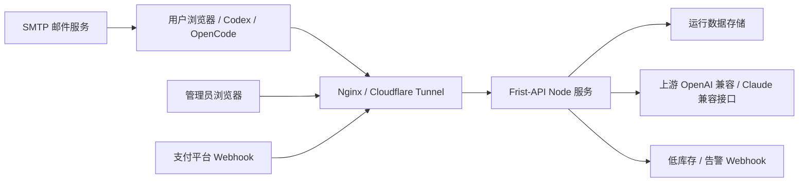

# Frist-API Production Readiness Audit

> 日期: 2026-05-02
> 范围: 腾讯云公开入口、用户注册到调用、充值入账、模型导出、网关转发、运营后台和商业化缺口

## 结论

Frist-API 当前可以支撑小范围真实用户验收: 用户能打开站点、注册登录、提交充值申请、创建用户 Key、导出 Codex/OpenCode/Claude/OpenClaw/Hermes 配置，并用 `/v1` 网关走统一鉴权和上游故障切换。

但它还不能按完整商业化自动运营标准对外扩大投放。核心原因不是页面数量，而是商业闭环还缺正式域名 HTTPS、自动支付回调、邮件找回、Turnstile、数据库持久化、备份恢复、管理员 2FA、订单对账、生产监控告警和合规入口。当前可用方式是人工收款 + 管理端人工入账 + 小范围用户测试。

## 本次线上故障根因

用户访问裸 IP 时出现 `ERR_CONNECTION_REFUSED`。复核结果:

| 层级 | 发现 | 影响 | 处理 |
|------|------|------|------|
| Docker | Frist-API 容器健康运行，但只绑定 `127.0.0.1:3180` | 外网不能直接访问容器端口 | 保持容器本地绑定，避免直接暴露 Node 服务 |
| Nginx | 反向代理没有监听裸 IP 测试端口 | 浏览器访问测试入口被拒绝 | 增加独立测试端口监听并反代到 `127.0.0.1:3180` |
| 部署版本 | 服务器代码落后于本地最新用户侧改动 | 外网即使打开也不是最新 open4 版本 | 同步 `apps/frist-api/` 和 Compose 文件到服务器 |
| 多项目边界 | 服务器 80/443 已有其他项目占用 | 不能直接把裸 IP 根路径改到 Frist-API | 保留原默认站点，只开放 Frist-API 测试端口 |

已验证的外部行为:

- 测试入口 `/` 返回 `200 OK`，HTML 包含最新 `styles.css?v=20260502-open4` 和 `app.js?v=20260502-open4`。
- `/api/frist/dashboard` 返回 `200 OK`。
- `/v1/models` 未带用户 Key 返回 `401`，属于预期鉴权行为。
- `apps/frist-api/deploy/smoke-test.sh` 对公网测试入口通过。

## 目标架构

当前实现中 `Store` 是 JSON 文件，适合验收，不适合商业化扩大。生产目标应迁移为 PostgreSQL 或 SQLite WAL 起步，配合 Redis 做会话粘滞、验证码、限流和模型列表缓存。

## 组件结构

| 组件 | 当前文件 | 职责 | 生产评价 |
|------|------|------|------|
| 用户端 | `apps/frist-api/index.html`, `src/app.js`, `src/styles.css` | 注册登录、充值申请、Key 管理、模型广场、教程和 CC Switch 导出 | 用户闭环已具备，仍需正式邮箱验证和找回密码 |
| 业务核心 | `apps/frist-api/src/core.js`, `src/businessFlow.js` | 模型排序、导入配置、价格解析、补号解析、路由优先级 | 适合继续拆成 domain service，避免前后端规则漂移 |
| 网关服务 | `apps/frist-api/server/server.js` | `/api/frist/*`、`/api/admin/*`、`/v1/*`、静态文件 | 单文件过大，生产应拆路由、存储、鉴权、支付和网关适配器 |
| 管理端 | `apps/frist-api/admin.html`, `src/admin.js` | 人工入账、补号、库存、价格草稿、审计事件 | 能运营小规模订单，缺订单对账和角色权限 |
| 部署 | `docker-compose.frist-api.yml`, `deploy/smoke-test.sh` | 2 核 2GB 服务器轻量部署和冒烟 | 已适配弱服务器，缺自动备份、日志轮转和监控 |
| 测试 | `apps/frist-api/tests/*.test.mjs` | 用户链路、管理链路、导出配置、网关转发 | 覆盖核心流程，缺支付回调和数据库迁移测试 |

## 数据流

1. 注册登录: 用户请求 `GET /api/frist/challenge` 获取验证码挑战，再调用 `POST /api/frist/register` 或 `POST /api/frist/login`，服务端写入用户、会话 Cookie 和认证事件。
2. 充值申请: 用户调用 `POST /api/frist/recharge`，生产默认生成 `pending_manual_payment` 订单，不直接加余额。
3. 人工入账: 管理员确认收到款后调用 `POST /api/admin/customers/recharge`，按邮箱给用户余额、日卡或月卡入账。
4. 创建 Key: 用户调用 `POST /api/frist/token` 创建 `fk-live-*`，可改名、禁用或删除。
5. 导入配置: 用户调用 `GET /api/frist/import-url`，后端输出默认模型和完整可用模型列表，并把同一模型列表写入多个兼容字段。
6. 网关调用: 客户端带 `Authorization: Bearer fk-live-*` 调 `/v1/chat/completions`、`/v1/responses`、`/v1/models` 或 `/v1/images/generations`。
7. 上游路由: 网关按用户套餐、模型分组、库存池、健康状态、会话粘滞和失败切换选择上游 Key。
8. 扣费审计: 成功请求优先按上游 `usage` 扣费，流式请求先做预估扣费，失败切换保留完整请求体。

## API 设计审计

| API | 当前状态 | 商业化要求 |
|------|------|------|
| `GET /api/frist/challenge` | 已有轻量验证码 | 接 Turnstile 后保留为后备或调试入口 |
| `POST /api/frist/register` / `login` | 已有验证码和限流 | 增加邮箱确认、找回密码、设备风控和审计日志 |
| `POST /api/frist/recharge` | 默认生成待处理订单 | 接支付平台后生成支付会话，禁止前端传金额后直接信任 |
| `POST /api/admin/customers/recharge` | 支持人工入账 | 必须记录操作者、收款凭证号、订单号和不可变审计事件 |
| `GET /api/frist/import-url` | 已输出全模型兼容字段 | 模型必须来自用户库存和上游 `/models` 探测，不应硬编码自称官方可用 |
| `/v1/models` | 已按用户 Key 和健康库存过滤 | 增加 TTL 缓存、模型别名表和官方命名校验状态 |
| `/v1/chat/completions` / `responses` | 已有鉴权、扣费、路由和流式透传 | 增加请求大小限制、并发隔离、熔断、慢请求日志和成本上限 |
| `/api/admin/replenishments` | 支持补号写入 | 增加双人复核、库存来源标记、过期任务和补号失败预算 |

## 数据库模式建议

当前 `runtime.json` 需要迁移。最小生产模式:

| 表 | 关键字段 | 说明 |
|------|------|------|
| `users` | `id`, `email`, `password_hash`, `email_verified`, `role`, `created_at` | 用户账号和管理员角色 |
| `sessions` | `id`, `user_id`, `token_hash`, `expires_at`, `ip_hash`, `user_agent_hash` | 登录会话，支持撤销 |
| `api_keys` | `id`, `user_id`, `key_hash`, `name`, `enabled`, `model_group`, `created_at`, `last_used_at` | 用户侧 `fk-live-*`，只存哈希和预览 |
| `accounts` | `user_id`, `balance_cents`, `package_cents`, `booster_cents`, `plan`, `expires_at` | 余额、套餐和有效期 |
| `payment_orders` | `id`, `user_id`, `provider`, `amount_cents`, `plan`, `status`, `provider_order_id`, `created_at`, `paid_at` | 支付单和人工入账单 |
| `upstream_credentials` | `id`, `provider_group`, `base_url`, `route_base_url`, `auth_type`, `key_ciphertext`, `pool`, `quota_remaining`, `status`, `expires_at` | 上游库存，Key 需要加密存储 |
| `model_catalog` | `model`, `family`, `rank`, `context_window`, `capabilities`, `official_status`, `updated_at` | 客户可见模型目录和能力 |
| `usage_events` | `id`, `user_id`, `api_key_id`, `model`, `prompt_tokens`, `completion_tokens`, `cost_cents`, `upstream_id`, `created_at` | 计费、对账和风控依据 |
| `audit_events` | `id`, `actor_user_id`, `action`, `target_type`, `target_id`, `metadata_json`, `created_at` | 管理端不可变审计 |

起步可用 SQLite WAL，超过单机运营或订单量上来后迁移 PostgreSQL。2 核 2GB 服务器不要本地跑大模型，只跑网关、鉴权、计费和轻量探测。

## 缓存策略

| 缓存对象 | 建议 TTL | 存储 | 原因 |
|------|------|------|------|
| 上游 `/models` 结果 | 30-60 分钟 | Redis 或数据库缓存表 | 降低补号和导入时的上游请求成本 |
| 上游健康状态 | 30-120 秒 | Redis | 避免每次用户请求都探测全部库存 |
| 会话粘滞 | 1-24 小时 | Redis | 保持同一对话固定健康上游，减少上下文漂移 |
| 验证码和登录限流 | 1-10 分钟 | Redis | 多进程和重启后仍然有效 |
| 静态资源 | 1 天到 7 天 | Nginx/Cloudflare | 降低弱服务器静态资源压力 |
| 价格草稿 | 版本化长期保存 | 数据库 | 价格变更要能回溯和对账 |

## 性能问题分析

| 问题 | 证据 | 影响 | 优化策略 |
|------|------|------|------|
| JSON 运行数据整文件读写 | 当前 Docker 挂载 `/data/runtime.json` | 用户、订单、库存增长后写入串行化，容易放大延迟和损坏风险 | SQLite WAL 或 PostgreSQL，写路径事务化 |
| 单 Node 进程承载全部功能 | `server/server.js` 同时服务静态、API、网关和管理 | 支付回调、补号探测和用户请求互相影响 | 拆网关进程、管理进程和探测队列 |
| 探测可能占用上游预算 | fallback 模型探测会逐模型尝试 | 上游多或模型多时成本不可控 | 探测预算、并发上限、失败缓存和人工确认 |
| 内存限流和验证码状态 | 当前状态在进程内 | 重启后失效，多实例无法共享 | Redis 化 |
| 模型默认排序硬编码 | `gpt-*` 排序在前端/核心代码中维护 | 官方模型变化后页面可能误导客户 | 用上游 `/models` + 官方目录校验 + 后台排序表 |
| 管理端缺不可变审计 | 当前已有事件展示，但不是独立审计表 | 人工入账纠纷和退款难追溯 | `audit_events` 只追加，不允许覆盖 |
| 缺监控告警 | 只有低库存 Webhook | 无法及时发现 5xx、扣费异常、支付回调失败 | Prometheus/日志告警/支付失败告警 |

## 清洁架构改造路径

下一阶段应按行为不变拆分，避免继续扩大单文件:

| 层 | 模块建议 | 说明 |
|------|------|------|
| Domain | `user`, `billing`, `inventory`, `modelCatalog`, `gatewayRouting` | 纯业务规则，不依赖 HTTP |
| Application | `registerUser`, `createPaymentOrder`, `confirmManualRecharge`, `routeGatewayRequest` | 编排用例，集中事务 |
| Adapters | `httpServer`, `runtimeStore`, `paymentStripe`, `paymentYipay`, `smtpMailer`, `turnstileVerifier`, `upstreamOpenAiCompat` | 对接外部服务 |
| Infrastructure | `postgresStore`, `redisCache`, `nginx`, `docker`, `backup` | 可替换设施 |
| UI | `authModal`, `apiKeyList`, `billingPanel`, `modelSelector`, `importConfigPanel` | 可复用组件，保证无障碍和加载状态 |

## 商业化开通清单

| 优先级 | 事项 | 需要你人工完成 | 我接入后的验收标准 |
|------|------|------|------|
| P0 | 固定域名 HTTPS | 购买域名，接入 Cloudflare，配置 Tunnel 或 DNS | `https://api.yourdomain.com/` 访问用户端，`/v1/models` 未授权返回 401 |
| P0 | 支付商户 | Stripe 或国内聚合支付完成实名审核，拿到 API Key、Webhook Secret、商户号、签名密钥 | 支付成功 Webhook 自动把订单置为 paid，失败和退款可追踪 |
| P0 | 数据持久化 | 选择 SQLite WAL 起步或 PostgreSQL | 重启容器、迁移版本、备份恢复后余额和 Key 不丢 |
| P0 | 备份目标 | 准备对象存储或独立备份机 | 每日备份、每周恢复演练、恢复时间有记录 |
| P1 | SMTP | 准备域名邮箱、SMTP 主机、端口、用户名、应用密码 | 注册验证和找回密码邮件可达 |
| P1 | Turnstile | Cloudflare 后台创建站点，拿到 Site Key 和 Secret Key | 注册登录必须通过真实 Turnstile 校验 |
| P1 | 管理员 2FA | 选 TOTP 或硬件 Key | 管理端高危操作需要二次确认 |
| P1 | 监控告警 | 准备告警 Webhook 或接 OpenClaw 通知 | 5xx、低库存、支付失败、异常扣费能主动通知 |
| P2 | 合规 | 准备服务条款、退款规则、隐私政策、AGPL 源码入口 | 用户可查看规则，使用 AGPL 派生时能访问源码说明 |

## 外部资料依据

- Stripe API keys: https://docs.stripe.com/keys
- Stripe Webhooks: https://docs.stripe.com/webhooks
- Cloudflare Tunnel: https://developers.cloudflare.com/cloudflare-one/connections/connect-networks/
- Cloudflare Tunnel public hostnames: https://developers.cloudflare.com/cloudflare-one/connections/connect-networks/routing-to-tunnel/http/
- Cloudflare Turnstile: https://developers.cloudflare.com/turnstile/
- OpenAI Models: https://platform.openai.com/docs/models

## 下一步建议

1. 先固定域名和 HTTPS，把临时裸 IP/Quick Tunnel 从客户入口下线。
2. 先接一个支付通道，不要 Stripe 和国内聚合支付同时开工。
3. 同步迁移运行数据到 SQLite WAL 或 PostgreSQL，否则订单和余额规模扩大后风险过高。
4. 把模型目录从硬编码改成数据源驱动: 上游 `/v1/models` 返回什么，用户真实可选列表就显示什么；默认最强模型只从该列表里选。
5. 做一轮支付回调、退款、余额回滚、上游 Key 耗尽和备份恢复的端到端演练，再对陌生付费用户开放。
