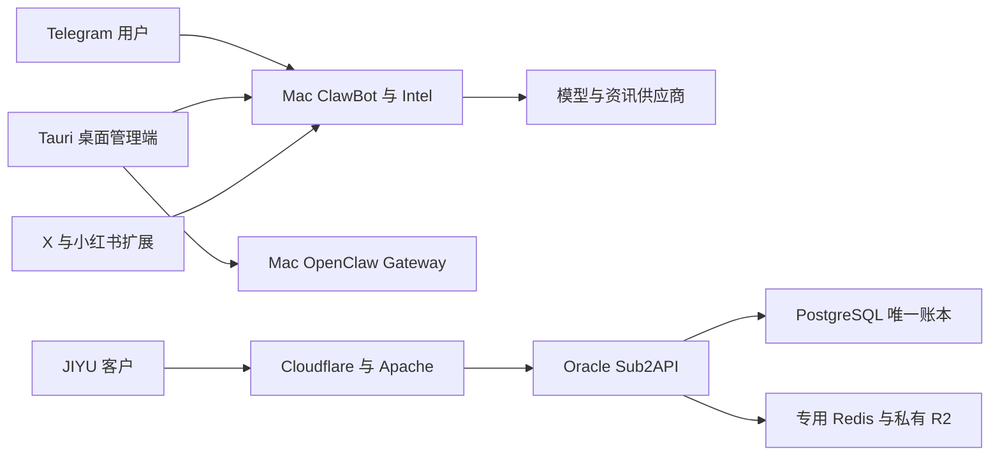

# OpenEverything / OpenClaw Bot / JIYU 全面审计报告

审计日期：2026-09-09（美东），2026-09-10（UTC）。代码基线：`e414e9592afef3707fd623c4d04add4fb5382123`，分支 `main`。本报告只提出决策与修复建议，没有修改产品代码或部署产品。

**结论：本项目已经形成可运行的个人 AI 自动化系统，以及独立的 JIYU 服务运营基础；尚没有足够证据把整个套件认定为可面向陌生客户规模销售的商业产品。** 最应优先处理的是成本控制失真、失败任务的投递可靠性、依赖与发布门禁，以及首次使用体验。现有 Intel 投递状态机、受控运维与备份逻辑具有保留价值，不建议整套重写。

## 一、范围、证据等级与需要补充的信息

### 1. 本次实际做了什么

扫描了仓库受跟踪目录、依赖与锁文件、配置样例、CI、Git 历史和公开 issue，并沿核心调用链阅读 Python 后端、React/Tauri 管理端、Intel、交易、记忆、观测、备份与 Sub2API 补丁。源码盘点覆盖主要自有源码目录中的 **448 个文件、163,601 行**，包括 Python 348、TSX 51、TS 24、Rust 19，其余为脚本、样式等；这是盘点数量，**不代表逐行审阅了所有代码**。第三方 vendor、上游子模块与实际安装运行时分别识别，未把依赖体积计入自研规模。

对核心路径运行针对性测试、文档检查、前端构建、依赖审计，读取本机健康状态与 Oracle 上的原生服务状态，并复核 JIYU 公网健康端点。未读取或展示运行密钥，未真实下单、支付、发消息、创建 API Key、还原生产数据库或变更费率。

| 证据标记 | 含义 |
|---|---|
| 实测 | 本次执行并观察结果；结论仅限该检查覆盖范围 |
| 代码确认 | 当前源码可以确认的实现或控制流；不等于已在生产触发 |
| 文档记录 | 仓库陈述；标注日期，不能自动代表当前运行状态 |
| 建议 / 未验证 | 推导、目标或缺失证据；不作为既成事实 |

### 2. 补充信息清单与访问限制

这些信息不阻止本报告，但会阻止“商业可用”签字：

| 尚缺信息或权限 | 当前掌握的证据 | 后续需要的最小材料 |
|---|---|---|
| 付费用户、收入、留存、实际毛利 | 有账户、余额、兑换码、计费及支付说明；没有当前可核验经营数据 | 脱敏的近 30 天活跃/付费/退款汇总、供应商账单与对账差异，无需明文用户资料 |
| JIYU 登录后业务验收 | 服务与健康探针通过；当前基线记录 MFA 阻止进一步验证 | 正常 MFA 会话下完成登录、Key 权限、余额/用量、订单或兑换核销、退款/冲正的受控验收 |
| 主体、目标市场、支付与模型服务授权 | 文档存在历史说明，不能确认当前经营主体与全部上游合同 | 主体与服务地区、支付产品批准范围、供应商转售/账号使用条款及数据处理协议 |
| 整机灾备与跨组件一致性 | 备份新鲜度、校验、已有演练标记通过 | 隔离环境中的完整恢复报告，含密钥恢复方式、依赖安装、真实业务与 RPO/RTO |
| 手机、桌面安装与无障碍体验 | 阅读了 UI 实现；未完成实际用户端逐屏走查 | 干净 Mac 安装、Telegram 手机任务、JIYU 手机浏览器与键盘操作记录 |
| ChatGPT 网页独立复核 | 用户指定的项目连接器调用报错；本地 bridge/公开端点恢复，但 OAuth 登录按钮持续等待，没有已连接证据 | 恢复后验证 workspace identity 与只读读取，再进行独立复核；本报告不能宣称已经过网页 ChatGPT 二次审查 |

本地仓库读取没有权限阻塞。外网部分请求一度超时：Python 漏洞审计未取得有效结果，GitHub CI 详细失败日志未下载成功；已取得 CI job/step 状态，不能臆测其完整错误堆栈。

## 二、自行识别的项目背景

| 项目背景 | 基于实证的判断 |
|---|---|
| 项目名称 | 仓库 README 为 **OpenClaw Bot**，桌面与项目地图采用 **OpenEverything**；**JIYU** 是 Oracle 上独立运行的 Sub2API 服务品牌。命名反映了不同产品层，当前不宜向客户混称一个统一 SaaS。证据：[README](/Users/blackdj/Desktop/OpenEverything/README.md:1)、[项目地图](/Users/blackdj/Desktop/OpenEverything/docs/001-project-map.md:1)。 |
| 一句话简介 | 以 Telegram 和桌面管理端连接多模型、资讯、个人自动化及运维能力，并维护独立的 JIYU AI/API 服务。 |
| 技术栈 | Python 3.12、FastAPI、python-telegram-bot、LiteLLM 路由、CrewAI、mem0、SQLite/Redis；React 18、TypeScript、Tauri 2/Rust；macOS LaunchAgent 为本机主运行方式，另有 Docker Compose；JIYU 为 Go/Sub2API、PostgreSQL、Redis，经 Cloudflare/Apache 对外，使用私有 R2。[技术栈](/Users/blackdj/Desktop/OpenEverything/README.md:20)、[部署职责](/Users/blackdj/Desktop/OpenEverything/docs/001-project-map.md:5)。 |
| 用户与阶段 | 明确面向个人 AI 自动化、学习与二次开发。代码有多入口和较成熟的运维保护；商业服务已有运行基础，客户体验、计费闭环和规模运营证据不足。判定为“个人系统已可用；商业产品待有条件试点”，不是从零原型，也不是全套成熟 SaaS。[项目定位](/Users/blackdj/Desktop/OpenEverything/README.md:9)。 |
| 团队规模与开发模式 | 未找到可确认实际人数的组织信息。Git shortlog 中主要作者约 1,002 次提交，其余为少量协作者/自动化账号；可推测维护高度集中，但提交身份不等于员工数。当前有主分支 CI、哈希锁和针对性回归。本次公开 open issue 查询为空，不能据此判断没有缺陷；源码 TODO/FIXME 检索未提供可信的完整待办清单，计划项主要依据当前文档。 |
| 商业化迹象 | JIYU 有账户、余额、订单、API Key、兑换码、上游费率同步与支付接入文档。**已有付费人数、当前流水、利润、复购未验证**；不能把代码中的订单字段或历史说明当成今日收入。[支付说明](/Users/blackdj/Desktop/OpenEverything/docs/029-jiyu-settings-and-payment-guide.md:1)、[JIYU 补丁](/Users/blackdj/Desktop/OpenEverything/scripts/sub2api-jiyu-v0.2.0.patch)。 |

当前核心价值可以概括为两条：其一，把个人 AI 与资讯、社媒草稿、运维工作放在 Telegram/桌面中完成；其二，以现有 Sub2API 为基础运营 JIYU。两者共享维护者及部分工程能力，但账户、账本与运行职责已有清晰边界，商业包装和验收也应分别处理。

### 运行边界



[当前基线](/Users/blackdj/Desktop/OpenEverything/docs/current/current-baseline.md:7)固定实际 Gateway 为 `2026.7.2-beta.7`，JIYU 为 Sub2API `0.2.0` 定制版。vendor 目录不是运行版本；New-API 是冷回滚材料。闲鱼客服/自动发货、Frist-API 和中央生图 MCP 已退役，**不计入待完成路线图，也不建议恢复它们**。[退役清单](/Users/blackdj/Desktop/OpenEverything/docs/001-project-map.md:45)。

## 三、功能全景与真实状态

“已实现”表示有可追溯实现，不表示所有部署和用户路径均验收通过。“部分实现”包括代码完整但生产或产品闭环仍缺验证的情况。

| 功能模块 | 实现状态 | 证据 | 备注 |
|---|---|---|---|
| 7-Bot Telegram 入口及角色协作 | 已实现 | [启动器](/Users/blackdj/Desktop/OpenEverything/packages/clawbot/multi_main.py)、[README](/Users/blackdj/Desktop/OpenEverything/README.md:11) | 本机 Bot 服务在运行；未逐个账号发送真实命令验收。 |
| 多模型路由、分层回退与收费模型选择 | 已实现 | [路由器](/Users/blackdj/Desktop/OpenEverything/packages/clawbot/src/litellm_router.py) | 路由针对性测试通过；供应商可用性、模型价格须独立更新。 |
| 成本统计与预算降级 | 部分实现 | [估价](/Users/blackdj/Desktop/OpenEverything/packages/clawbot/src/core/cost_control.py:110)、[路由累计](/Users/blackdj/Desktop/OpenEverything/packages/clawbot/src/litellm_router.py:1180) | 模型误匹配且预算账本未接主链，不能作为硬支出上限。 |
| FastAPI 本机内控与 WebSocket | 已实现 | [服务](/Users/blackdj/Desktop/OpenEverything/packages/clawbot/src/api/server.py)、[认证](/Users/blackdj/Desktop/OpenEverything/packages/clawbot/src/api/auth.py) | 单所有者 token；不具备面向多租户 SaaS 的主体隔离。 |
| Tauri 桌面工作台与服务管理 | 已实现 | [页面入口](/Users/blackdj/Desktop/OpenEverything/apps/openclaw-manager-src/src/App.tsx)、[原生服务命令](/Users/blackdj/Desktop/OpenEverything/apps/openclaw-manager-src/src-tauri/src/commands/service.rs) | 当前本机构建失败；同 HEAD CI 桌面 job 成功，先排本地安装完整性。 |
| 首次引导、功能选择、模型配置 | 部分实现 | [完成流程](/Users/blackdj/Desktop/OpenEverything/apps/openclaw-manager-src/src/components/Onboarding/index.tsx:425) | 保存失败仍完成引导，没有在此流程验证可成功调用。 |
| Intel 多源监听、存储、内容处理 | 已实现 | [Intel 源码](/Users/blackdj/Desktop/OpenEverything/packages/clawbot/src/intel)、[健康入口](/Users/blackdj/Desktop/OpenEverything/packages/clawbot/src/intel/runtime_health.py) | 本次健康快照显示监听运行、6/6 源检查通过；不代表内容价值或所有订阅投递成功。 |
| Intel 定时简报与持久投递 | 部分实现 | [调度流水线](/Users/blackdj/Desktop/OpenEverything/packages/clawbot/src/intel/scheduled_pipeline.py)、[投递租约](/Users/blackdj/Desktop/OpenEverything/packages/clawbot/src/intel/db/store.py:408) | 有去重、租约及结果未知状态，值得保留；自然调度产物仍待验收。 |
| 普通早报、日报、周报 | 部分实现 | [定时任务](/Users/blackdj/Desktop/OpenEverything/packages/clawbot/src/execution/scheduler.py:163) | 与 Intel 不同；内存完成标记存在失败不重试、重启重复的窗口。 |
| 共享记忆与管理 | 已实现 | [共享记忆](/Users/blackdj/Desktop/OpenEverything/packages/clawbot/src/shared_memory.py)、[API](/Users/blackdj/Desktop/OpenEverything/packages/clawbot/src/api/routers/memory.py:15) | 能搜索/更新/删除；当前 API 未建立用户/租户隔离合同。 |
| 投资研究、组合与交易看板 | 已实现 | [交易系统](/Users/blackdj/Desktop/OpenEverything/packages/clawbot/src/trading_system.py)、[Portfolio](/Users/blackdj/Desktop/OpenEverything/apps/openclaw-manager-src/src/components/Portfolio/index.tsx) | 研究工具定位明确；真实经纪商交易本次未验收。 |
| 手动卖出、券商结果与对账 | 部分实现 | [卖出 API](/Users/blackdj/Desktop/OpenEverything/packages/clawbot/src/api/routers/trading.py:280)、[券商桥](/Users/blackdj/Desktop/OpenEverything/packages/clawbot/src/broker_bridge.py:1413) | 已有前端确认、串行提交与异常结果处理；仍缺 HTTP 请求级持久幂等/服务端确认合同。 |
| X/小红书采集、草稿、安全填入 | 已实现 | [运行边界](/Users/blackdj/Desktop/OpenEverything/docs/001-project-map.md:39)、[发布门禁](/Users/blackdj/Desktop/OpenEverything/packages/clawbot/src/execution/social/publish_gate.py) | 默认填入与发布分离；本次未操作账号或发帖。 |
| 微信入口/扩展 | 部分实现 | [扩展清单](/Users/blackdj/Desktop/OpenEverything/.openclaw/extensions/openclaw-weixin/package.json)、[通道](/Users/blackdj/Desktop/OpenEverything/.openclaw/extensions/openclaw-weixin/src/channel.ts) | 有受跟踪实现；未验证真实微信接入与端到端媒体路径。 |
| 可选浏览器、抓取与外部工具 | 部分实现 | [后端依赖](/Users/blackdj/Desktop/OpenEverything/packages/clawbot/requirements.txt)、[源码目录](/Users/blackdj/Desktop/OpenEverything/packages/clawbot/src) | 集成存在不等于所有平台当前可用；账号条款和可选依赖增加维护成本。 |
| 日志、模型观测与健康诊断 | 已实现 | [健康脚本](/Users/blackdj/Desktop/OpenEverything/scripts/auto_health_check.sh)、[Langfuse](/Users/blackdj/Desktop/OpenEverything/packages/clawbot/src/langfuse_obs.py)、[观测](/Users/blackdj/Desktop/OpenEverything/packages/clawbot/src/observability.py) | 已有健康分类；模型内容截断不等于敏感信息脱敏。 |
| 本机备份、校验与恢复演练 | 已实现 | [备份](/Users/blackdj/Desktop/OpenEverything/scripts/local_backup.sh)、[恢复](/Users/blackdj/Desktop/OpenEverything/scripts/disaster_recovery.sh) | 新鲜度及既有演练标记通过；本次没有做整机恢复切换。 |
| JIYU 账户、余额、API 与上游管理 | 已实现 | [管理脚本](/Users/blackdj/Desktop/OpenEverything/scripts/sub2api_oracle_manage.sh)、[定制补丁](/Users/blackdj/Desktop/OpenEverything/scripts/sub2api-jiyu-v0.2.0.patch) | 生产核心服务和健康端点通过；登录后余额/Key/计费业务未验证。 |
| JIYU 自动支付与财务闭环 | 部分实现 | [支付前置条件](/Users/blackdj/Desktop/OpenEverything/docs/029-jiyu-settings-and-payment-guide.md:31) | 有上游能力和接入文档；历史记录为关闭，当前开关及真实交易未确认。 |
| JIYU 私有对象存储与异步图片 | 部分实现 | [存储与图片说明](/Users/blackdj/Desktop/OpenEverything/docs/029-jiyu-settings-and-payment-guide.md) | 文档记录 R2 已配置、图片上游受阻；本次未付费生图，不宣称成功。 |
| 中国大陆/境外双 origin 服务分流 | 仅规划未实现 | [分流方案](/Users/blackdj/Desktop/OpenEverything/docs/029-jiyu-settings-and-payment-guide.md)、[当前基线](/Users/blackdj/Desktop/OpenEverything/docs/current/current-baseline.md:7) | 文档给出方案和前置条件，当前基线仍以 Oracle 为唯一活动服务，不能按双活销售。 |
| 公开分发、客户支持与统一商业 Onboarding | 部分实现 | [签名配置](/Users/blackdj/Desktop/OpenEverything/apps/openclaw-manager-src/src-tauri/tauri.conf.json:49)、[安全政策](/Users/blackdj/Desktop/OpenEverything/docs/014-security.md) | 有内部构建/回滚和开源贡献文档；完整商业支持、签名安装与客户验收缺证据。 |

## 四、阻塞项：先列可以立即开始的修复

排序综合实际影响、受影响用户面、已知证据强度和成本。成本是熟悉项目的一名维护者的粗估，包含针对性回归，不含资质审批、外部供应商等待或大规模数据迁移。“立即处理”表示可开始修复，不表示已经授权部署。

### A. 可立即开始

| 顺序 | 阻塞项 | 严重程度与影响范围 | 可立即处理 | 估计成本 | 建议与验收 |
|---|---|---|---|---|---|
| 1 | 本地成本估价与预算账本脱节 | 高；付费模型选择、费用展示、预算判断 | 是 | 天级（2–4 天；精确匹配本身小时级） | 模型名规范化后精确查表；未知价格显式未知；调用前预留、结束结算、失败释放；同步流与流式均写唯一账本，重启/并发不漏账。 |
| 2 | 依赖门禁失败，安全结果不完整 | 高；新版本发布与长期维护 | 是 | 天级（2–5 天，兼容问题另估） | 定向升级受影响依赖并复核调用可达性；分别跑各生态审计，避免前一步失败遮蔽后续结果；同一提交全部门禁通过才候选发布。 |
| 3 | 早报/日报成功标记早于发送确认 | 中；承诺按时交付内容的用户会漏收 | 是 | 天级（1–3 天） | 复用 Intel 的持久状态/租约思想；失败可重试，结果未知先对账；覆盖发送异常、重启、并发与窗口跨越。 |
| 4 | 文档治理脚本与现有文档结构冲突 | 中；CI、贡献者和接管者 | 是 | 小时级（2–4 小时） | 统一当前扁平目录规则与索引策略，修复死链及跨仓库路径判断；`make docs-check` 通过，当前基线唯一。 |
| 5 | 首次引导把“保存失败”仍视为完成 | 中；首次使用和支持工单 | 是 | 天级（1–2 天） | 先保存、再做可选连接验证，成功后记录完成；失败保留进度；可明确选择仅浏览/稍后配置。 |
| 6 | Docker 内控 API 的监听与端口映射不一致 | 中；按 README 使用 Docker 的新用户 | 是 | 天级（约 1 天） | 容器内监听适合容器网卡的地址，宿主仍绑定 loopback；非本地监听必须有 token；从宿主验证鉴权和 ping，而非只跑容器内部 health。 |
| 7 | 本地前端依赖不完整导致构建失败 | 中；本机打包/开发 | 是 | 小时级（1–3 小时；若重现再排源码） | 在隔离临时目录用锁文件干净安装重现；核对 lucide 包文件与完整性；避免直接全局升级或覆盖当前运行包。 |
| 8 | 可观测性上传内容未统一脱敏 | 高（启用外部观测时）；客户提示词与敏感内容 | 是 | 天级（2–4 天） | 所有 exporter 前统一屏蔽密钥和选定 PII；内容采集默认可关闭；植入测试哨兵确认出口、日志和导出均无原文。 |
| 9 | 手动交易 API 缺请求级持久幂等与服务端确认 | 高（启用真实券商时）；资金操作 | 是 | 天级（3–5 天） | 同一业务请求唯一键、短时确认挑战与参数绑定、重放返回同一订单结果；断线未知状态拒绝盲重试并进入对账。 |

### B. 需要产品范围或外部条件先明确

| 顺序 | 阻塞项 | 严重程度与影响范围 | 可立即处理 | 估计成本 | 必要条件与验收 |
|---|---|---|---|---|---|
| 10 | 本机单所有者接口不适合直接多租户化 | 高；一旦面向外部多用户将涉及越权与记忆混用 | 否，先确定单机版或 SaaS | 周级以上（3–6 周） | 单机版保持单所有者边界；SaaS 另立身份、租户、授权、审计和数据隔离合同，跨租户负向测试全部拒绝。 |
| 11 | JIYU 经营、支付和真实计费缺完整验收证据 | 高；收费、退款、纠纷与利润 | 否，缺正常 MFA 与经营材料 | 技术天级，资质时间未知 | 账户→Key→请求→扣费→供应商成本→退款/冲正可追溯；真实支付另需合法接入与明确授权的小额验证。 |
| 12 | 商业数据/供应商条款/许可证边界未形成发布材料 | 高；分发、数据处理和持续经营 | 否，需核实主体与使用方式 | 周级以上 | 形成组件许可证清单、发布源码义务、服务地区/数据流表与供应商授权；MediaCrawler 非商业用途限制单独处理。 |
| 13 | 缺干净终端安装验收与完整灾备切换证据 | 中至高；客户安装、机器丢失或节点故障 | 可先演练设计，完整验证需隔离目标 | 天级至周级 | 签名/公证后的安装与升级回滚、从异地备份恢复真实业务；测得 RPO/RTO 后再承诺 SLA。 |

### 关键问题的代码证据与边界

**1. 成本控制不是可用的硬预算闸门。** [价格表](/Users/blackdj/Desktop/OpenEverything/packages/clawbot/src/core/cost_control.py:24)先定义 `gpt-4o` 再定义 `gpt-4o-mini`，[估价循环](/Users/blackdj/Desktop/OpenEverything/packages/clawbot/src/core/cost_control.py:110)采用子串首次匹配。对实际方法做隔离验证：100 万输入 token、零输出时，`gpt-4o-mini` 得出 2.5，而表中它自己的值为 0.15；未知模型得出 0。这是在比较项目内部价格表，不是在声明供应商当前报价。

进一步搜索 `record_cost(`，生产源码仅找到方法定义和文档示例；主路由 [普通调用](/Users/blackdj/Desktop/OpenEverything/packages/clawbot/src/litellm_router.py:1180)与[流式调用](/Users/blackdj/Desktop/OpenEverything/packages/clawbot/src/litellm_router.py:1334)更新自己的 `_total_cost`，[预算建议](/Users/blackdj/Desktop/OpenEverything/packages/clawbot/src/litellm_router.py:1255)却读取另一套 CostController 状态。结果可能同时出现错误高估某模型和预算计数漏记。收费模型开关等其他保护仍存在，不能据此声称所有调用都会失控；此问题也**不等于 JIYU 账本有相同缺陷**。

**2. 日报可靠性必须按不同流水线区分。** [普通早报](/Users/blackdj/Desktop/OpenEverything/packages/clawbot/src/execution/scheduler.py:175)在生成与发送前写 `_last_news_date`；[普通日报](/Users/blackdj/Desktop/OpenEverything/packages/clawbot/src/execution/scheduler.py:212)在发送前写日期。进程内异常后当天可能不重试，进程重启则丢失完成记录。Intel 已有 [持久唯一约束](/Users/blackdj/Desktop/OpenEverything/packages/clawbot/src/intel/db/store.py:49)和[租约](/Users/blackdj/Desktop/OpenEverything/packages/clawbot/src/intel/db/store.py:408)，应优先对齐已有实践，不必换掉整个 Intel 系统。

**3. Docker 有“内部健康、外部不可达”的配置组合。** [启动器](/Users/blackdj/Desktop/OpenEverything/packages/clawbot/multi_main.py:938)只传端口，[服务默认](/Users/blackdj/Desktop/OpenEverything/packages/clawbot/src/api/server.py:382)绑定 `127.0.0.1`，而 [Compose](/Users/blackdj/Desktop/OpenEverything/docker-compose.yml:46)通过容器端口转发。容器 loopback 不等于容器网卡；内部 health 可以通过，宿主端口仍无法连接。这是源码与网络配置推导，本次没有启动容器复现。另外 README 的简单 `docker-compose up -d` 未解释 Compose 插值所需的 `--env-file`，而 Redis 密码是必填项。[配置要求](/Users/blackdj/Desktop/OpenEverything/docker-compose.yml:13)。

**4. 引导完成不代表首次调用成功。** [Onboarding](/Users/blackdj/Desktop/OpenEverything/apps/openclaw-manager-src/src/components/Onboarding/index.tsx:425)先持久化完成标记，保存 Key/URL 失败只发 toast，随后仍 `onComplete()`；此处没有连接验证。这会把配置错误转移到后续使用阶段。另有“量化交易 / 自动化投资策略执行”的[欢迎页文案](/Users/blackdj/Desktop/OpenEverything/apps/openclaw-manager-src/src/i18n/zh-CN.ts:1072)，应与 README 的受控研究定位对齐，避免超过已验收能力的承诺。

**5. 安全已有基础，但不具备商业租户合同。** [认证](/Users/blackdj/Desktop/OpenEverything/packages/clawbot/src/api/auth.py:74)有常量时间 token 比较、生产无 token 拒绝等保护；开发 loopback 场景允许无 token，不应误报为已暴露的公网漏洞。与此同时，[记忆 API](/Users/blackdj/Desktop/OpenEverything/packages/clawbot/src/api/routers/memory.py:15)没有用户/租户身份参数，更新/删除以 key 操作；共享 token 不能满足多租户授权。WebSocket token 位于查询参数，后续需要避免 URL 日志泄漏并补充 Origin 策略，但不把该实现直接等同于已发生泄漏。

**6. 交易已有保护，缺的是更完整的服务端合同。** [卖出处理](/Users/blackdj/Desktop/OpenEverything/packages/clawbot/src/api/routers/trading.py:280)检查券商状态、订单结果和人工对账条件；[券商桥](/Users/blackdj/Desktop/OpenEverything/packages/clawbot/src/broker_bridge.py:1413)串行化卖出，并有提交记录、未完成订单/未知结果保护；前端也有确认与防连点。仍未在该 HTTP 合同看到请求幂等键和绑定交易参数的服务端确认挑战，单纯重复 HTTP 请求无法依靠 UI 证明是同一意图。本次 IBKR 未启用，不是已发生的重复下单事故。

**7. 截断不是脱敏。** [Langfuse 上传](/Users/blackdj/Desktop/OpenEverything/packages/clawbot/src/langfuse_obs.py:194)直接截取输入/输出前 2,000 字符，[_safe_input](/Users/blackdj/Desktop/OpenEverything/packages/clawbot/src/langfuse_obs.py:252)主要做提取和截断；存在真实调用入口。是否启用外部 exporter 未读取秘密配置，不能认定生产已经外传。商业化前必须把内容策略统一放到出口，不能只依赖散落的日志脱敏。

## 五、本次验证记录：通过什么、没有通过什么

| 检查 | 观察结果 | 可以得出的结论 |
|---|---|---|
| 针对性 Python 测试 | **186 passed，2.87 秒**；覆盖 API 安全、路由配置、Intel 调度及 API 回归等 5 个测试文件 | 这些已存在的路径回归通过；不代表全部测试、渗透测试或生产业务通过。 |
| Node 运维与静态安全测试 | **38 passed，0 failed**；备份/恢复脚本、Sub2API 管理与桌面静态安全断言 | 测试包含临时夹具和脚本逻辑，未在生产执行恢复或交易。 |
| 供应链静态检查 | 2 个 workflow、16 个 action SHA、354 个 npm 锁定包检查通过 | 固定与完整性规则有基础；与“无已知漏洞”是两回事。 |
| 当前 HEAD 的 GitHub CI | `security-gates` 在 `Audit locked dependencies` 失败；Python 和桌面 job 成功 | 当前提交整体发布门禁未通过。[对应 CI](https://github.com/djblack1209-coder/OpenClaw-Bot/actions/runs/34397468742)。 |
| 本地前端构建 | TypeScript 阶段完成，Vite 缺 `lucide-react/.../icons/toolbox.js` 而失败 | 同 HEAD CI 成功，优先怀疑本机依赖安装不完整；尚未做干净安装复现，不能定为源码编译错误。 |
| 文档治理 | `bash scripts/check_docs_layout.sh` 失败 | 脚本仍要求不存在的 `003-docs-index.md`、`007-operations.md`，且 current 白名单/标题约定不匹配；CI 该步骤被更早失败遮蔽。[脚本](/Users/blackdj/Desktop/OpenEverything/scripts/check_docs_layout.sh:6)。 |
| 前端 npm audit | 15 个受影响依赖节点：高 6、中 8、低 1、严重 0 | 包含 eslint 等开发依赖和传递影响；不是 15 个独立可远程利用漏洞。 |
| Gateway npm runtime audit，排除 dev | 6 个受影响依赖节点：高 1、中 5、严重 0 | 高危涉及 fast-uri；中危涉及 Hono/MCP SDK 等链。须定位实际使用路径并做兼容升级。 |
| 微信扩展 npm audit | 3 个中危受影响依赖节点，高危与严重为 0；命令退出 0 | 退出 0 仅表示未超过指定 high 阈值，不表示完全没有漏洞。 |
| Python 锁文件漏洞审计 | 网络错误，未生成有效报告 | **未知，不是 0 漏洞**。本次未重新跑本地 Cargo audit；CI 桌面 job 有对应门禁且成功，仍以该 CI 时点为限。 |
| 本机健康脚本 | Gateway/API 200、3 个 LaunchAgent 运行；Intel 监听与源检查通过；scheduler 为 warning | 自然调度交付尚未闭环；总体 `ok=false`、`release_ready=false` 的快照不支持全绿宣称。 |
| 备份健康 | 本次检查距最近备份约 7 小时，checksum/ready/drill 标记通过 | 有近期备份与既有演练证据；未重新做完整灾备切换，不能给出实测 RTO。 |
| JIYU 原生服务及公网 | Oracle Sub2API/Redis/相关 timer 活跃，PostgreSQL preflight、内部 health、Responses WS 代理探针通过；随后公网 `/health` 返回 200 | 核心服务存活。先前脚本 `000000` 是 curl 失败标记叠加，不是 HTTP 状态码，也不足以宣称持续宕机。登录后业务仍未验证。 |

前端、runtime 和微信扩展的节点数不能相加当作独立漏洞总数，且开发依赖与生产依赖应分开处置。例证包括 [fast-uri 官方安全公告](https://github.com/advisories/GHSA-5jgf-p345-68v8)、[js-yaml 公告](https://github.com/advisories/GHSA-2883-xcg3-v3hh)、[Browserslist 公告](https://github.com/advisories/GHSA-c83g-rgw3-j3cx)。修复应以锁定版本、可达调用链和回归结果为准，避免未经兼容验证的大版本升级。

复跑入口：

```bash
# 仓库根目录
node --test scripts/auto_ops_scripts.test.mjs scripts/sub2api_ops_scripts.test.mjs apps/openclaw-manager-src/src/lib/security-hardening.static.test.mjs
node scripts/check_supply_chain.mjs
bash scripts/check_docs_layout.sh
npm run build --prefix apps/openclaw-manager-src
npm audit --prefix apps/openclaw-manager-src --audit-level=high --json
npm audit --prefix apps/openclaw-manager-src/src-tauri/npm-runtime-lock --omit=dev --audit-level=high --json
npm audit --prefix .openclaw/extensions/openclaw-weixin --audit-level=high --json
```

Python 本次在临时目录的受跟踪源码副本中执行，使用现有 Python 3.12 虚拟环境，避免加载工作区私密运行文件：

```bash
# 临时副本的 packages/clawbot 目录；Python 可执行文件使用原项目 .venv312
TESTING=true LITELLM_LOG=ERROR PYTHONDONTWRITEBYTECODE=1 python -m pytest \
  tests/test_api_security_middleware.py tests/test_security.py \
  tests/test_llm_routing_config.py tests/test_intel_scheduled_pipeline.py \
  tests/test_api_routes_regression.py --tb=short -q -o addopts= --timeout=30
```

## 六、从真实使用路径看体验摩擦

以下为代码/文档驱动的旅程审计，并结合构建和健康实测；没有把静态推导伪装为已完成的逐屏用户测试。

| 用户路径 | 当前体验与证据 | 建议 | 可验收标准 |
|---|---|---|---|
| 了解产品 | OpenClaw Bot、OpenEverything、JIYU 并存；欢迎页偏向客服和自动投资，README 则定位研究和个人自动化 | 面向用户分别说明“个人工作台”和“JIYU API 服务”，首页只展示已启用并可验证的核心任务 | 5 位目标用户阅读 1 分钟后，至少 4 位能准确说出自己该用哪个入口、能做什么。 |
| 安装 | README 让用户自行安装 Python/Node/Rust；默认 pip/npm 安装与 CI 锁文件路径不一致；Docker 额外依赖未说明 | 首选一条受支持安装路径；提供依赖诊断和锁文件安装；可选模块后装 | 3 台干净受支持 Mac 成功安装；失败指出具体依赖与恢复步骤；记录真实耗时，目标首次任务 15 分钟内完成。 |
| 配置 | Onboarding 保存失败仍完成；Key 与 URL 未经验证；功能勾选并不证明可选服务可运行 | 显示“未配置/已保存/已验证/暂时失败”四种状态；允许只浏览；连接测试明确是否会消耗额度 | 错误 Key/地址、网络超时、保存失败均不显示已验证；重开引导能继续，无需重新填写全部内容。 |
| 首次价值 | 页面和功能很多，但缺少统一的“完成第一个有用任务”验收；自然 Intel 调度仍待验证 | 先引导一个低风险任务：生成可核对来源的资讯摘要或查看服务诊断，再让用户选择扩展能力 | 5 位试用者中至少 4 位独立完成首任务；显示来源、执行状态与下一步，记录流失位置。 |
| 日常使用 | 本机在线状态影响 Bot/Intel；普通日报与 Intel 的可靠性实现不同；费用反馈可能失真 | 对外显示最后成功业务时间、下一次任务、待重试原因及可信用量，区分主动关闭与故障 | 连续 7 天自然任务有完整记录；静默漏发为 0；费用展示可与账本核对。 |
| 出错恢复 | 现有健康信息区分一些可选服务，但公网探测与总体 release_ready 容易被误读；构建缺包错误偏开发者 | 将错误定位到入口、供应商、权限、配置或网络；展示最后成功时间、重试/诊断动作与脱敏 request ID | 断网、上游 429、无额度、Key 失效四种情况均有可执行提示；不把缺权限与服务宕机混为一谈。 |
| 交易与发布 | 已有 UI 确认和发布门禁，但客户可能把按钮成功等同最终成交/发布 | 显示草稿、待确认、已提交、已完成、结果未知；敏感操作绑定明确对象与参数 | 模拟超时后不显示虚假成功，不自动重复资金/发布动作；能查到最终状态与审计记录。 |
| 手机与可访问性 | Tauri 最小宽 900、高 600；手机价值依赖 Telegram/JIYU，不能据桌面组件推断手机适配 | 分别验证 iOS/Android Telegram、手机网页、键盘、缩放、减少动画；重构前先收集实际卡点 | 关键手机任务无需桌面协助；200% 缩放可完成核心操作；可见焦点和错误读出通过检查。 |

[首次引导](/Users/blackdj/Desktop/OpenEverything/apps/openclaw-manager-src/src/components/Onboarding/index.tsx:384)、[桌面最小尺寸](/Users/blackdj/Desktop/OpenEverything/apps/openclaw-manager-src/src-tauri/tauri.conf.json:20)、[运行职责](/Users/blackdj/Desktop/OpenEverything/docs/001-project-map.md:5)是上述建议的主要证据。

## 七、开源/社区对标与是否值得自研

本次实际检索覆盖 GitHub 仓库、官方文档、issue/discussion 和 Reddit 个人经验。没有声称遍历 V2EX、NodeSeek、X、小红书或所有中文社区。官方说明用于确认能力，社区反馈只作为试验设计与风险线索；采用前还需核对目标版本、活跃度、许可证和集成成本。

迁移成本以单维护者、现有功能保留为前提。它们是估计，不是已经验证的工期。

| 自研/集成模块 | 参考方案与外部证据 | 判断 | 成本与验证重点 |
|---|---|---|---|
| 本地 LLM 计量与预算 | [LiteLLM Proxy 用户预算](https://docs.litellm.ai/docs/proxy/users) | **替换重复的预算/计量机制，保留业务路由策略。** 已在使用 LiteLLM 风格 SDK；SDK 统计不能直接当成 Proxy 的持久预算。先修账本，再判断是否需要独立 Proxy。 | 修现有 2–4 天；引入 Proxy 约 1–2 周。必须验证流式中断、并发预留、缓存、退款/失败和 Redis/DB 故障行为。 |
| 普通定时任务轮询与日期去重 | [APScheduler 3.x 指南](https://apscheduler.readthedocs.io/en/3.x/userguide.html) | **统一已有调度基础，不引入第二套大工作流平台。** 可复用 APScheduler 的持久 job、misfire/coalesce；投递幂等仍由业务状态机负责。 | 2–5 天；明确 job ID 与重启替换行为，不让多进程共享不受支持的 job store 用法。 |
| Intel 聚合、摘要与可靠投递 | [RSSHub](https://github.com/DIYgod/RSSHub) 可补充标准源；仓库已有持久投递状态 | **保留核心。** 来源归一、内容质量、订阅偏好与投递审计是差异化；只替换薄弱采集适配器，避免把稳定的本地合同交给不确定抓取服务。 | 单源适配约 1–3 天；验收时效、来源可追溯、重复内容和故障降级。 |
| SQLite 一致性备份、归档与远端运输 | [restic 仓库检查](https://restic.readthedocs.io/en/stable/045_working_with_repos.html) | **保留应用一致性逻辑，按规模考虑替换运输/保留策略。** restic 能降低加密、去重和存储管理负担，不能替代 SQLite 快照和业务恢复验证。 | 3–7 天小试点；旧备份仍可读，异地取回与完整业务恢复通过后才切换。 |
| JIYU 账户、Key、余额、订单与后台 | [Sub2API](https://github.com/Wei-Shaw/sub2api)、[本项目兼容构建](/Users/blackdj/Desktop/OpenEverything/.github/workflows/sub2api-jiyu-compat.yml:103) | **继续复用上游，缩小定制补丁。** 不另造支付账本/管理后台；保留地域策略、品牌、CC Switch 导入和确有业务需要的费率同步。 | 补丁拆分/上游化约 1–3 周；每个上游升级以真实合同测试验收，不自动追 latest。 |
| Tauri 服务管理、安装与回滚 | [Tauri macOS 签名](https://v2.tauri.app/distribute/sign/macos/) | **保留 Tauri 与已有单一写入口。** 迁移 Electron 没有已证实收益；补签名、公证与干净机器验收即可。 | 3–7 天加证书/账号前置条件；首次安装、升级失败原子回滚及卸载通过。 |
| Langfuse/Phoenix 内容观测 | [Langfuse masking](https://langfuse.com/docs/observability/features/masking)、[维护者讨论](https://github.com/orgs/langfuse/discussions/11019) | **复用观测平台，替换分散的内容出口处理。** 先确定一个主要链路并统一脱敏，不新增第三套仪表盘。 | 2–4 天；先确认目标 SDK 版本支持的方法，测试 span/event/export 全部出口与保留策略。 |
| mem0 及共享记忆层 | [mem0 search 与 user_id](https://github.com/mem0ai/mem0/blob/main/docs/core-concepts/memory-operations/search.mdx) | **保留检索引擎，重做必要的权限边界。** 换向量库不能解决租户身份未传递；单所有者部署无须先付出完整 SaaS 成本。 | 单机边界整理 2–3 天；多租户约 2–4 周，覆盖 search/update/delete/export 全生命周期隔离。 |
| 通知传输适配 | [Apprise](https://github.com/caronc/apprise)；仓库已有相关生态依赖 | **优先复用现有标准通知适配，保留 Telegram 交互。** 普通告警可统一出口；按钮、确认和聊天上下文不能用简单广播库替代。 | 1–3 天；权限、重试限流、重复消息和静默策略保持一致。 |
| 交易执行与人工确认 | 券商原生 API 与当前 broker bridge；[卖出实现](/Users/blackdj/Desktop/OpenEverything/packages/clawbot/src/broker_bridge.py:1413) | **保留已有风险与对账业务逻辑，补合同。** 没有证据支持用通用 Agent/交易框架直接替代资金状态机。 | 幂等/挑战/对账回归 3–5 天；真实交易继续作为单独、受控验证范围。 |
| MediaCrawler 等平台抓取桥 | [MediaCrawler LICENSE](https://github.com/NanmiCoder/MediaCrawler/blob/main/LICENSE) | **商业产品不可把当前“非商业学习用途”许可证组件直接视作可售基础。** 优先官方 API、获授权 feed，或取得额外授权；这不是技术换库即可消除的条款问题。 | 单源替换天级至周级，授权周期未知；保留来源与许可证据。 |

两条社区线索值得转化为具体测试：LiteLLM 的 [预算异常 issue](https://github.com/BerriAI/litellm/issues/36926)提示预算功能仍需压力与故障测试，不能因库名成熟就免验收；这不证明当前项目存在该 issue，也不判断它在目标版本是否已修复。Reddit 的[完整恢复讨论](https://www.reddit.com/r/selfhosted/comments/1vnxw2u/how_often_do_you_test_a_full_restore_of_your/)与[Tauri 分发体验](https://www.reddit.com/r/tauri/comments/1syv8et/how_to_distribute_tauri_apps_without_damaged/)分别提示“文件能读”与“应用能恢复”、“开发机能运行”与“陌生用户能安装”的差距；技术实现仍以官方指南和实测为准。

### 不值得现在投入的重写

不建议拆微服务、迁移桌面框架、另造计费后台、全面换向量库或上大型工作流集群。目前最明显问题来自状态合同与交付验收，而非所选框架无法支持需求。也不应把 vendor 更新、引入更多 Agent 或增加控制台数量作为商业成熟度指标。

JIYU 定制发布已有校验清单、不可覆盖的发布修订与针对性测试，是优点；但 [兼容工作流](/Users/blackdj/Desktop/OpenEverything/.github/workflows/sub2api-jiyu-compat.yml:73)只接受经过审查的几个版本，新上游版本在定时任务中会“跳过并保持绿色”。这是一项合理保护，必须在运营状态中标记“未适配”，而非误读成“已支持最新版本”。构建还应记录上游解析后的 commit、补丁摘要、依赖与二进制的对应关系。

## 八、商业化差距与分阶段路线图

### 1. 先确定一个可以出售的结果

建议保留开源个人工作台定位，并把商业验证收窄到 **JIYU 的可核对 API 服务**，或 **Intel 的稳定、可追溯资讯交付** 两者之一。JIYU 已有账户/账本和线上服务，工程上更接近收费入口；但经营资质、上游授权、支付及毛利仍未验证。如果这些条件不能满足，先做不涉及交易执行的资讯/个人部署服务试点更合理。此为基于现状的产品判断，不是已验证的市场需求。

首月安排目标用户访谈与两条需求的小规模比较，最终只选择一条收费试点。不要同时承诺通用 Agent、自动投资、全平台运营和 AI 中转四套服务。

### 2. 七个维度的行动、目标与验收

下表所有数字都是**建议验收目标**，不是当前已达到的指标。时间从决定投入修复之日起算。

| 维度 | 当前差距与依据 | 短期：1 个月内 | 中期：1–3 个月 | 长期：3–6 个月以上 |
|---|---|---|---|---|
| 稳定性、观测与容灾 | 普通日报存在状态问题；Intel 自然投递待证实；健康可达不等于业务完成；Mac 是个人系统单点，完整恢复未测。[调度](/Users/blackdj/Desktop/OpenEverything/packages/clawbot/src/execution/scheduler.py:163)、[备份](/Users/blackdj/Desktop/OpenEverything/scripts/local_backup.sh) | 修复投递状态和误报；定义“有效请求成功/应投递成功”，排除用户主动关闭。验收：连续 7 天任务无静默漏发，一次上游超时可定位并重试，一次隔离恢复有记录。 | 建立按入口的延迟、成功率、队列年龄和花费看板及值班手册。验收：连续 30 天目标 99.5% 有效业务成功；故障 5 分钟内发现；恢复目标 RPO≤24h、RTO≤4h 经演练测得。 | 按已付费需求减少 Mac 依赖或提供托管部署，只有证据支持时承诺更高 SLA。验收：两次不同故障演练满足承诺，扩容无账本/投递重复，季度复查恢复。 |
| 安全、隐私与合规 | 有 token、白名单与发布门禁，但内容出口未统一脱敏；服务地区、主体、上游授权未核实；许可证混合 | 修补内容出口，盘点数据类型/目的/地区/保留期、依赖许可证及供应商条款。验收：测试秘密不进入观测出口；发布物无未处理高危；每个商用组件有许可依据。 | 对外形成隐私说明、服务条款、删除/导出机制、事件响应和授权记录。验收：测试用户完成导出与删除；一次模拟泄漏有轮换、影响判断和通知流程；当地法律/支付要求有书面核对结果。 | 随合同需求做独立安全评审和必要认证，避免先为标志付费。验收：高风险发现关闭并复验；季度权限/供应商/数据地区复查，保留可核查证据。 |
| 计费、定价与财务 | 本地估价/预算链有缺陷；JIYU 账本存在，但真实扣费、退款、发票与经营指标未验收 | 修本地预算；JIYU 用测试数据做请求→计量→扣费→供应商成本核对，记录成功、失败、缓存、流式中断。验收：100 个代表性事件无重复扣费，差异有明确定义和解释。 | 主体/渠道允许后做受控收费试点，明确退款、税费、发票/收据及支持范围。验收：重复/乱序回调不重复入账，退款可冲正，连续 30 天能算实际贡献毛利、拒付/退款率。 | 有真实数据后推出分层方案和团队配额。验收：每档有正贡献毛利，超量规则透明、可撤销自动续费（如提供），账单可追溯到用量事件，财务月结可复核。 |
| 多租户与权限 | 本机 API 为单 token/共享记忆；JIYU 是不同身份/账本边界，不能以其账号系统替代本机隔离 | 明确销售单机版或 JIYU 服务；绘制信任边界。验收：本机 API 不被误作公共多用户入口；密钥最小权限、轮换、撤销测试通过。 | 只有确需共享服务才实现租户 ID、角色、资源所有权和不可绕过的授权检查。验收：用户 A 对 B 的检索、修改、删除、导出、日志/计费查询全部拒绝；后台操作可审计。 | 按真实企业需求增加团队角色、委派管理或 SSO。验收：成员离职撤权、共享资源转移、账单归属与跨团队访问均经测试，无孤儿权限。 |
| 文档与开发者体验 | 文档门禁与结构冲突；安装命令偏离锁文件；首次引导先完成后保存；API 有实现但缺客户接入闭环 | 修死链、安装矩阵与引导；提供 1 条黄金路径和脱敏诊断包。验收：docs-check 通过，3 次干净安装通过，5 人试用至少 4 人不求助完成首任务。 | 基于真实 API 提供认证、限流、错误码、分页/流式与 SDK 示例；版本化变更日志。验收：干净环境可执行所有客户示例，升级回滚文档由非作者执行成功。 | 明确支持平台与弃用周期，自动验证示例和兼容矩阵。验收：每次发布可定位源码/依赖/二进制，客户能依文档完成迁移，不依赖作者私有配置。 |
| 客户支持与响应 | 有开源 issue/安全政策，未见完整商业工单、服务时段与升级机制；维护高度集中 | 定义支持入口、支持时段、严重等级与脱敏 request ID；准备前三类故障说明。验收：5 个模拟工单均能复现/定位且无秘密外泄；明确无人值守时的承诺。 | 记录真实工单、首响、解决时间和重复原因；把高频问题反哺产品。验收：支持时段内高优先级问题 4 小时内首次响应目标达成≥90%，前五类问题有可执行手册。 | 按付费规模补轮值/备援，培训第二位可接管者或服务伙伴。验收：原维护者缺席一周仍可升级、恢复和响应约定等级故障。 |
| 获客、品牌与产品价值 | 名称/能力承诺分散；未验证 ICP、转化与留存；不能从 GitHub 提交量推断市场 | 访谈 8–10 位明确目标用户，分别测试 JIYU 与 Intel 的具体任务价值，选一条主线。验收：至少 5 位明确愿试用并指出替代方案和付费条件，落地页承诺与已验收能力一致。 | 做 5–10 位有条件的设计伙伴试点（满足收费前提才收费），发布可复现示例和匿名案例。验收：记录首次成功、4 周持续使用、退出原因与支持成本；只有正向证据才扩大。 | 选择一个可测获客渠道迭代，分清自然传播、部署服务和 SaaS 收入。验收：连续 3 个批次可算获客成本/贡献毛利，续用达到预设目标；未达到则收窄产品，不靠增加功能解释失败。 |

### 3. 定价与商业模式：先计量，再试价

不建议现在给出未经成本验证的固定“无限量”套餐。可测试的方案如下，价格应由真实用量和愿付意愿决定：

| 方案假设 | 计量和售卖对象 | 前置条件 | 不应混入的承诺 |
|---|---|---|---|
| 开源个人工作台 + 一次性部署/支持 | 卖安装、迁移、配置和有限支持时间；模型费用由用户自己的账户承担 | 可重复安装、明确支持范围、允许分发的组件 | 不承诺自动投资收益或所有第三方平台长期可用。 |
| JIYU 按用量预付费 / 有额度套餐 | 按可核对模型输入/输出、缓存、图片等原生用量计费，分别展示额度和超量规则 | 主体/支付/上游授权明确，原生账本、退款和对账闭环 | 不把本机 CostController 的估价当客户财务账本，不销售“永不失效”的账号能力。 |
| Intel 订阅或团队资讯服务 | 按来源范围、简报频率、成员数和服务级别计费；让来源可追溯 | 数据授权、内容质量、准时交付、稳定的用户价值 | 不把信息整理包装成收益保证或个性化自动交易服务。 |

每月贡献毛利应至少扣除模型/内容供应商、基础设施、支付手续费、退款与可归因支持成本；税务/发票处理依据实际主体。是否值得商业化，应看完成任务、持续使用和单位经济性，而不是新增模块数。

### 4. 法律与许可证的具体核实方向

根项目 Apache-2.0 并不覆盖所有子目录。应按实际发布物检查 Sub2API、New-API、MediaCrawler、桌面及运行包的许可证；[Sub2API v0.2.0 LICENSE](https://github.com/Wei-Shaw/sub2api/blob/v0.2.0/LICENSE)为 LGPL-3.0，New-API 使用 AGPL-3.0，MediaCrawler 明确非商业学习用途。具体义务取决于使用/修改/分发方式，应准备对应源码、声明和许可清单，不将“存在不同许可证”直接认定为自动不兼容。

若向中国大陆公众提供生成式 AI 服务，应依据实际服务方式核对[《生成式人工智能服务管理暂行办法》](https://www.cac.gov.cn/2023-07/13/c_1690898327029107.htm)的适用范围和责任；涉及个人信息境外提供时，要核对[《个人信息保护法》](https://www.npc.gov.cn/WZWSREL25wYy9jMi9jMzA4MzQvMjAyMTA4L3QyMDIxMDgyMF8zMTMwODguaHRtbD9yZWY9aW1i)相关要求。当前无法确认经营主体、服务对象与数据规模，不能直接给出“已合规”或“一定需要某许可证”的结论。地域过滤、服务器在境外或用户自备 Key，都不单独证明满足所有要求。支付规则以拟接入渠道当前批准的业务范围为准，历史文档不能代替批准材料。

### 5. 实施顺序与发布停止条件

首周先处理成本、依赖、日报、文档和本地构建复现；第二周补引导、隐私出口和高风险 API 合同；随后用剩余首月完成自然业务观察、隔离恢复及目标用户验证。资质/许可材料可同时准备，但它们不能用增加测试数量替代。

有以下任一情况时，不应扩大付费用户或公开承诺服务级别：账单不可核对、重复写入无法控制、用户数据隔离未通过、许可证/供应商授权未确认、真实交付持续失败，或恢复能力未满足所承诺的范围。停止扩量不等于关闭已正常运行的个人工具；应维持当前受控边界，逐项完成明确的验收。

## 九、总览摘要

1. **先修正确性和可靠性。** 已确认本地成本模型误匹配、预算账本脱节、部分日报提前标记完成；这些比新增功能更直接影响信任与费用。
2. **当前发布门禁未通过。** 本轮 186 项 Python 与 38 项 Node 检查通过，但 CI 依赖门禁、文档检查和本机构建有失败；测试通过不能替代商业验收。
3. **保留已有核心，减少重复实现。** Intel 持久投递、受控服务管理、应用一致性备份和 JIYU 原生账户/账本值得保留；优先替换重复预算、调度与传输胶水。
4. **商业主线应收窄。** OpenEverything 继续作为个人/开源工作台；JIYU 或 Intel 选择一条进行有条件的客户试点，先验证真实用量、交付、许可和单位经济性。
5. **服务存活已验证，经营闭环仍缺证据。** JIYU 健康端点和核心服务通过；登录后计费/支付、手机安装体验、完整灾备以及当前付费指标尚未验证，不能据此宣称全套商业就绪。
