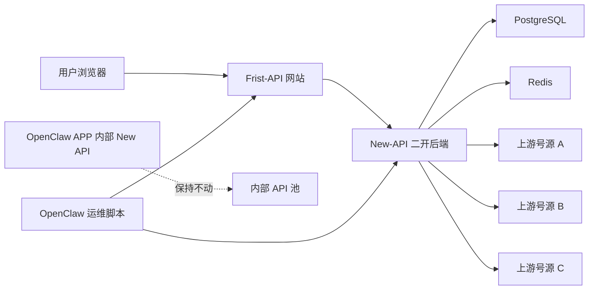
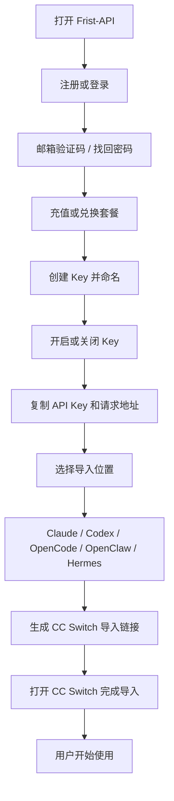
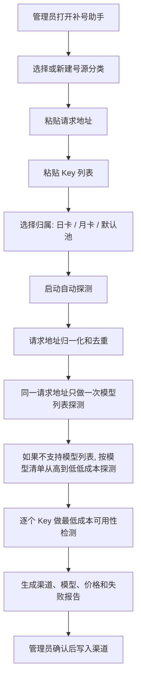
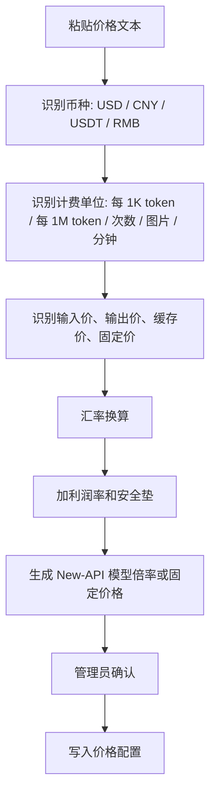

# Frist-API MVP 方案

> 日期: 2026-05-01
> 状态: MVP 方向已确认，网站雏形已落地，已新增 New-API 前端适配层，待迁移到真实 New-API fork
> 目标: 把 New-API 二开成公开收费中转站，作为 OpenClaw 之外的独立盈利渠道

## 参考依据

- `QuantumNous/new-api` 官方文档把它定位为统一 AI 网关，支持统一接口、智能路由、多渠道负载、细粒度计费、Token 权限、模型访问控制、调用审计、仪表盘和用量统计: [New API Project Introduction](https://docs.newapi.pro/en/docs/guide/wiki/basic-concepts/project-introduction)。
- `QuantumNous/new-api` GitHub 仓库当前明确为 AGPL-3.0，并提供 Docker/Docker Compose 部署方式: [QuantumNous/new-api](https://github.com/QuantumNous/new-api)。

## 一句话说明

Frist-API 是一个对外卖 API 的中转收费网站。它不替代 OpenClaw APP 里现有的 New API 内部管理池，也不把 OpenClaw 的本地硬件当成推理资源。Frist-API 只负责用户注册、充值、发 Key、计费、用量统计、CC Switch 一键导入、模型连通性展示和上游号源管理，真正的模型请求通过中转网关转发到上游号商。

## 边界

### 要做

- 基于 `QuantumNous/new-api` 做公开站，品牌名统一为 `Frist-API`。
- 页面 UI 第一版重构，方向参考 `https://tabcode.cc/dashboard` 的黑白极简控制台，但不照抄。
- 用户端跑通完整流程: 注册、充值、创建 Key、开启或关闭 Key、选择导入位置、导入 CC Switch、开始使用。
- 管理端增加补号助手，把上游号源按请求地址归类管理，降低管理员操作门槛。
- 价格系统支持复制粘贴一大段价格信息，由脚本解析、换算美元/人民币、生成模型价格表。
- 用户侧提供模型连通性检测页，让用户看到每个模型当前是否可用、延迟大概如何、最近是否异常。
- 管理侧支持直连和代理两种上游访问路径测速，自动选择更稳定、更快、更省钱的路径。
- 日卡、月卡、默认池分开管理；日卡号源额度耗尽后自动摘除并切换到同组可用号源。
- 部署上与 OpenClaw 内部 New API 隔离，独立数据库、独立 Redis、独立域名、独立运行进程。

### 不做

- 不改 OpenClaw APP 现有 New API 页面。
- 不让 OpenClaw 本机硬件承担模型推理。
- 不自研一套新的中转后端，优先复用 `QuantumNous/new-api` 的网关、计费、令牌、用户、支付、日志能力。
- 第一版不做复杂代理商、多级分销、自动续费深度运营和风控评分系统。
- 第一版不做所有号商的专用适配器。先用请求地址归类和自动探测，把不同号商差异收敛到配置层。
- 第一版不自动绕过号商条款；明显禁止转售或来源不明的号源只能进入内部测试池，不能进入公开售卖池。

## 总体架构



Frist-API 作为网站公开给用户。用户的 API 请求进入 Frist-API 后，只做鉴权、计费、日志、限流、模型路由，然后通过中转网关转发到上游号商。这样服务器压力主要来自 HTTP 转发和数据库写入，不承担模型计算，适合硬件一般的服务器。

### 中转与弱服务器策略

Frist-API 的默认路径是“用户请求 → Frist-API 计费鉴权 → 上游号商”。服务器只做轻量转发，不跑本地模型、不做大规模后台评测、不把长文本结果落库保存。对弱服务器的关键保护是:

- 请求转发使用流式透传，避免把完整大响应长期堆在内存里。
- 用 Redis 缓存号源档案、模型列表、连通性快照和价格表，减少数据库读写。
- 用户用量图表分页加载，不一次性查全量日志。
- 补号探测默认省钱模式，所有探测任务都有并发上限、请求数上限和预算上限。
- 直连和代理测速结果缓存，只有失败率升高或管理员手动触发时重新测速。

## 用户端流程



### 用户页面

**仪表盘**，只展示用户能看懂的信息: 今日费用、本月费用、剩余额度、套餐状态、最近调用、模型消耗排行、API Key 快捷入口、CC Switch 导入入口。

**API 管理**，用户可以创建 Key、命名 Key、查看脱敏 Key、点击验证后显示完整 Key、开启或关闭 Key、删除 Key、复制请求地址、进入 CC Switch 导入向导。不要暴露复杂的分组、渠道、模型映射和倍率配置。

**CC Switch 导入向导**，用户先选择要导入到哪里: Claude、Codex、OpenCode、OpenClaw、Hermes。系统根据选择生成不同的 provider 参数。默认模型从可用模型列表里选择，也允许用户手动输入模型名。最后生成 `ccswitch://v1/import?...` 深链并打开。

**模型连通性检测**，用户可以看到每个模型的状态: 正常、拥堵、不可用、维护中。页面只展示用户能理解的信息，例如是否可用、最近一次检测时间、平均延迟和推荐替代模型。用户点击检测时优先读后台缓存，不对每个用户都发真实请求，避免烧号源额度。

**充值与套餐**，第一版保留三种入口: 余额充值、兑换码、日卡/月卡。用户只需要知道自己还有多少钱、套餐什么时候到期、能不能继续用。

**个人资料**，包括邮箱、密码、验证码、找回密码、可选 2FA。公开站必须默认开启验证码或 Turnstile，防止机器人批量注册。

## 管理端补号助手

补号助手的目标是让不懂技术的管理员只输入 Key 和请求地址，其余由系统排查。



### 号源归类

第一版不要求提前知道每家号商的专用接口。系统以请求地址为类别，例如同一个 `https://supplier-a.example.com/v1` 算同一类号源。第一次接入一个新请求地址时，系统创建号源档案，后续补号默认复用这份档案。

号源档案包含:

- 标准化后的请求地址。
- 上游类型猜测: OpenAI 兼容、Claude 兼容、Gemini 兼容、OpenRouter 类、未知。
- 探测出的模型列表。
- 每个模型的可用状态、上下文限制、输出限制、是否支持流式、是否支持工具调用。
- 价格解析结果。
- 最近探测时间和失败原因。
- 推荐写入的 New-API 渠道参数。

### 上游号商预设

管理端需要提前准备“号商模板”，但模板不要求管理员懂接口。模板只做自动猜测和默认值，不把业务绑定死到某一家号商。

模板字段包括:

- 请求地址规则: 是否需要 `/v1`、是否有 chat/completions、responses、messages、models 等端点。
- 认证方式: Bearer Key、x-api-key、自定义 Header、URL 参数。
- 接口族: OpenAI 兼容、Claude 兼容、Gemini 兼容、OpenRouter 类、未知兼容。
- 默认模型探测清单: Claude、GPT、Gemini、DeepSeek、Qwen、Kimi、图片模型等。
- 默认价格解析提示: 这个号商常见的价格文本格式和币种。
- 默认代理策略: 直连优先、代理优先、只允许代理、只允许直连。

管理员第一次接入新号商时，只需要填请求地址和 Key。系统会先匹配模板；匹配不上时进入未知兼容模式，自动探测端点和认证方式。

### 自动探测策略

优先调用上游的模型列表接口，比如 OpenAI 兼容的 `/v1/models`。如果上游不支持模型列表，系统使用内置模型清单从高到低探测。探测顺序按成本和价值排序，先测便宜且高概率存在的模型，再测昂贵模型。每次探测都要有最大请求数和最大预算，避免一次补号消耗过多额度。

探测结果分三层:

- 请求地址层: 这个地址是不是能连、像哪类接口、认证格式是什么。
- 模型层: 哪些模型可用、返回格式是否正常、上下文限制大致是多少。
- Key 层: 每个 Key 是否有效、是否额度不足、是否被限速、是否被封禁。

需要注意，模型列表可以按请求地址只探测一次，但每个 Key 是否可用必须至少做一次低成本检测。否则系统无法区分好号和坏号。

### 直连和代理测速

同一个请求地址会做两类连接探测:

- 直连: 从 Frist-API 服务器直接访问上游。
- 代理: 通过后台配置的代理出口访问上游。

每类连接至少记录: DNS 是否可解析、TLS 是否正常、首包时间、完整响应时间、HTTP 状态码、错误类型和最近失败率。系统默认选择“成功率更高且延迟更低”的路径；如果直连更快就走直连，如果直连被墙、被限速或失败率高就走代理。测速本身也要限频，不能每次用户请求都重新测速。

### 模型效果和上下文限制

第一版只做轻量判断，不做完整评测。原因是完整评测会烧钱，也会拖慢补号流程。

轻量判断包括:

- 基础回复是否正常。
- 是否支持流式。
- 是否支持 JSON 输出。
- 是否支持工具调用。
- 粗略上下文限制。先读取上游模型列表或已知模型库；拿不到时，用小步探测估算，不做暴力长上下文压测。
- 模型别名和真实模型名映射。

模型效果第一版只记录基础可用性和异常样例，不给出主观评分。等有真实用户调用日志后，再基于失败率、延迟、用户消耗、投诉记录做质量评分。

## 价格系统

管理员可以把号商给的价格说明整段粘贴到一个输入框里。系统解析后生成结构化价格表，再让管理员确认。



### 价格解析原则

- 不直接自动上线价格，必须先给管理员看解析结果。
- 支持美元和人民币互转，汇率使用后台配置的固定汇率。第一版不依赖实时汇率，避免外部服务不稳定。
- 每个模型生成三类数值: 上游成本价、对外销售价、利润率。
- 无法解析的模型标为待确认，不写入线上价格。
- 如果价格文本存在冲突，以更贵的一项作为默认，防止亏本。

### 价格控制

第一版用简单规则:

- 销售价 = 成本价 * 利润倍率 + 安全垫。
- 日卡/月卡绑定可用模型组，避免低价套餐调用高成本模型。
- 对昂贵模型设置单日额度、并发限制和余额预扣。
- 每个模型配置最低余额要求，防止余额过低但请求过长导致亏损。

### 自动控价边界

自动控价只负责生成建议价，不直接越权改线上价格。线上生效必须经过管理员确认。控价规则按从严原则执行:

- 同一个模型有多条价格时，默认选更贵的成本价，防止亏本。
- 找不到价格的模型默认隐藏，不能进入公开模型广场。
- 日卡套餐只开放低风险模型组；高成本模型必须要求余额充值或月卡。
- 当上游成本上涨时，新价格先进入待确认状态，同时后台提示可能亏损的模型。
- 当汇率或利润倍率变化时，只重新计算待确认价格，不自动覆盖管理员手动锁定的价格。

## 日卡池和自动切换

日卡号源通常有额度、次数或到期时间限制，所以需要和月卡、默认池分开管理。系统把号源分成三个池:

- 日卡池: 适合短期售卖，额度小，到期快。
- 月卡池: 主力稳定池，优先保证付费月卡用户。
- 默认池: 余额按量用户和兜底模型池。

路由规则:

1. 用户请求进来后，先判断用户套餐允许的模型组。
2. 在对应模型组里找健康号源，优先选择同套餐池内延迟低、失败少、余额充足的 Key。
3. 如果某个日卡 Key 返回额度不足、余额不足、到期、封禁或连续失败，系统把它标记为不可用，并自动切到同池下一个健康 Key。
4. 如果同池没有可用 Key，系统按后台策略决定是否降级到默认池；降级前必须确认不会亏本，也不能让低价套餐调用高成本模型。
5. 日卡 Key 如果有每日重置时间，系统到重置点后自动恢复为待检测状态；没有重置规则的 Key 需要管理员手动恢复。

用户侧只看到“模型正常 / 当前拥堵 / 暂不可用 / 推荐替代模型”，不要看到日卡、渠道、Key、分组这些内部概念。

## UI 第一版方向

当前用户端方向从“控制台”调整为“低密度商业网站”。参考 Apple 的首屏克制、Uiverse Galaxy 的柔和层次和 nanfu.global 的商业质感，但用户页不做高密度数据后台。管理端继续保留补号、价格、库存和审计能力，和用户端完全隔离。

### 用户仪表盘

用户端不保留左侧导航，也不展示“控制台、API 与用量、模型与渠道、充值与订购、支持”这类不可点击分组文字。注册和登录放在右上角账户菜单。

首页固定展示:

- 余额
- 模型消耗
- Claude / OpenAI 连通性
- API Key、充值、CC Switch 三个直接入口

API 页面只处理创建 Key、开关 Key、复制 Key、查看请求地址。充值页面只展示日卡、月卡、余额和兑换码。CC Switch 页面让用户选择 Claude、Codex、OpenCode、OpenClaw、Hermes，并提供一键导入链接和 auth.json/config.toml 手动配置。用户端不要出现补号助手、号源、渠道写入、价格解析等管理端内容。

### 管理端

管理端左侧增加:

- 号源总览
- 补号助手
- 模型探测
- 价格解析
- 渠道管理
- 用户管理
- 订单与兑换码
- 风控日志

补号助手必须是向导式，不要让管理员直接面对 New-API 原始表单。

## 数据与配置

建议新增这些逻辑概念，落地时可以用 New-API 现有表加字段，也可以新增表。

| 概念 | 用途 |
|---|---|
| 号源档案 | 按请求地址归类，记录接口类型、探测结果、推荐参数 |
| 探测任务 | 记录每次自动探测的输入、进度、结果和成本 |
| 模型能力档案 | 记录模型是否可用、上下文、工具调用、流式、异常 |
| 价格草稿 | 从粘贴文本解析出来，等待管理员确认 |
| 导入目标 | Claude、Codex、OpenCode、OpenClaw、Hermes 的 CC Switch 参数模板 |
| 套餐模型组 | 日卡、月卡、默认池分别允许调用哪些模型 |
| 上游连接档案 | 记录直连/代理测速、失败率、推荐访问路径 |
| 额度池 | 记录日卡、月卡、默认池的 Key 状态、额度状态和自动切换规则 |
| 连通性快照 | 面向用户展示模型是否可用、延迟和推荐替代模型 |

### 当前前端适配边界

当前 `apps/frist-api` 已新增轻量适配层，目的不是重写 New-API，而是让用户控制台能先吃 New-API 的会话数据:

- `apps/frist-api/src/newApiClient.js` 负责创建 New-API 会话客户端。
- 前端优先读取 `/api/status`、`/api/user/self`、`/api/token/`、`/api/log/self` 和 `/api/frist/channel-health`。
- `/api/frist/channel-health` 是后续需要在 New-API fork 中补齐的用户安全接口，只返回脱敏后的 Claude/OpenAI 连通性快照，不直接暴露管理端渠道表。
- 如果 New-API 不可用或某个可选接口缺失，页面自动回退到演示数据，保证今晚原型能继续打开。
- 前端只用登录会话读取用户数据，不把管理员 Key、上游号商 Key 或原始渠道字段带到浏览器。
- Docker 原型通过 Nginx 把同域 `/api/` 和 `/v1/` 代理到 New-API 容器，保持公开网站和中转后端的同域接入方式。

### 当前业务链路实现边界

当前 `apps/frist-api/src/businessFlow.js` 已把 Frist-API 的核心交易链路抽成可测试状态机，先跑通业务规则，再迁移到 New-API fork 的真实接口:

- 用户侧已跑通注册、登录、充值申请、兑换码、创建 Key、开启/关闭 Key、CC Switch 导入链接生成。
- 页面侧已把注册和登录收进右上角账户菜单，`API` 页面只保留 Key 创建、开关和请求地址。
- Key 列表按每个 Key 自己的启停状态渲染；多个 Key 并存时不会被全局开关误导。
- 管理侧已跑通补号报告: 请求地址归一化、模型探测结果、Key 健康检测、直连/代理推荐、价格文本解析和待确认价格草稿。
- 路由侧已跑通日卡池自动切换: 某个健康 Key 额度不足时标记为不可用，并切到同池下一个健康 Key。
- `businessFlow.js` 仍是本地状态机，轻量后端已把充值申请、兑换码、验证码、Key 创建和补号写入落到 JSON 运行数据；生产落地时要把这些函数映射到 New-API 的用户、Token、兑换码、支付、渠道和日志接口。
- 用户页面仍不展示补号、号源、渠道写入、价格解析等管理端内容；这些能力只进入独立管理端。

### 当前公开试用后端边界

当前 `apps/frist-api/server/server.js` 已新增轻量 Node 后端，用来把今晚雏形从“页面演示”推进到“本地可试用链路”:

- 用户接口: `/api/frist/register`、`/api/frist/login`、`/api/frist/verify`、`/api/frist/recharge`、`/api/frist/redeem`、`/api/frist/token`、`/api/frist/import-url` 和 `/api/frist/dashboard`。
- 管理接口: `/api/admin/replenishments` 和 `/api/admin/customers/recharge`，用管理员令牌写入补号库存或按邮箱人工确认入账，返回给页面时只展示脱敏 Key 预览。
- 网关接口: `/v1/chat/completions`，使用用户 `fk-live-*` 鉴权，再按用户套餐映射到日卡、月卡或默认池。
- 真实计费: 用户请求成功后扣减套餐额度，再扣减加油包额度；余额不足时在访问上游前返回提示，避免亏损。
- 价格扣费: 管理端粘贴的模型价格会写入价格草稿；上游返回 `usage.prompt_tokens` / `usage.completion_tokens` 时，网关按输入/输出销售价计算真实扣费，并同步扣用户额度和上游库存额度。
- 充值安全: 公开环境默认关闭演示充值，用户侧充值按钮只生成待处理充值单；早期运营通过管理端人工入账或一次性兑换码给用户加额度。
- 补号探测: 管理端支持自动探测、严格探测和信任写入。未填写模型时优先对同一请求地址调用一次上游 `/models`，再逐 Key 做最低成本聊天健康检查，过滤认证失败或额度不足的 Key。
- 上游兼容: 如果号商不支持 `/models`，系统会按内置模型清单逐个做低成本聊天探测，只把实际通过的模型写入号源档案和上游凭证。
- 路径择优: 管理端可选填代理请求地址。补号时系统会分别探测直连和代理路径，按成功率和延迟选择 `routeBaseUrl`，网关转发时使用这个择优路径。
- 日卡切换: 候选上游 Key 按池子、模型、健康状态和延迟筛选；额度不足的 Key 会先标记耗尽并跳过；上游返回余额不足时标记当前 Key 耗尽并重试下一枚健康 Key；上游 5xx 或网络失败时标记失败并切到下一枚健康 Key；日卡套餐到期后会清空套餐额度并切回默认套餐。
- 补充恢复: 同一个请求地址下补充同一枚上游 Key 时会更新原库存记录，额度恢复后重新置为健康状态，不重复堆积。
- 存储方式: 当前用 JSON 文件保存用户、会话、用户 Key、号源库存、价格草稿和事件日志，适合小范围公开实测；正式运营要迁移到 SQLite/PostgreSQL 或 New-API fork 数据库。
- 前端接线: 用户端优先调用轻量后端，失败时回退演示状态；管理端独立在 `/admin.html`，用户页面继续不展示补号和价格解析入口。
- 部署准备: 新增生产环境变量模板和冒烟脚本，公网部署时建议容器只绑本地端口，前面用 HTTPS 反向代理。

当前边界不是最终生产架构: 暂未实现找回密码、SMTP、支付回调、管理员 2FA、探测预算、真实上下文上限识别、工具调用能力识别、价格确认工作流和数据库备份。

## 部署方案

Frist-API 独立部署，不与 OpenClaw 内部 New API 共用运行环境。

建议端口和服务:

- Web/API: `127.0.0.1:3100` 或容器内 `3000`，公网通过 Nginx/Caddy 暴露。
- PostgreSQL: 独立库 `frist_api`。
- Redis: 独立实例或独立 DB。
- 域名: `frist-api.example.com` 或后续实际域名。
- 备份: 每日数据库备份，保留至少 7 天。

硬件较弱时的默认策略:

- 禁止本地模型推理。
- 关闭不必要的后台重任务。
- 模型探测设置并发上限。
- 用 Redis 缓存模型列表和号源档案。
- 大图表和日志分页加载。
- 补号探测默认省钱模式。
- 当前轻量服务默认端口是 `127.0.0.1:3180`，Docker Compose 已按 256MB 内存限制配置，适合 2 核 2GB 服务器小规模试用。

## 安全与合规

- `QuantumNous/new-api` 使用 AGPL-3.0 协议，公开二开运营时要准备源码公开入口或公开 fork。
- 管理端必须开启 2FA。
- Key 默认脱敏展示，查看完整 Key 要二次验证。
- 支付回调、登录、注册、补号探测都要限流。
- 价格配置必须留审计日志，避免误改导致亏损。
- 不提交 `.env`、上游 Key、数据库备份和支付密钥。
- 上游号商是否允许转售需要单独确认，禁止把明显违反条款的渠道放进公开售卖池。

## 实施顺序

1. 建立 Frist-API 独立 fork 和部署入口，确认品牌名、端口、数据库、Redis、域名配置。
2. 做品牌替换和 UI 第一版，包括首页、用户仪表盘、API 管理、充值、个人资料。
3. 改造 CC Switch 导入向导，支持 Claude、Codex、OpenCode、OpenClaw、Hermes 五个导入目标。
4. 做模型连通性页，先用后台缓存展示模型状态，避免用户侧重复探测烧额度。
5. 做补号助手 MVP，支持按请求地址归类、模板匹配、模型列表探测、直连/代理测速、Key 低成本检测、渠道写入。
6. 做价格解析 MVP，支持粘贴价格文本、币种识别、单位识别、汇率换算、利润倍率、安全垫、亏损保护和人工确认。
7. 做日卡池自动切换，额度耗尽、到期、封禁、连续失败时自动摘除并切到同组健康 Key。
8. 做部署脚本、健康检查、备份脚本和最小监控。
9. 跑测试、构建、截图验证，再接入真实小规模号源试运营。

## 验证标准

- 用户能完成注册、登录、充值或兑换码、创建 Key、关闭 Key、重新开启 Key。
- 用户能选择 Claude、Codex、OpenCode、OpenClaw、Hermes，并成功生成 CC Switch 导入链接。
- 管理员输入同一个请求地址和多枚 Key 时，模型列表只探测一次，每枚 Key 做低成本有效性检测。
- 上游不支持模型列表时，系统能按内置模型清单逐项探测，并输出哪些模型可用。
- 同一个请求地址能分别记录直连和代理的连通性、延迟、错误类型，并自动选择推荐路径。
- 管理员粘贴价格文本后，系统能生成价格草稿，并要求确认后才写入线上价格。
- 用户能打开模型连通性页，看到可用、拥堵、不可用、最近检测时间和推荐替代模型。
- 日卡池某个 Key 额度耗尽后，系统能自动摘除这个 Key，并切到同模型组下一个健康 Key。
- 弱服务器环境下，请求只中转不本地推理，补号探测有并发和预算限制。
- OpenClaw APP 现有 New API 页面不受影响。

## 交接提示词

```text
你现在接手 OpenClaw 项目的 Frist-API 盈利渠道设计与实现。当前仓库是 /Users/blackdj/Desktop/OpenEverything，必须遵守 AGENTS.md SOP。先读 docs/project-map.md、docs/status/HEALTH.md、docs/specs/2026-05-01-frist-api-mvp-design.md、docs/guides/frist-api-quickstart.md，再动代码。

业务目标: 基于 QuantumNous/new-api 二开一个公开收费 API 中转网站，品牌名固定为 Frist-API。OpenClaw APP 现有 New API 页面保持不动，Frist-API 独立部署、独立数据库、独立 Redis、独立域名，只作为中转收费系统，不用本机硬件做模型推理。

用户端 MVP: 注册、登录、邮箱验证码/找回密码、充值或兑换码、创建 Key、开启/关闭 Key、复制 API Key 和请求地址、选择导入位置并生成 CC Switch 导入链接。导入目标必须支持 Claude、Codex、OpenCode、OpenClaw、Hermes。网页端要让用户选择导入位置，不要只写死 Claude/Codex。

管理端 MVP: 做补号助手。管理员只输入请求地址和一批 Key，系统以同一个请求地址为号源类别管理。第一次接入某个请求地址时自动匹配号商模板，探测接口类型、模型列表、认证方式、模型能力、直连/代理速度和推荐渠道参数。若上游不支持模型列表，则按内置模型清单从高到低做低成本探测。模型列表按请求地址缓存，同一请求地址只探测一次；每枚 Key 仍要做一次最低成本有效性检测。

价格系统 MVP: 管理员把号商价格说明整段粘贴进输入框，脚本自动识别币种、计费单位、输入价、输出价、固定价、缓存价，按后台固定汇率换算美元/人民币，再加利润倍率和安全垫，生成价格草稿。价格草稿必须让管理员确认后才写入线上配置，无法解析或冲突的模型标记为待确认，不能自动上线。找不到价格的模型默认隐藏，不能进入公开模型广场。

日卡和连通性: 日卡、月卡、默认池分开管理。日卡 Key 额度用完、到期、封禁或连续失败时，自动摘除并切到同模型组下一个健康 Key；没有健康 Key 时按后台策略降级或返回用户可理解的暂不可用提示。用户侧需要模型连通性页，展示正常、拥堵、不可用、维护中、最近检测时间和推荐替代模型，但不要暴露渠道、Key、倍率和分组。

UI 方向: 参考 https://tabcode.cc/dashboard 的黑白极简控制台。用户侧要小白友好，隐藏渠道、分组、模型映射、倍率等复杂概念。管理侧要向导式，重点是号源总览、补号助手、模型探测、价格解析、渠道管理、用户管理、订单与兑换码、风控日志。

实现约束: 优先复用 QuantumNous/new-api 现有注册、用户、充值、令牌、渠道、模型、日志和支付能力；需要改 FastAPI/Tauri/新库时按 docs/sop/docs-first-protocol.md 先查官方文档；任何代码变更必须更新 docs/CHANGELOG.md，发现问题登记 docs/status/HEALTH.md。公开二开要注意 QuantumNous/new-api 的 AGPL-3.0 协议，保留源码公开入口或公开 fork。

当前雏形: 已有 apps/frist-api 用户控制台、独立 /admin.html 管理端、apps/frist-api/server/server.js 轻量中转后端、apps/frist-api/src/core.js 核心逻辑、apps/frist-api/src/newApiClient.js New-API 适配层、apps/frist-api/tests/ 测试、docker-compose.frist-api.yml 原型入口、Makefile 的 frist-api-test/frist-api-dev/frist-api-up/frist-api-down 命令。当前版本已能本地跑通注册、充值申请、人工入账、兑换、创建 Key、CC Switch 导入、补日卡池、直连/代理择优、价格扣费、网关转发和日卡自动切换，仍不是最终 New-API fork。

第一步建议: 从现有 apps/frist-api 原型继续，不要重复搭静态骨架；下一阶段在 QuantumNous/new-api fork 中补齐用户安全接口和真实 Token 操作，再把页面迁移或复刻到 New-API 的真实 Web UI，接真实用户 Token、渠道检测、补号助手、价格草稿和兑换码/支付。不要直接改 OpenClaw APP 现有 New API 页面。每一步都要跑构建/测试并截图验证。
```
